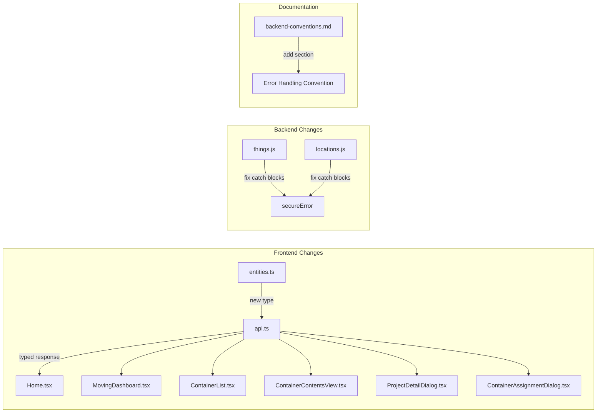

# Design Document

## Overview

This feature resolves two related inconsistencies in the codebase:

1. **Frontend response type mismatch**: The `getContainers()` API client method declares a union return type `Container[] | { containers, count, hasMore, lastEvaluatedKey }`, but the backend (`containerService.listContainers()`) always returns the object shape. Every frontend caller defensively checks `Array.isArray()` and uses `as any` casts to extract the container array. The fix is to define a `ContainerListResponse` type matching the actual backend shape, update `getContainers()` to return `Promise<ContainerListResponse>`, and simplify all callers.

2. **Backend error handling inconsistency**: Some handler inner functions (`handleUpdate` in things, `handleGet`/`handleCreate`/etc. in locations) use `error()` with raw `err.message` or `throw new Error(...)` in catch blocks for unexpected errors. The convention should be: `error()` for intentional safe messages (validation, not-found, method-not-allowed), `secureError()` for unexpected catch blocks. The containers handler already follows this pattern in its outer handler but its inner functions use `throw new Error(...)` which is caught by the outer `secureError()` — this is acceptable. The things and locations handlers need targeted fixes.

Both changes are mechanical refactors with no new business logic.

## Architecture

No architectural changes. The existing layered architecture remains:

```
Frontend Components → ApiClient (api.ts) → Backend Handlers → Services → DynamoDB
```

Changes are confined to:
- **Type layer**: New `ContainerListResponse` interface in `frontend/src/types/entities.ts`
- **API client**: Updated return type on `getContainers()` in `frontend/src/services/api.ts`
- **Frontend callers**: Simplified response handling in 6 components/pages
- **Backend handlers**: Error handling fixes in `things.js` and `locations.js`
- **Documentation**: Error handling convention added to `.kiro/steering/backend-conventions.md`



## Components and Interfaces

### New Type: `ContainerListResponse`

Defined in `frontend/src/types/entities.ts` and re-exported via `frontend/src/types/index.ts` (which already does `export * from './entities'`).

```typescript
export interface ContainerListResponse {
  containers: Container[];
  count: number;
  hasMore: boolean;
  lastEvaluatedKey?: string;
}
```

This matches the shape returned by `containerService.listContainers()`:

```javascript
// backend/services/containerService.js — listContainers return value
return {
  containers,          // Container[]
  lastEvaluatedKey,    // from DynamoDB pagination
  count: containers.length,
  hasMore: result.hasMore
};
```

### Updated API Client Method

```typescript
// Before
async getContainers(inventoryId?: string): Promise<Container[] | { containers: Container[], count: number, hasMore: boolean, lastEvaluatedKey?: any }> {

// After
async getContainers(inventoryId?: string): Promise<ContainerListResponse> {
  const url = inventoryId ? `/containers?inventoryId=${inventoryId}` : '/containers';
  return this.get<ContainerListResponse>(url);
}
```

### Frontend Caller Simplification

Each caller currently has a pattern like:

```typescript
// Before — defensive checks and unsafe casts
let containerData: Container[];
if (Array.isArray(response)) {
  containerData = response;
} else if (response && typeof response === 'object' && 'containers' in response) {
  containerData = (response as any).containers || [];
} else {
  containerData = [];
}
```

After the type fix, callers access the property directly:

```typescript
// After — type-safe access
const containerData = response.containers;
```

**Affected callers** (6 files):

| File | Current Pattern | Change |
|------|----------------|--------|
| `pages/Home.tsx` | `Array.isArray` + `as any` cast | `response.containers` |
| `pages/MovingDashboard.tsx` | `Array.isArray` + `as any` cast | `response.containers` |
| `components/ContainerList.tsx` | `Array.isArray` + `as any` cast | `response.containers` |
| `components/ContainerContentsView.tsx` | `Array.isArray` + `as any` cast | `response.containers` |
| `components/ProjectDetailDialog.tsx` | `Array.isArray` + `as any` cast | `response.containers` |
| `components/ContainerAssignmentDialog.tsx` | `Array.isArray` + filter | `response.containers.filter(...)` |

Additionally, `pages/Things.tsx` has a similar pattern at line 145 and should be updated.

### Backend Error Handling Fixes

**Current handler patterns and what needs to change:**

#### `containers.js` — Already correct
The outer handler catches with `secureError(err, context, origin)`. Inner `handle*` functions use `throw new Error('Failed to ...')` for unexpected errors, which propagates to the outer catch. Intentional errors use `error()` with safe messages. No changes needed.

#### `things.js` — One fix needed
`handleUpdate` (line ~370) uses `error()` with `err.message` for unexpected errors:
```javascript
// Before — leaks err.message to client
return error('Failed to update thing: ' + err.message, 500, origin);
```
Should become a throw so the outer `secureError` catches it:
```javascript
// After — propagates to outer secureError
throw err;
```

All other inner functions in `things.js` already use `throw new Error(...)` which propagates to the outer `secureError()` catch block correctly.

#### `locations.js` — Pattern fix needed
The locations handler's inner functions use `throw new Error(...)` for unexpected errors, but the outer handler does not pass `origin` to `secureError()`. The outer catch should be:
```javascript
// Before
return secureError(err, context);

// After
return secureError(err, context, origin);
```
Wait — looking more carefully, the locations handler doesn't extract `origin` at all. The `origin` parameter needs to be extracted and threaded through. The inner functions also don't pass `origin` to their `error()` calls. This is a separate issue from the error handling convention, but the `secureError` call in the outer catch should at minimum include origin for CORS headers.

The inner functions' `throw new Error(...)` pattern is correct — it propagates to the outer `secureError()`. The fix is to extract `origin` in the outer handler and pass it to `secureError()`.

### Error Handling Convention Documentation

A new section will be added to `.kiro/steering/backend-conventions.md` under the existing "Error Handling" section:

```markdown
## Error Handling Convention: error() vs secureError()

**`error(message, statusCode, origin)`** — Use for intentional responses where YOU control the message:
- Input validation failures (400)
- Resource not found (404)
- Access denied (403)
- Method not allowed (405)
- Any case where the message is a string literal you wrote

**`secureError(errorObj, context, origin)`** — Use for unexpected errors in catch blocks:
- Any catch block where `err.message` may contain internal details
- Database errors, service failures, unhandled exceptions
- Never pass `err.message` to `error()` in a catch block

**Pattern for inner handle* functions:**
```js
async function handleCreate(event, origin) {
  try {
    // validation — use error() with safe messages
    if (!body.name) {
      return error('Name is required', 400, origin);
    }
    // business logic...
    return success(result, 201, origin);
  } catch (err) {
    // Known error conditions — use error() with safe messages
    if (err.message === 'Entity not found') {
      return error('Resource not found', 404, origin);
    }
    if (err.statusCode === 403) {
      return error('Access denied', 403, origin);
    }
    // Unexpected errors — throw to outer secureError
    throw err;
  }
}
```
```

## Data Models

### New TypeScript Interface

```typescript
// frontend/src/types/entities.ts
export interface ContainerListResponse {
  containers: Container[];
  count: number;
  hasMore: boolean;
  lastEvaluatedKey?: string;
}
```

No backend data model changes. The backend already returns this shape from `containerService.listContainers()`.

No database schema changes.

## Error Handling

This feature is primarily about error handling. The key decisions:

1. **`error()` is not deprecated** — it remains the correct choice for intentional responses with developer-controlled messages (validation, not-found, method-not-allowed).

2. **`secureError()` is required for unexpected errors** — any catch block handling an unknown error must use `secureError()` to prevent leaking `err.message` contents (which may include DynamoDB table names, query details, or stack traces).

3. **Inner function pattern**: Inner `handle*` functions should catch known error conditions (not-found, access-denied) and return `error()` with safe messages. Unknown errors should `throw` to propagate to the outer handler's `secureError()` catch block.

4. **Origin threading**: All response functions (`error()`, `secureError()`, `success()`) need the `origin` parameter for CORS headers. The locations handler is missing this.

## Testing Strategy

This feature is a mechanical refactor — no new business logic, algorithms, parsers, or data transformations are introduced. Property-based testing does not apply.

**Why PBT does not apply**: Every change is either a type annotation update, removal of dead-code branches, or swapping one error response function for another. There are no functions with varying input/output behavior to test with generated inputs.

### Unit Tests (Example-Based)

**Frontend tests:**
- Verify `getContainers()` returns a `ContainerListResponse` object (mock API response)
- Verify callers correctly access `response.containers` without defensive checks (component render tests with mocked API)

**Backend tests:**
- Verify `things.handleUpdate` returns a `secureError` response (not `error()` with `err.message`) when an unexpected error occurs
- Verify `locations` handler passes `origin` to `secureError()` in the outer catch block
- Verify intentional error responses (validation, not-found, method-not-allowed) still use `error()` with their existing safe messages and correct status codes

### Integration Tests

- Existing handler tests should continue to pass — the error response shape changes only for unexpected errors (generic message + requestId instead of raw error message)
- Frontend build (`tsc -b && vite build`) must pass with no type errors after the union type removal

### Test Commands

- Frontend: `npm test` (in `frontend/` directory)
- Backend: `npm test` (in `backend/` directory)
- Frontend type check: `npm run build` (in `frontend/` directory)
