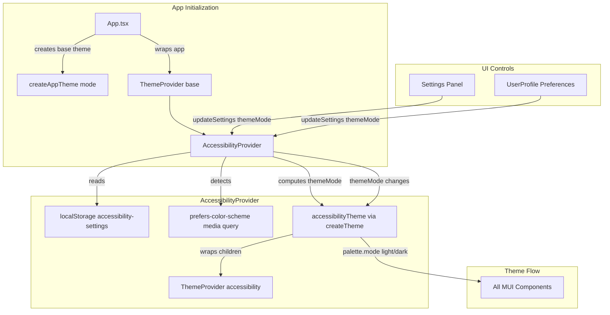

# Design Document: Dark Theme Settings

## Overview

This feature adds dark theme support to the application by extending the existing theme and accessibility infrastructure. The core approach is:

1. **Refactor `theme.ts`** to export a factory function (`createAppTheme(mode)`) instead of a static `theme` object, using MUI's native `palette.mode` to switch between light and dark palettes.
2. **Extend `AccessibilityContext`** to include a `themeMode` property in its persisted settings, detect the system `prefers-color-scheme` preference on first visit, and feed the mode into the theme factory.
3. **Rename the Settings dialog** from "Accessibility Settings" to "Settings" and add an "Appearance" section with a dark mode toggle as the first section.
4. **Add a "Preferences" section** to the User Profile page with a matching theme toggle.
5. **Update `Header.tsx`** menu item label from "Accessibility" to "Settings".

All theme-aware MUI components using the `sx` prop will automatically pick up palette changes through the existing `ThemeProvider` hierarchy. No changes to individual page components are needed.

## Architecture



### Theme Provider Hierarchy

The app has a two-level `ThemeProvider` setup:

1. **Outer `ThemeProvider`** in `App.tsx` — provides the base theme from `theme.ts`. This will now receive a `mode` parameter from the context.
2. **Inner `ThemeProvider`** in `AccessibilityProvider` — creates a modified theme that layers accessibility overrides (high contrast, font size, color blindness filters) on top of the base theme.

The dark mode palette is integrated at the **inner `ThemeProvider`** level inside `AccessibilityProvider`. This is the correct integration point because:
- The `AccessibilityProvider` already calls `createTheme()` with palette overrides (high contrast mode).
- It already reads from and writes to `localStorage('accessibility-settings')`.
- It already wraps children in its own `ThemeProvider`, so the dark palette merges naturally with other accessibility overrides.

The outer `ThemeProvider` in `App.tsx` continues to provide the base light theme. The `AccessibilityProvider` overrides `palette.mode` and mode-specific colors in its derived theme.

### Design Decision: Single Context vs. Separate Theme Context

**Decision**: Extend the existing `AccessibilityContext` rather than creating a separate `ThemeContext`.

**Rationale**:
- The `AccessibilityContext` already manages visual preferences (high contrast, font size, color blindness) and persists them to `localStorage('accessibility-settings')`.
- Adding `themeMode` to this same context keeps all visual preferences in one place.
- A separate context would require a second `ThemeProvider` wrapper or complex coordination between two contexts that both modify the theme.
- The settings dialog already consumes `useAccessibility()` — adding theme controls there is straightforward.

## Components and Interfaces

### Modified: `frontend/src/theme.ts`

**Change**: Export a factory function instead of a static object.

```typescript
// Before
export const theme = createTheme({ palette: { mode: 'light', ... } });

// After
export type ThemeMode = 'light' | 'dark';

export function createAppTheme(mode: ThemeMode = 'light') {
  return createTheme({
    palette: {
      mode,
      primary: { main: '#1976d2' },
      secondary: { main: '#dc004e' },
      ...(mode === 'light'
        ? {
            background: { default: '#f5f5f5', paper: '#ffffff' },
            text: { primary: '#212121', secondary: '#757575' },
          }
        : {
            primary: { main: '#9046ff' },
            secondary: { main: '#46ff90' },
            background: { default: '#121212', paper: '#1e1e1e' },
            text: { primary: '#e0e0e0', secondary: '#aaaaaa' },
          }),
    },
    typography: { /* unchanged */ },
    breakpoints: { /* unchanged */ },
    components: { /* unchanged */ },
  });
}

// Backward-compatible default export for App.tsx outer ThemeProvider
export const theme = createAppTheme('light');
```

### Modified: `frontend/src/contexts/AccessibilityContext.tsx`

**Changes**:
1. Add `themeMode: ThemeMode` to the `AccessibilitySettings` interface.
2. Default `themeMode` to `'light'`.
3. On initialization, if no localStorage value exists, detect `prefers-color-scheme` and set accordingly.
4. In the `accessibilityTheme` memo, set `palette.mode` based on `settings.themeMode` and apply mode-specific background/text colors from the theme factory.
5. Add validation: if persisted `themeMode` is not `'light'` or `'dark'`, fall back to `'light'` and overwrite.

```typescript
interface AccessibilitySettings {
  highContrast: boolean;
  largeText: boolean;
  reducedMotion: boolean;
  keyboardNavigation: boolean;
  screenReaderMode: boolean;
  fontSize: 'small' | 'medium' | 'large' | 'extra-large';
  colorBlindnessMode: 'none' | 'protanopia' | 'deuteranopia' | 'tritanopia';
  themeMode: ThemeMode;  // NEW
}
```

**Initialization logic** (inside `useState` initializer):
```typescript
const saved = localStorage.getItem('accessibility-settings');
if (saved) {
  const parsed = JSON.parse(saved);
  // Validate themeMode
  if (parsed.themeMode && parsed.themeMode !== 'light' && parsed.themeMode !== 'dark') {
    parsed.themeMode = 'light';
    localStorage.setItem('accessibility-settings', JSON.stringify({ ...defaultSettings, ...parsed }));
  }
  return { ...defaultSettings, ...parsed };
}

// No saved settings — detect system preference
const prefersDark = window.matchMedia('(prefers-color-scheme: dark)').matches;
return { ...defaultSettings, themeMode: prefersDark ? 'dark' : 'light' };
```

**Theme creation** (inside `useMemo`):
```typescript
const darkPalette = settings.themeMode === 'dark' ? {
  mode: 'dark' as const,
  primary: { main: '#9046ff' },
  secondary: { main: '#46ff90' },
  background: { default: '#121212', paper: '#1e1e1e' },
  text: { primary: '#e0e0e0', secondary: '#aaaaaa' },
} : {};

return createTheme({
  ...baseTheme,
  palette: {
    ...baseTheme.palette,
    ...darkPalette,
    ...(settings.highContrast && { /* existing high contrast overrides */ }),
  },
  // ... rest unchanged
});
```

### Modified: `frontend/src/components/accessibility/AccessibilitySettings.tsx`

**Changes**:
1. Rename dialog title from "Accessibility Settings" to "Settings".
2. Replace `AccessibilityIcon` with MUI `Settings` icon in the header.
3. Update `aria-labelledby` to reference the new title.
4. Add an "Appearance" section as the **first** section, containing a `Switch` for dark mode.
5. Update close button announcement to "Settings closed".
6. Announce theme changes to screen readers.

```typescript
// New "Appearance" section (placed before "Visual Settings")
<Box sx={{ mb: 3 }}>
  <Typography variant="h6" sx={{ display: 'flex', alignItems: 'center', gap: 1, mb: 2 }}>
    <PaletteIcon />
    Appearance
  </Typography>
  <FormControlLabel
    control={
      <Switch
        checked={settings.themeMode === 'dark'}
        onChange={(e) => {
          const newMode = e.target.checked ? 'dark' : 'light';
          updateSettings({ themeMode: newMode });
          announceToScreenReader(`Theme changed to ${newMode} mode`);
        }}
        inputProps={{ 'aria-label': 'Dark mode' }}
      />
    }
    label="Dark mode"
  />
  <Typography variant="body2" color="text.secondary" sx={{ ml: 2 }}>
    Switch between light and dark color schemes
  </Typography>
</Box>
```

### Modified: `frontend/src/pages/UserProfile.tsx`

**Changes**: Add a "Preferences" section after the existing `MfaStatusSection`, containing a theme toggle.

```typescript
import { useAccessibility } from '../contexts/AccessibilityContext';

// Inside the component:
const { settings, updateSettings, announceToScreenReader } = useAccessibility();

// After MfaStatusSection:
<Paper sx={{ p: 3, mt: 3 }}>
  <Typography variant="h6" gutterBottom>Preferences</Typography>
  <FormControlLabel
    control={
      <Switch
        checked={settings.themeMode === 'dark'}
        onChange={(e) => {
          const newMode = e.target.checked ? 'dark' : 'light';
          updateSettings({ themeMode: newMode });
          announceToScreenReader(`Theme changed to ${newMode} mode`);
        }}
        inputProps={{ 'aria-label': 'Dark mode' }}
      />
    }
    label="Dark mode"
  />
</Paper>
```

### Modified: `frontend/src/components/Header.tsx`

**Changes**:
1. Rename the menu item from "Accessibility" to "Settings".
2. Replace `AccessibilityIcon` with MUI `Settings` icon in the menu item.
3. Rename the context method reference from `openAccessibilitySettings` to `openSettings` (or keep the existing name for backward compatibility and rename later).

### Modified: `frontend/src/App.tsx`

**Changes**:
1. Update the `MobileSidebarContext` method name from `openAccessibilitySettings` to `openSettings` for clarity (optional, can keep existing name).
2. The `resetToDefaults` function in the Settings panel must include `themeMode: 'light'` in its reset object.

## Data Models

### AccessibilitySettings (Extended)

```typescript
interface AccessibilitySettings {
  // Existing fields
  highContrast: boolean;
  largeText: boolean;
  reducedMotion: boolean;
  keyboardNavigation: boolean;
  screenReaderMode: boolean;
  fontSize: 'small' | 'medium' | 'large' | 'extra-large';
  colorBlindnessMode: 'none' | 'protanopia' | 'deuteranopia' | 'tritanopia';
  // New field
  themeMode: ThemeMode;  // 'light' | 'dark'
}
```

### ThemeMode Type

```typescript
type ThemeMode = 'light' | 'dark';
```

### localStorage Schema

**Key**: `'accessibility-settings'`

**Value** (JSON string):
```json
{
  "highContrast": false,
  "largeText": false,
  "reducedMotion": false,
  "keyboardNavigation": true,
  "screenReaderMode": false,
  "fontSize": "medium",
  "colorBlindnessMode": "none",
  "themeMode": "dark"
}
```

**Migration**: Existing users who have saved accessibility settings will not have a `themeMode` key. The spread `{ ...defaultSettings, ...parsed }` handles this — `themeMode` defaults to `'light'` from `defaultSettings` when absent from the parsed object.

### Dark Palette Values

| Token | Light | Dark |
|---|---|---|
| `palette.mode` | `'light'` | `'dark'` |
| `background.default` | `#f5f5f5` | `#121212` |
| `background.paper` | `#ffffff` | `#1e1e1e` |
| `text.primary` | `#212121` | `#e0e0e0` |
| `text.secondary` | `#757575` | `#aaaaaa` |
| `primary.main` | `#1976d2` | `#9046ff` (purple) |
| `secondary.main` | `#dc004e` | `#46ff90` (complementary green) |

## Correctness Properties

*A property is a characteristic or behavior that should hold true across all valid executions of a system — essentially, a formal statement about what the system should do. Properties serve as the bridge between human-readable specifications and machine-verifiable correctness guarantees.*

### Property 1: Theme factory produces valid theme for any mode

*For any* valid `ThemeMode` value (`"light"` or `"dark"`), calling `createAppTheme(mode)` SHALL return a complete MUI theme object where `palette.mode` equals the input mode, `primary.main` equals `"#1976d2"` for light mode or `"#9046ff"` for dark mode, `secondary.main` equals `"#dc004e"` for light mode or `"#46ff90"` for dark mode, and the typography font family, breakpoints, and component overrides are preserved identically across both modes.

**Validates: Requirements 1.1, 1.4**

### Property 2: Settings persistence round-trip

*For any* valid `ThemeMode` value, calling `updateSettings({ themeMode: mode })` SHALL persist the value to `localStorage('accessibility-settings')` such that parsing the stored JSON and reading the `themeMode` field returns the same value that was set.

**Validates: Requirements 2.2, 3.1**

### Property 3: Invalid theme mode fallback

*For any* string that is not `"light"` or `"dark"`, if that string is stored as the `themeMode` value in `localStorage('accessibility-settings')`, the `AccessibilityProvider` SHALL initialize with `themeMode` set to `"light"` and overwrite the invalid value in localStorage.

**Validates: Requirements 3.3**

### Property 4: Toggle reflects context state

*For any* valid `ThemeMode` value in the `AccessibilityContext`, the theme toggle `Switch` component (in both the Settings Panel and User Profile page) SHALL have its `checked` state equal to `themeMode === 'dark'`.

**Validates: Requirements 5.2, 6.2**

## Error Handling

| Scenario | Handling |
|---|---|
| `localStorage` is unavailable (private browsing, quota exceeded) | The existing `try/catch` in `AccessibilityProvider` initialization handles this. Settings work in-memory for the session but won't persist. |
| `localStorage` contains malformed JSON for `'accessibility-settings'` | The existing `catch` block in the `useState` initializer returns `defaultSettings` (which now includes `themeMode: 'light'`). |
| `localStorage` contains a valid JSON object but `themeMode` is an invalid value (e.g., `"blue"`) | New validation logic detects the invalid value, resets `themeMode` to `'light'`, and overwrites the localStorage entry. |
| `window.matchMedia` is unavailable | The `matchMedia` call is wrapped in a conditional. If unavailable, defaults to `'light'`. The test setup already mocks `matchMedia`. |
| User has existing saved settings without `themeMode` field | The spread `{ ...defaultSettings, ...parsed }` fills in `themeMode: 'light'` from defaults. No migration script needed. |

## Testing Strategy

### Property-Based Tests (via `@fast-check/vitest`)

Each correctness property maps to a single property-based test with a minimum of 100 iterations.

| Property | Test Description | Generator |
|---|---|---|
| Property 1 | `createAppTheme` returns valid theme for any mode | `fc.constantFrom('light', 'dark')` |
| Property 2 | `updateSettings` round-trips themeMode through localStorage | `fc.constantFrom('light', 'dark')` |
| Property 3 | Invalid themeMode in localStorage falls back to `'light'` | `fc.string().filter(s => s !== 'light' && s !== 'dark')` |
| Property 4 | Toggle checked state matches `themeMode === 'dark'` | `fc.constantFrom('light', 'dark')` |

**Library**: `@fast-check/vitest` (already installed, `fcIt` exported from test setup)
**Configuration**: Minimum 100 iterations per property test
**Tag format**: `Feature: dark-theme-settings, Property {N}: {description}`

### Unit Tests (example-based)

| Test | Validates |
|---|---|
| `createAppTheme('dark')` returns dark palette values | Req 1.2 |
| `createAppTheme('light')` returns light palette values | Req 1.3 |
| Context initializes themeMode from localStorage | Req 2.3 |
| Context defaults to `'light'` when no localStorage | Req 2.4 |
| Settings dialog title is "Settings" | Req 4.1 |
| Settings dialog uses Settings icon | Req 4.2 |
| Settings dialog has correct aria-labelledby | Req 4.3 |
| Close button announces "Settings closed" | Req 4.4 |
| Appearance section exists with theme toggle | Req 5.1 |
| Toggle calls updateSettings on change | Req 5.3 |
| Toggle change announces to screen reader | Req 5.4 |
| Toggle has accessible label "Dark mode" | Req 5.5 |
| Appearance section appears before Visual Settings | Req 5.6 |
| UserProfile has Preferences section with toggle | Req 6.1 |
| UserProfile toggle calls updateSettings | Req 6.3 |
| UserProfile toggle announces to screen reader | Req 6.4 |
| Preferences section appears after MFA section | Req 6.5 |
| System dark preference detected when no localStorage | Req 7.1, 7.2 |
| System light preference detected when no localStorage | Req 7.3 |
| Explicit user choice overrides system preference | Req 7.4 |
| Theme changes without page reload | Req 8.1 |
| Reduced motion skips transitions | Req 8.2 |

### Test File Locations

- `frontend/src/components/accessibility/__tests__/AccessibilitySettings.test.tsx` — Settings panel tests
- `frontend/src/contexts/__tests__/AccessibilityContext.test.tsx` — Context and persistence tests
- `frontend/src/pages/__tests__/UserProfile.test.tsx` — UserProfile preferences tests
- `frontend/src/__tests__/theme.test.ts` — Theme factory property and unit tests
