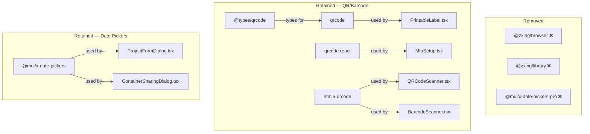

# Design Document

## Overview

Remove three unused npm packages from the frontend dependency tree:

| Package | Why Unused |
|---------|-----------|
| `@zxing/browser` | No imports anywhere in the codebase; `html5-qrcode` handles all scanning |
| `@zxing/library` | No imports anywhere in the codebase; transitive dep of `@zxing/browser` |
| `@mui/x-date-pickers-pro` | No imports; only `@mui/x-date-pickers` (non-pro) is used |

This is a mechanical cleanup — delete three lines from `frontend/package.json`, regenerate the lock file, and verify the build and tests still pass. No code changes, no new logic.

## Architecture

No architectural changes. The dependency graph narrows:

All changes are confined to:
- `frontend/package.json` — remove 3 dependency entries
- `frontend/package-lock.json` — regenerated by `npm install`

No source code files are modified.

## Components and Interfaces

No component or interface changes. The three removed packages have zero imports in the codebase, so removing them has no effect on any module.

## Data Models

No data model changes.

## Error Handling

No error handling changes. If `npm install` or the build fails after removal, the developer investigates before proceeding (per Requirement 5.3).

## Testing Strategy

Property-based testing does not apply to this feature. There are no functions, algorithms, parsers, or data transformations being added or changed. The entire feature is removing unused dependency declarations from `package.json`.

**Why PBT does not apply**: No code logic is being written or modified. The changes are purely declarative (removing lines from a JSON manifest) and verified by existing tooling (build, test suite).

### Verification Steps

1. **Build verification**: `npm run build` in `frontend/` must complete without errors (`tsc -b && vite build`)
2. **Test verification**: `npm test` in `frontend/` must pass with no new failures
3. **Retained dependency check**: Confirm `qrcode`, `@types/qrcode`, `qrcode.react`, and `html5-qrcode` remain in `package.json`
4. **Removed dependency check**: Confirm `@zxing/browser`, `@zxing/library`, and `@mui/x-date-pickers-pro` are absent from `package.json` dependencies

### Test Commands

- Frontend build: `npm run build` (in `frontend/` directory)
- Frontend tests: `npm test` (in `frontend/` directory)
