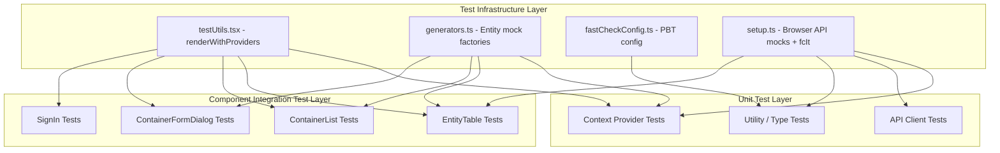

# Design Document: Frontend Test Coverage

## Overview

This design establishes comprehensive frontend test coverage for the most critical components, context providers, the API client, and shared type definitions. The current test suite has only 8 files — all bugfix regressions — and zero coverage of core user flows. This feature adds tests for the 6 highest-impact areas: `InventoryContext`, `NotificationContext`, `ApiClient`, `EntityTable`, `ContainerList`, `ContainerFormDialog`, `SignIn`, and shared entity types.

The approach builds on the existing Vitest + jsdom + @testing-library/react infrastructure and the `@fast-check/vitest` property-based testing setup already configured in the project. Tests will use a shared `renderWithProviders` helper (enhanced to wrap components in required context providers) and mock factories for entities and the API client, keeping individual test files focused on behavior rather than setup boilerplate.

## Architecture

The test architecture follows a layered strategy that mirrors the application's own layers:



**Key architectural decisions:**

1. **Enhanced `renderWithProviders`** — The existing helper renders components without context providers. It will be extended to wrap components in `NotificationProvider` and a mock `InventoryProvider` (with controllable state), since nearly every component under test depends on one or both.

2. **Module-level API client mocking** — Tests for components that import `apiClient` will use `vi.mock('../services/api')` at the module level. A reusable mock factory will return an object with all public methods stubbed as `vi.fn()`, matching the real `ApiClient` class signature.

3. **AWS Amplify mocking** — Both `InventoryContext` and `SignIn` depend on `aws-amplify/auth`. These will be mocked at the module level with `vi.mock('aws-amplify/auth')` to control authentication state without real Cognito calls.

4. **Property-based tests for type invariants** — The `@fast-check/vitest` integration (via `fcIt` from setup.ts) will be used for property tests on entity type constraints and EntityTable row rendering, with a minimum of 100 iterations per property.

## Components and Interfaces

### Test Infrastructure Enhancements

#### `renderWithProviders` (enhanced)

```typescript
// frontend/src/tests/testUtils.tsx
interface RenderWithProvidersOptions extends RenderOptions {
  inventoryContextValue?: Partial<InventoryContextType>;
  withNotificationProvider?: boolean;
  routerEntries?: string[];
}

function renderWithProviders(
  ui: ReactElement,
  options?: RenderWithProvidersOptions
): RenderResult & { notificationMocks: NotificationContextType }
```

Wraps the component under test in:
- `MemoryRouter` (with optional initial entries)
- `NotificationProvider` (real provider, so Snackbar/Dialog rendering can be asserted)
- A mock `InventoryContext.Provider` (with controllable `currentInventory`, `inventories`, `loadInventories`, `isLoading`)

Returns the standard `RenderResult` plus references to notification mock functions when using a mock notification provider.

#### Entity Mock Factories

```typescript
// frontend/src/tests/generators.ts (extended)
function createMockContainer(overrides?: Partial<Container>): Container
function createMockThing(overrides?: Partial<Thing>): Thing
function createMockLocation(overrides?: Partial<Location>): Location
function createMockRoom(overrides?: Partial<Room>): Room
function createMockInventory(overrides?: Partial<Inventory>): Inventory
```

Each factory returns a valid entity with sensible defaults (UUIDs, ISO dates, required fields). Callers can override any field.

#### API Client Mock Factory

```typescript
// frontend/src/tests/generators.ts (extended)
function createMockApiClient(): Record<string, vi.Mock>
```

Returns an object with every public method of `ApiClient` stubbed as `vi.fn()`. Used with `vi.mock('../services/api', () => ({ default: createMockApiClient() }))`.

### Test File Structure

| Test File | Location | Tests |
|---|---|---|
| `InventoryContext.test.tsx` | `frontend/src/tests/__tests__/` | Provider lifecycle, auth-dependent loading, default inventory creation, auto-select, hook error |
| `NotificationContext.test.tsx` | `frontend/src/tests/__tests__/` | showSuccess, showError (toast + modal), showInfo, clickaway behavior, hook error |
| `ApiClient.test.ts` | `frontend/src/tests/__tests__/` | Core CRUD methods, request/response interceptors, auth token injection, error handling |
| `ApiClientEntities.test.ts` | `frontend/src/tests/__tests__/` | Entity-specific methods: URL construction, query parameter passing |
| `EntityTable.test.tsx` | `frontend/src/components/__tests__/` | Column/row rendering, edit/delete actions, loading state, mobile layout, search filtering, property test for row count |
| `ContainerList.test.tsx` | `frontend/src/components/__tests__/` | Fetch on mount, add/edit/delete flows, success/error notifications |
| `ContainerFormDialog.test.tsx` | `frontend/src/components/__tests__/` | Create vs edit mode, validation, API calls, error display |
| `SignIn.test.tsx` | `frontend/src/components/__tests__/` | Credential submission, MFA challenges, password change, error display, loading state |
| `EntityTypes.property.test.ts` | `frontend/src/tests/__tests__/` | Property tests for ContainerStatus, HandlingFlag, ApiResponse, dateAdded invariants |

## Data Models

No new data models are introduced. Tests operate on the existing entity types defined in `frontend/src/types/entities.ts`:

- **Container** — Primary entity for container management tests. Key fields: `id`, `inventoryId`, `name`, `type`, `status`, `handlingFlags`, `itemCount`, `estimatedValue`, `qrCode`.
- **Inventory** — Used by InventoryContext tests. Key fields: `id`, `name`, `ownerId`, `createdAt`, `updatedAt`.
- **Thing, Location, Room** — Used in mock factories for components that reference related entities.
- **ApiResponse\<T\>** — The standard API response wrapper. Property tests verify the `success`/`data` relationship.
- **ContainerStatus, HandlingFlag, ContainerType** — `as const` enum objects. Property tests verify values stay within defined sets.

## Correctness Properties

*A property is a characteristic or behavior that should hold true across all valid executions of a system — essentially, a formal statement about what the system should do. Properties serve as the bridge between human-readable specifications and machine-verifiable correctness guarantees.*

### Property 1: Notification rendering preserves severity and message

*For any* notification severity ("success", "error", "info") and *for any* non-empty message string, calling the corresponding show method on the NotificationProvider SHALL render a Snackbar containing that exact message with the correct severity.

**Validates: Requirements 3.1, 3.2, 3.4**

### Property 2: Successful API response data extraction

*For any* API response with `success: true` and a `data` field, *for any* CRUD method (get, post, put), the ApiClient SHALL return the `data` value unchanged.

**Validates: Requirements 4.1, 4.5**

### Property 3: Failed API response error propagation

*For any* API response with `success: false` and an `error` message string, *for any* CRUD method (get, put), the ApiClient SHALL throw an Error whose message matches the response's `error` value.

**Validates: Requirements 4.2, 4.6**

### Property 4: EntityTable row count invariant

*For any* array of valid column definitions and *for any* array of row data objects, the EntityTable SHALL render exactly `data.length` rows in the DataGrid.

**Validates: Requirements 6.7**

### Property 5: EntityTable search filtering correctness

*For any* dataset and *for any* search term that is a substring of at least one row's column value, the EntityTable SHALL display only rows where at least one column value contains the search term (case-insensitive).

**Validates: Requirements 6.6**

### Property 6: ContainerStatus value membership

*For any* value drawn from the `ContainerStatus` const object, that value SHALL be one of: "empty", "packing", "packed", "in_transit", "stored", "unpacking", "unpacked".

**Validates: Requirements 10.1**

### Property 7: HandlingFlag value membership

*For any* array of values drawn from the `HandlingFlag` const object, every element SHALL be one of: "fragile", "heavy", "valuable", "priority", "keep_upright", "temperature_sensitive".

**Validates: Requirements 10.2**

### Property 8: ApiResponse success implies data is defined

*For any* `ApiResponse<T>` object where `success` is `true`, the `data` field SHALL be defined (not `undefined`).

**Validates: Requirements 10.3**

### Property 9: Entity dateAdded ISO 8601 validity

*For any* entity object (Thing, Location, Room, Category, Person) with a `dateAdded` field, the `dateAdded` value SHALL be a valid ISO 8601 string that parses to a valid Date.

**Validates: Requirements 10.4**

## Error Handling

### Test Infrastructure Errors

- **Missing context provider**: If a component under test requires a context provider not included in `renderWithProviders`, the test will fail with a clear error from the context hook (e.g., "useInventory must be used within an InventoryProvider"). This is by design — tests for Requirements 2.5 and 3.5 explicitly verify this behavior.
- **Mock factory type drift**: If the real `ApiClient` adds new public methods, the mock factory will be missing them. Tests that call unmocked methods will fail with "not a function" errors. The mock factory should be updated when the API client changes.

### Component Error Handling Under Test

- **API client errors**: Components like `ContainerList` and `ContainerFormDialog` catch API errors and display them via `showError`. Tests verify both the success path (showSuccess called) and the error path (showError called with the error message).
- **Authentication errors**: The `ApiClient` response interceptor handles 401 by calling `signOut` and the `authErrorCallback`. Tests verify this chain fires correctly.
- **Network errors**: The `ApiClient` response interceptor converts missing-response errors to "Network error - please check your connection". Tests verify this specific message.
- **Form validation errors**: `ContainerFormDialog` validates required fields (name) and format constraints (hex color, numeric weight/storageRate, contentsSummary length). Tests verify validation messages appear and submission is blocked.
- **Auth challenge errors**: `SignIn` handles various Amplify error types (`NotAuthorizedException`, `UserNotConfirmedException`, etc.) with user-friendly messages. Tests verify the error-to-message mapping.

## Testing Strategy

### Dual Testing Approach

This feature uses both example-based unit tests and property-based tests:

- **Example-based tests** cover specific user interactions, component lifecycle events, error scenarios, and integration points between components and the API client. These form the bulk of the test suite.
- **Property-based tests** verify universal invariants that should hold across all valid inputs — notification rendering, API response handling, EntityTable row rendering, type constraints, and search filtering.

### Property-Based Testing Configuration

- **Library**: `@fast-check/vitest` (already installed), using `fcIt` exported from `frontend/src/tests/setup.ts`
- **Minimum iterations**: 100 per property test (configured in `frontend/src/tests/fastCheckConfig.ts`)
- **Timeout**: 10 seconds per test (configured in `frontend/vitest.config.ts`)
- **Tag format**: Each property test includes a comment referencing its design property:
  ```typescript
  // Feature: frontend-test-coverage, Property 1: Notification rendering preserves severity and message
  ```

### Test Organization

| Category | Files | Approach |
|---|---|---|
| Context providers | `InventoryContext.test.tsx`, `NotificationContext.test.tsx` | Example-based + 1 property test for notifications |
| API client | `ApiClient.test.ts`, `ApiClientEntities.test.ts` | Example-based + 2 property tests for response handling |
| Components | `EntityTable.test.tsx`, `ContainerList.test.tsx`, `ContainerFormDialog.test.tsx`, `SignIn.test.tsx` | Example-based + 2 property tests for EntityTable |
| Type invariants | `EntityTypes.property.test.ts` | Property-based only (4 property tests) |

### Mocking Strategy

- **`aws-amplify/auth`**: Mocked at module level with `vi.mock('aws-amplify/auth')`. Controls `signIn`, `confirmSignIn`, `signOut`, `fetchAuthSession`, `getCurrentUser`.
- **`aws-amplify/utils`**: Mocked to provide a controllable `Hub.listen` for auth event simulation.
- **`../services/api`**: Mocked at module level. The default export is replaced with the mock factory object. Individual test cases configure return values via `mockResolvedValue` / `mockRejectedValue`.
- **`react-router-dom`**: `useNavigate` is mocked to verify navigation calls in `SignIn` tests.
- **`useMediaQuery`**: Mocked to control mobile/desktop breakpoint behavior in `EntityTable` tests.
- **`axios`**: For `ApiClient` tests, axios is mocked at the module level to intercept HTTP calls and verify URL construction, headers, and payloads.

### Running Tests

```bash
cd frontend
npm test
```

This runs `vitest --run` which executes all test files in a single pass (no watch mode).

