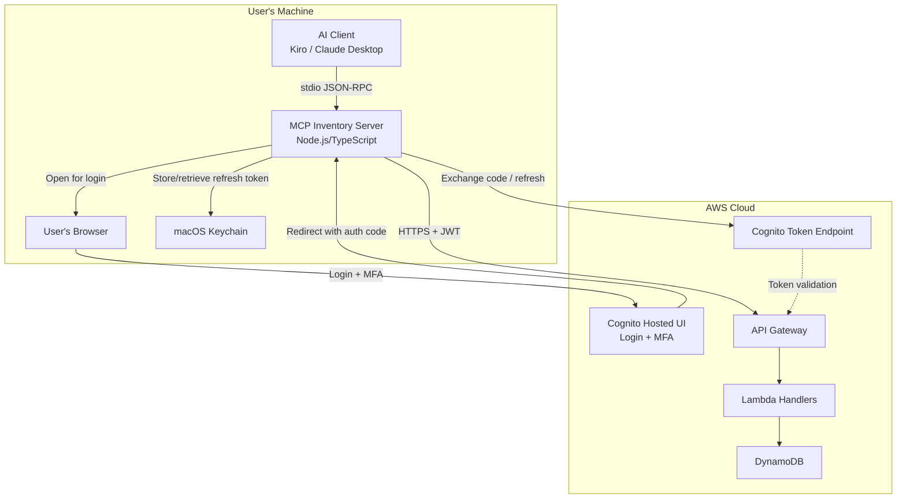
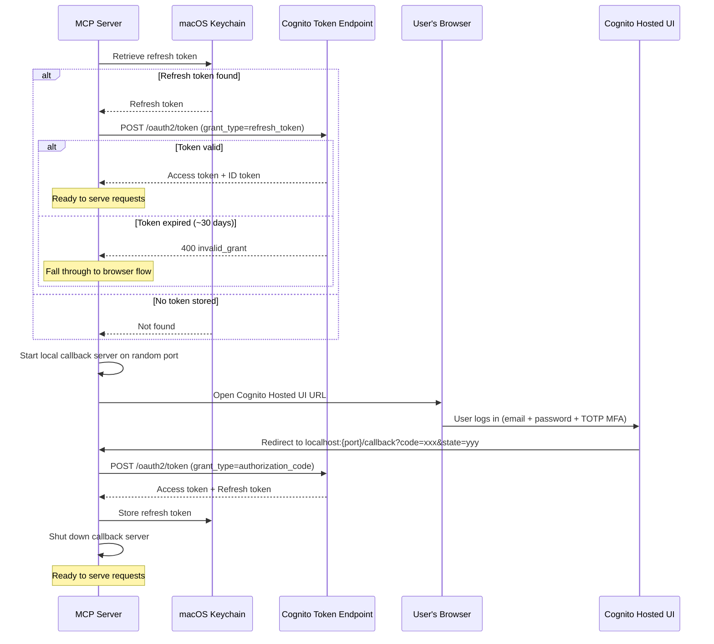
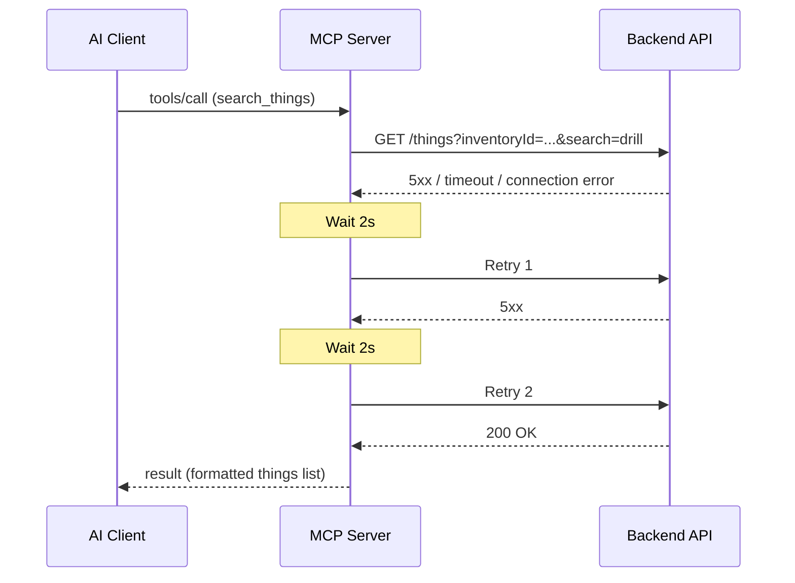

# Design Document: MCP Inventory Server

## Overview

The MCP Inventory Server is a standalone Node.js/TypeScript process that exposes the WheresMyStuff backend REST API as MCP (Model Context Protocol) tools. It communicates with AI clients (Kiro, Claude Desktop) over stdio transport and translates natural language-friendly tool calls into authenticated HTTP requests against the existing backend API.

The server runs locally on the user's machine, authenticates via browser-based OAuth (Cognito Hosted UI with MFA support), stores refresh tokens securely in the macOS Keychain, and provides intelligent name resolution so users can refer to items, locations, and rooms by approximate names rather than UUIDs.

### Key Design Decisions

1. **TypeScript for the MCP server** — The MCP server is a new standalone package (not part of the existing backend). TypeScript provides type safety for the MCP protocol schema definitions and tool input validation, which is critical for correct JSON-RPC handling.

2. **Wrap existing API rather than direct DB access** — The MCP server acts as an API client, not a direct DynamoDB consumer. This preserves the backend's authorization model, audit logging, rate limiting, and validation without duplication.

3. **Browser-based OAuth with Cognito Hosted UI** — Rather than storing static JWT tokens in config files, the server uses the OAuth Authorization Code flow with the Cognito Hosted UI. This leverages the same login flow as the web app (email + password + TOTP MFA), avoids storing passwords in plaintext, and provides automatic token refresh via securely stored refresh tokens.

4. **macOS Keychain for token storage** — Refresh tokens are stored in the macOS Keychain rather than plaintext files. This provides OS-level encryption, access control, and prevents credential leakage through config files or environment variables.

5. **In-process entity cache for name resolution** — Locations, rooms, and categories are cached in memory for the lifetime of the server process to enable fast fuzzy name matching without repeated API calls.

6. **Single inventory scope** — The server is configured with one inventory ID via environment variable, simplifying every tool call (no need to specify inventory context per-request).

## Architecture



### Data Flow

#### Startup Authentication Flow



#### Tool Invocation Data Flow

1. AI Client sends a JSON-RPC `tools/call` message over stdin (e.g., `search_things` with query "drill")
2. MCP Server parses the message, validates tool inputs against the registered schema
3. MCP Server resolves any names to IDs using the in-memory entity cache (fetching from API if cache is empty)
4. MCP Server makes authenticated HTTPS request(s) to the Backend API with the current access token as Bearer token
5. If the API returns 401, the AuthManager silently refreshes the access token and retries the request
6. MCP Server formats the API response into human-readable text content
7. MCP Server writes the JSON-RPC response to stdout

### Retry and Error Flow



## Components and Interfaces

### File Structure

```
mcp-server/
├── package.json
├── tsconfig.json
├── src/
│   ├── index.ts              # Entry point, server initialization
│   ├── server.ts             # MCP server setup, tool registration
│   ├── config.ts             # Environment variable loading and validation
│   ├── auth-manager.ts       # OAuth flow, token refresh, Keychain storage
│   ├── api-client.ts         # HTTP client for Backend API
│   ├── name-resolver.ts      # Entity cache + fuzzy name matching
│   ├── formatters.ts         # Response formatting (API data → text)
│   └── tools/
│       ├── search-things.ts
│       ├── get-things-in-location.ts
│       ├── create-thing.ts
│       ├── update-thing.ts
│       ├── move-thing.ts
│       ├── delete-thing.ts
│       ├── list-locations.ts
│       ├── list-rooms.ts
│       ├── list-categories.ts
│       ├── get-things-by-category.ts
│       ├── list-containers.ts
│       ├── get-container-contents.ts
│       └── find-thing-container.ts
├── tests/
│   ├── auth-manager.test.ts
│   ├── name-resolver.test.ts
│   ├── formatters.test.ts
│   ├── api-client.test.ts
│   └── tools/
│       └── *.test.ts
└── mcp.json                  # Configuration example for AI clients
```

### Component: Config (`src/config.ts`)

Responsible for reading and validating environment variables at startup. No secrets are stored in config — only non-sensitive identifiers and URLs.

```typescript
interface ServerConfig {
  apiUrl: string;           // WHERESMYSTUFF_API_URL
  userPoolId: string;       // WHERESMYSTUFF_USER_POOL_ID
  clientId: string;         // WHERESMYSTUFF_CLIENT_ID
  cognitoDomain: string;    // WHERESMYSTUFF_COGNITO_DOMAIN (e.g., wheresmystuff.auth.eu-west-1.amazoncognito.com)
  inventoryId: string;      // WHERESMYSTUFF_INVENTORY_ID
  region: string;           // WHERESMYSTUFF_REGION (e.g., eu-west-1)
}

function loadConfig(): ServerConfig;
// Throws with descriptive stderr message and exits non-zero if any required var is missing
```

### Component: AuthManager (`src/auth-manager.ts`)

Manages the full OAuth token lifecycle: Keychain retrieval, token refresh, browser-based login, and secure storage.

```typescript
interface AuthTokens {
  accessToken: string;
  idToken: string;
  refreshToken: string;
  expiresAt: number;        // Unix timestamp when access token expires
}

interface AuthManagerOptions {
  clientId: string;
  cognitoDomain: string;    // Full domain, e.g., wheresmystuff.auth.eu-west-1.amazoncognito.com
  region: string;
  loginTimeoutMs?: number;  // Default: 120000 (2 minutes)
}

class AuthManager {
  constructor(options: AuthManagerOptions);

  // Main entry point — resolves to a valid access token
  // Tries: 1) cached in-memory token, 2) refresh via Keychain token, 3) browser login
  async getAccessToken(): Promise<string>;

  // Force a refresh (called on 401 response)
  async refreshAccessToken(): Promise<string>;

  // Full browser-based OAuth flow
  private async performBrowserLogin(): Promise<AuthTokens>;

  // Exchange refresh token for new access token
  private async exchangeRefreshToken(refreshToken: string): Promise<AuthTokens>;

  // Exchange authorization code for tokens
  private async exchangeAuthorizationCode(code: string, redirectUri: string): Promise<AuthTokens>;

  // Keychain operations (using keytar or keychain-access package)
  private async getStoredRefreshToken(): Promise<string | null>;
  private async storeRefreshToken(token: string): Promise<void>;
  private async deleteStoredRefreshToken(): Promise<void>;
}
```

**Keychain storage details:**
- Service name: `wheresmystuff-mcp-{clientId}` (supports multiple configurations)
- Account name: `refresh-token`
- Uses the `keytar` package for cross-platform Keychain access (macOS Keychain Services)

**Browser login flow:**
1. Generate a cryptographically random `state` parameter (32 bytes, hex-encoded)
2. Start a temporary HTTP server on `localhost` with a random available port
3. Construct the Cognito Hosted UI URL: `https://{cognitoDomain}/oauth2/authorize?response_type=code&client_id={clientId}&redirect_uri=http://localhost:{port}/callback&scope=openid+email+profile&state={state}`
4. Open the URL in the user's default browser via `open` (macOS)
5. Wait for the callback request (GET `/callback?code=...&state=...`)
6. Validate the `state` parameter matches the original
7. Exchange the `code` for tokens via POST to `https://{cognitoDomain}/oauth2/token`
8. Store refresh token in Keychain, shut down the callback server
9. If no callback received within 120 seconds, timeout and exit

**Token refresh flow:**
1. POST to `https://{cognitoDomain}/oauth2/token` with `grant_type=refresh_token`, `client_id`, `refresh_token`
2. On success: update in-memory access token, update expiry
3. On `invalid_grant` error: delete stored refresh token from Keychain, fall through to browser login

### Component: ApiClient (`src/api-client.ts`)

HTTP client that wraps all communication with the Backend API. Gets access tokens from the AuthManager on each request (enabling transparent token refresh).

```typescript
interface ApiClientOptions {
  baseUrl: string;
  authManager: AuthManager;
  timeout?: number;       // Default: 30000ms
  maxRetries?: number;    // Default: 2
  retryDelay?: number;    // Default: 2000ms
}

class ApiClient {
  constructor(options: ApiClientOptions);

  // Core HTTP methods with retry logic and automatic token refresh on 401
  get<T>(path: string, params?: Record<string, string>): Promise<T>;
  post<T>(path: string, body: unknown): Promise<T>;
  put<T>(path: string, body: unknown): Promise<T>;
  delete<T>(path: string, params?: Record<string, string>): Promise<T>;
}
```

**Retry behavior:**
- Retries on 5xx, connection refused, DNS failure, timeout
- Up to 2 additional attempts with 2s delay between
- Does NOT retry on 4xx (client errors) — except 401 which triggers token refresh then one retry

**401 handling:**
- On first 401 response, call `authManager.refreshAccessToken()` and retry the request once
- If the refresh succeeds and the retry succeeds, return normally
- If the refresh fails (refresh token expired), return error indicating re-authentication needed

**Error mapping:**
- 401 → Attempt token refresh; if refresh fails: "Session expired, please re-authenticate"
- 403 → "Access denied to this resource"
- 404 → "Resource not found"
- 429 → "Rate limited, retry after {seconds}s"
- 5xx after retries → "Server communication problem"

### Component: NameResolver (`src/name-resolver.ts`)

Maintains an in-memory cache of locations, rooms, and categories for the server's lifetime. Provides name-to-ID resolution with fuzzy matching.

```typescript
interface ResolvedEntity {
  id: string;
  name: string;
  type: 'location' | 'room' | 'category' | 'container' | 'thing';
  parentName?: string;  // For rooms: parent location name
}

interface ResolutionResult {
  status: 'exact' | 'multiple' | 'not_found';
  match?: ResolvedEntity;
  candidates?: ResolvedEntity[];  // Up to 10 candidates
}

class NameResolver {
  constructor(apiClient: ApiClient, inventoryId: string);

  // Lazy-loads cache on first call; retries on failure
  resolveLocation(name: string): Promise<ResolutionResult>;
  resolveRoom(name: string): Promise<ResolutionResult>;
  resolveCategory(name: string): Promise<ResolutionResult>;
  resolveContainer(name: string): Promise<ResolutionResult>;
  resolveThing(name: string): Promise<ResolutionResult>;

  // Force refresh (useful if data changes during session)
  invalidateCache(): void;
}
```

**Resolution algorithm:**
1. Case-insensitive exact match against cached entity names
2. If no exact match: case-insensitive substring match
3. Return up to 10 candidates sorted by relevance (exact prefix matches first, then substring matches)

### Component: Formatters (`src/formatters.ts`)

Converts API response objects into human-readable text for the AI client.

```typescript
function formatThingsList(things: Thing[], locations: Map<string, string>, rooms: Map<string, string>, categories: Map<string, string>): string;
function formatLocationsList(locations: Location[]): string;
function formatRoomsList(rooms: Room[], locations: Map<string, string>): string;
function formatCategoriesList(categories: Category[]): string;
function formatContainersList(containers: Container[]): string;
function formatContainerContents(container: Container, items: Thing[]): string;
function formatResolutionCandidates(candidates: ResolvedEntity[]): string;
```

### Component: Tool Handlers (`src/tools/*.ts`)

Each tool handler file exports a tool definition and handler function:

```typescript
interface ToolDefinition {
  name: string;
  description: string;
  inputSchema: object;  // JSON Schema
}

type ToolHandler = (args: Record<string, unknown>) => Promise<{
  content: Array<{ type: 'text'; text: string }>;
  isError?: boolean;
}>;
```

### MCP Tool Schemas

| Tool | Parameters | Description |
|------|-----------|-------------|
| `search_things` | `query?: string`, `tags?: string[]` | Search things by text and/or tags |
| `get_things_in_location` | `name: string` | Get things in a location or room |
| `create_thing` | `name: string`, `location?: string`, `room?: string`, `category?: string`, `description?: string`, `tags?: string[]` | Create a new thing |
| `update_thing` | `thing: string`, `location?: string`, `room?: string`, `category?: string`, `description?: string`, `tags?: string[]`, `notes?: string`, `condition?: string`, `value?: number`, `make?: string`, `model?: string`, `brand?: string` | Update an existing thing |
| `move_thing` | `thing: string`, `destination: string` | Move a thing to a new location/room |
| `delete_thing` | `thing: string` | Delete a thing from inventory |
| `list_locations` | (none) | List all locations |
| `list_rooms` | `location?: string` | List rooms, optionally filtered by location |
| `list_categories` | (none) | List all categories |
| `get_things_by_category` | `category: string` | Get things in a category |
| `list_containers` | (none) | List all containers |
| `get_container_contents` | `container: string` | Get items in a container |
| `find_thing_container` | `thing: string` | Find which container holds a thing |

## Data Models

### Internal Types (used within the MCP server)

```typescript
// Mirrors the backend Thing entity, subset of fields relevant to MCP responses
interface ThingRecord {
  id: string;
  name: string;
  description?: string;
  locationId?: string;
  roomId?: string;
  categoryId?: string;
  containerId?: string;
  tags?: string[];
  notes?: string;
  condition?: string;
  purchasePrice?: number;
  make?: string;
  model?: string;
  brand?: string;
  inventoryId: string;
}

interface LocationRecord {
  id: string;
  name: string;
  description?: string;
  type?: string;
}

interface RoomRecord {
  id: string;
  name: string;
  locationId: string;
}

interface CategoryRecord {
  id: string;
  name: string;
  description?: string;
}

interface ContainerRecord {
  id: string;
  name: string;
  status: string;
  itemCount: number;
  estimatedValue: number;
  locationId?: string;
  type?: string;
}
```

### Configuration File (`mcp.json`)

No secrets are stored in this file — only non-sensitive identifiers and URLs. Authentication is handled interactively via browser login, with refresh tokens stored in the macOS Keychain.

```json
{
  "mcpServers": {
    "wheresmystuff": {
      "command": "node",
      "args": ["./mcp-server/dist/index.js"],
      "env": {
        "WHERESMYSTUFF_API_URL": "https://api.wheresmystuff.example.com",
        "WHERESMYSTUFF_USER_POOL_ID": "eu-west-1_xxxxxxxxx",
        "WHERESMYSTUFF_CLIENT_ID": "xxxxxxxxxxxxxxxxxxxxxxxxxx",
        "WHERESMYSTUFF_COGNITO_DOMAIN": "wheresmystuff.auth.eu-west-1.amazoncognito.com",
        "WHERESMYSTUFF_INVENTORY_ID": "<your-inventory-uuid>",
        "WHERESMYSTUFF_REGION": "eu-west-1"
      }
    }
  }
}
```

### API Response Envelope

The Backend API returns responses in this envelope:

```typescript
interface ApiResponse<T> {
  success: boolean;
  data?: T;
  error?: string;
}
```

The ApiClient unwraps this envelope, returning `data` on success or throwing a typed error on failure.


## Infrastructure Changes

The following CloudFormation resources need to be added or updated to support the OAuth browser login flow:

### New Resource: Cognito User Pool Domain

```yaml
UserPoolDomain:
  Type: AWS::Cognito::UserPoolDomain
  Properties:
    Domain: !Sub wheresmystuff-${Environment}
    UserPoolId: !Ref UserPool
```

This creates the Hosted UI at `https://wheresmystuff-{env}.auth.{region}.amazoncognito.com`.

### Updated Resource: UserPoolClient

Add OAuth settings to the existing `UserPoolClient` resource:

```yaml
UserPoolClient:
  Type: AWS::Cognito::UserPoolClient
  Properties:
    ClientName: !Sub home-inv-client-${Environment}
    UserPoolId: !Ref UserPool
    GenerateSecret: false
    ExplicitAuthFlows:
      - ALLOW_USER_PASSWORD_AUTH
      - ALLOW_USER_SRP_AUTH
      - ALLOW_REFRESH_TOKEN_AUTH
    PreventUserExistenceErrors: ENABLED
    # OAuth settings for MCP server browser login
    AllowedOAuthFlows:
      - code
    AllowedOAuthFlowsUserPoolClient: true
    AllowedOAuthScopes:
      - openid
      - email
      - profile
    CallbackURLs:
      - http://localhost/callback
    SupportedIdentityProviders:
      - COGNITO
```

**Notes:**
- `GenerateSecret: false` — Required for public clients (no client secret in the MCP server)
- `CallbackURLs` uses `http://localhost/callback` — Cognito allows localhost without HTTPS for development/desktop apps. The actual port is dynamic but Cognito validates only the scheme+host+path prefix.
- `AllowedOAuthFlows: [code]` — Authorization Code flow only (no implicit grant)
- The existing `ExplicitAuthFlows` are preserved for the web app's direct Cognito SDK usage

## Correctness Properties

*A property is a characteristic or behavior that should hold true across all valid executions of a system — essentially, a formal statement about what the system should do. Properties serve as the bridge between human-readable specifications and machine-verifiable correctness guarantees.*

### Property 1: Case-insensitive name resolution

*For any* entity (location, room, category, container, or thing) with name N in the inventory, and *for any* case variation of N (uppercase, lowercase, mixed case), the name resolver SHALL resolve to the same entity ID.

**Validates: Requirements 5.2, 5.3, 5.4, 6.2, 10.3, 11.2, 13.1**

### Property 2: Substring matching returns candidates capped at 10

*For any* set of entities and *for any* query string that is a substring of one or more entity names, the name resolver SHALL return those entities as candidates, and the number of returned candidates SHALL never exceed 10.

**Validates: Requirements 13.2, 13.3**

### Property 3: Disambiguation returns all matching entities

*For any* name resolution that matches multiple entities (2 or more, up to 10), the response SHALL include every matching entity's name, ID, and type, and the server SHALL NOT perform any mutating operation.

**Validates: Requirements 4.3, 5.6, 6.3, 7.3, 11.3**

### Property 4: Authorization header present on all API requests

*For any* tool invocation that results in one or more HTTP requests to the Backend API, every request SHALL include an Authorization header with value `Bearer <access_token>` where `access_token` is a valid token obtained from the AuthManager.

**Validates: Requirements 2.18**

### Property 5: Token refresh on 401

*For any* Backend API request that receives a 401 response, the AuthManager SHALL attempt to refresh the access token using the stored refresh token before the request is retried. If the refresh succeeds, the retried request SHALL use the new access token.

**Validates: Requirements 2.19**

### Property 6: No secrets in plaintext files

*For any* server configuration, the mcp.json file and environment variables SHALL NOT contain passwords, access tokens, refresh tokens, or client secrets. Only non-sensitive identifiers (pool IDs, client IDs, domains, URLs, regions) are stored in configuration.

**Validates: Requirements 2.21**

### Property 7: Retry on server errors

*For any* Backend API request that receives a 5xx response, connection timeout, or connection refusal, the system SHALL make up to 2 additional retry attempts (3 total) with at least a 2-second delay between attempts before returning an error.

**Validates: Requirements 12.5, 12.6**

### Property 8: Thing list formatting includes required fields

*For any* non-empty list of things returned by the Backend API, the formatted text output SHALL contain each thing's name, and for each thing that has a locationId, roomId, categoryId, or tags, the formatted output SHALL include the resolved location name, room name, category name, and tag list respectively.

**Validates: Requirements 3.6, 9.4**

### Property 9: Update merges existing data with changes

*For any* existing thing record and *for any* non-empty subset of updatable fields, the PUT request body sent to the Backend API SHALL contain the original values for all fields NOT in the update subset, and the new values for all fields IN the update subset.

**Validates: Requirements 6.4**

### Property 10: Move correctly updates IDs based on destination type

*For any* move operation where the destination resolves to a room, the update SHALL set `roomId` to the room's ID and `locationId` to the room's parent location ID. *For any* move operation where the destination resolves to a location (not a room), the update SHALL set `locationId` to the location's ID and set `roomId` to null/undefined.

**Validates: Requirements 7.4, 7.5**

### Property 11: Unexpected error responses include status code but not body

*For any* Backend API response with an HTTP status code not in {200, 201, 401, 403, 404, 429, 5xx}, the error message returned to the AI client SHALL include the numeric status code and SHALL NOT contain any content from the response body.

**Validates: Requirements 12.7**

### Property 12: stdout contains only valid protocol messages

*For any* sequence of tool invocations (valid or invalid), all data written to stdout by the MCP server SHALL be valid JSON-RPC 2.0 messages, and no diagnostic or log text SHALL appear on stdout.

**Validates: Requirements 1.5**

## Error Handling

### Error Categories and Responses

| Error Source | HTTP Status | User-Facing Message | Action |
|---|---|---|---|
| Missing env var | N/A (startup) | "[VAR_NAME] is required" → stderr | Exit code 1 |
| Auth failure (after refresh attempt) | 401 | "Session expired. Please re-authenticate by restarting the server." | Return isError response |
| Access denied | 403 | "You don't have access to this resource." | Return isError response |
| Not found | 404 | "The requested [entity type] was not found." | Return isError response |
| Rate limited | 429 | "Rate limited. Please retry after {N} seconds." | Return isError response |
| Server error | 5xx | "Unable to reach the inventory server. Please try again later." | Retry 2x, then return isError |
| Timeout | N/A | (treated as server error) | Retry 2x, then return isError |
| Validation error | 400 | "Validation failed: {field}: {reason}" | Return isError response |
| Name not resolved | N/A | "Could not find [type] matching '[name]'. Did you mean: ..." | Return suggestions |
| Ambiguous name | N/A | "Multiple matches found for '[name]': ..." | Return candidates list |
| Login timeout | N/A | "Browser login timed out after 120s" → stderr | Exit code 1 |
| OAuth state mismatch | N/A | "Security error: OAuth state mismatch" → stderr | Exit code 1 |

### Error Response Format

All tool errors are returned as MCP tool results with `isError: true`:

```typescript
{
  content: [{ type: 'text', text: 'Error message here' }],
  isError: true
}
```

### Security Considerations

- No passwords, client secrets, or tokens are stored in plaintext files or environment variables
- Refresh tokens are stored in the macOS Keychain with OS-level encryption and access control
- The OAuth state parameter is cryptographically random (32 bytes) to prevent CSRF attacks
- The callback server binds only to localhost, preventing external access
- The callback server is shut down immediately after receiving the authorization code
- Access tokens are held only in memory and never persisted to disk
- Response bodies from unexpected API errors are NOT forwarded to the AI client (prevents information leakage)
- The server validates tool input schemas before making any API calls
- No secrets are written to stdout or included in MCP protocol messages
- The `mcp.json` configuration contains only non-sensitive identifiers (pool IDs, client IDs, domains)

## Testing Strategy

### Unit Tests (Vitest)

Unit tests cover specific examples, edge cases, and error conditions:

- **Config loading**: Missing env vars produce correct error messages and exit codes
- **Error mapping**: Each HTTP status code maps to the correct error message
- **Tool input validation**: Invalid inputs (empty names, oversized queries) are rejected
- **Edge cases**: Empty results, single match vs multiple matches, empty containers
- **Formatter output**: Specific formatting examples with known inputs

### Property-Based Tests (fast-check via Vitest)

Property-based tests verify universal properties across randomized inputs. The MCP server uses `fast-check` integrated with Vitest.

**Configuration:**
- Minimum 100 iterations per property test
- Each property test references its design document property number
- Tag format: `Feature: mcp-inventory-server, Property {N}: {title}`

**Properties to implement:**

1. **Name resolution is case-insensitive** — Generate random entity names, vary case, verify same ID is returned
2. **Substring matching cap** — Generate entity lists of varying size, verify at most 10 candidates returned
3. **Disambiguation completeness** — Generate multi-match scenarios, verify all matches appear
4. **Auth header invariant** — Generate random tool calls, verify Bearer header on all outgoing requests
5. **Retry behavior** — Generate random 5xx responses, verify exactly 3 attempts with delays
6. **Thing formatting completeness** — Generate random thing records, verify all present fields appear in output
7. **Update data merge** — Generate random existing records and update subsets, verify correct merge
8. **Move ID assignment** — Generate random room/location destinations, verify correct ID updates
9. **Error sanitization** — Generate random status codes and response bodies, verify body is not leaked
10. **stdout protocol compliance** — Generate random tool calls, verify all stdout output is valid JSON-RPC

### Integration Tests

Integration tests verify end-to-end behavior with a running server process:

- Server startup and tool registration
- Full tool invocation flow (stdin → process → stdout)
- Cache behavior (API called once for repeated resolutions)
- Graceful handling of API unavailability during cache population

### Test Dependencies

```json
{
  "dependencies": {
    "keytar": "^7.9.0",
    "open": "^10.0.0"
  },
  "devDependencies": {
    "vitest": "^3.0.0",
    "fast-check": "^4.0.0",
    "@fast-check/vitest": "^0.2.0",
    "nock": "^14.0.0"
  }
}
```

- `keytar` — macOS Keychain access for secure refresh token storage
- `open` — Opens URLs in the user's default browser
- `vitest` — Test runner
- `fast-check` / `@fast-check/vitest` — Property-based testing
- `nock` — HTTP request mocking for API client and OAuth endpoint tests
