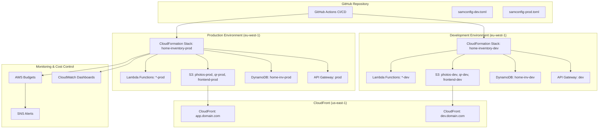

# Design Document

## Overview

This design document outlines a cost-effective production deployment system that creates a separate production environment alongside the existing development environment. The solution leverages AWS free tier services, GitHub Actions for CI/CD, and implements aggressive cost containment measures to keep monthly costs under $50.

The design focuses on:
- **Environment Isolation**: Complete separation between dev and prod using CloudFormation parameters
- **Cost Optimization**: Maximum use of free tier services with automatic cost containment
- **Simple Operations**: Manual processes where automation would be expensive
- **Data Protection**: Built-in AWS features for backup and recovery
- **GitHub Actions CI/CD**: Free automated deployments with environment protection

## Architecture

### Multi-Environment Architecture



### Environment Separation Strategy

**Resource Naming Convention:**
- Development: `home-inv-{service}-dev`
- Production: `home-inv-{service}-prod`

**Stack Separation:**
- Development Stack: `home-inventory-system-dev`
- Production Stack: `home-inventory-system-prod`
- CloudFront Dev: `home-inventory-cloudfront-dev`
- CloudFront Prod: `home-inventory-cloudfront-prod`

## Components and Interfaces

### 1. GitHub Actions CI/CD Pipeline

**Workflow Structure:**
```yaml
# .github/workflows/deploy.yml
name: Deploy Home Inventory System
on:
  push:
    branches: [main]
  workflow_dispatch:
    inputs:
      environment:
        description: 'Environment to deploy'
        required: true
        default: 'dev'
        type: choice
        options:
        - dev
        - prod
```

**Pipeline Stages:**
1. **Validation**: Lint, test, security scan
2. **Build**: SAM build and package
3. **Deploy Dev**: Automatic deployment to development
4. **Integration Tests**: Smoke tests against dev environment
5. **Deploy Prod**: Manual approval required for production
6. **Production Tests**: Health checks and smoke tests

**Environment Protection:**
- Production deployments require manual approval
- Required reviewers for production changes
- Deployment windows (e.g., business hours only)

### 2. Infrastructure as Code

**CloudFormation Template Structure:**
```yaml
# template.yaml (enhanced)
Parameters:
  Environment:
    Type: String
    AllowedValues: [dev, prod]
    Default: dev
  
  EnableDeletionProtection:
    Type: String
    AllowedValues: [true, false]
    Default: false
  
  LogRetentionDays:
    Type: Number
    Default: 7
    AllowedValues: [1, 3, 5, 7, 14, 30]

Conditions:
  IsProduction: !Equals [!Ref Environment, prod]
  EnableProtection: !Equals [!Ref EnableDeletionProtection, true]

Resources:
  # DynamoDB with conditional deletion protection
  InventoryTable:
    Type: AWS::DynamoDB::Table
    DeletionPolicy: !If [IsProduction, Retain, Delete]
    UpdateReplacePolicy: !If [IsProduction, Retain, Delete]
    Properties:
      DeletionProtectionEnabled: !If [IsProduction, true, false]
      PointInTimeRecoverySpecification:
        PointInTimeRecoveryEnabled: !If [IsProduction, true, false]
```

**Configuration Files:**
- `samconfig-dev.toml`: Development environment parameters
- `samconfig-prod.toml`: Production environment parameters with protection enabled

### 3. Cost Management System

**AWS Budgets Configuration:**
```yaml
# Cost budget with alerts
CostBudget:
  Type: AWS::Budgets::Budget
  Properties:
    Budget:
      BudgetName: !Sub home-inventory-${Environment}
      BudgetLimit:
        Amount: !If [IsProduction, 30, 20]  # $30 prod, $20 dev
        Unit: USD
      TimeUnit: MONTHLY
    NotificationsWithSubscribers:
      - Notification:
          NotificationType: FORECASTED
          ComparisonOperator: GREATER_THAN
          Threshold: 80
        Subscribers:
          - SubscriptionType: EMAIL
            Address: admin@example.com
```

**S3 Lifecycle Policies:**
```yaml
# Automatic cost optimization
LifecycleConfiguration:
  Rules:
    - Id: OptimizeStorage
      Status: Enabled
      Transitions:
        - TransitionInDays: 30
          StorageClass: STANDARD_IA
        - TransitionInDays: 90
          StorageClass: GLACIER
    - Id: DeleteOldLogs
      Status: Enabled
      Prefix: logs/
      ExpirationInDays: !Ref LogRetentionDays
```

### 4. Monitoring and Alerting

**CloudWatch Dashboard:**
```json
{
  "widgets": [
    {
      "type": "metric",
      "properties": {
        "title": "Cost Tracking",
        "metrics": [
          ["AWS/Billing", "EstimatedCharges", "Currency", "USD"]
        ]
      }
    },
    {
      "type": "metric", 
      "properties": {
        "title": "Free Tier Usage",
        "metrics": [
          ["AWS/Lambda", "Invocations"],
          ["AWS/DynamoDB", "ConsumedReadCapacityUnits"],
          ["AWS/S3", "NumberOfObjects"]
        ]
      }
    }
  ]
}
```

**Cost Alerts:**
- 50% of budget: Warning email
- 80% of budget: Urgent email + Slack notification
- 100% of budget: Critical alert + automatic cost-saving measures

### 5. Database Migration System

**Migration Script Structure:**
```bash
#!/bin/bash
# migrate-to-prod.sh

# 1. Backup current production data
aws dynamodb create-backup \
  --table-name home-inv-prod \
  --backup-name "pre-migration-$(date +%Y%m%d-%H%M%S)"

# 2. Export development schema
aws dynamodb describe-table \
  --table-name home-inv-dev \
  --query 'Table.{AttributeDefinitions:AttributeDefinitions,KeySchema:KeySchema,GlobalSecondaryIndexes:GlobalSecondaryIndexes}' \
  > dev-schema.json

# 3. Validate schema compatibility
./validate-schema.sh dev-schema.json prod-schema.json

# 4. Apply migration if validation passes
if [ $? -eq 0 ]; then
  sam deploy --config-file samconfig-prod.toml
else
  echo "Schema validation failed. Migration aborted."
  exit 1
fi
```

## Data Models

### Environment Configuration Model

```typescript
interface EnvironmentConfig {
  environment: 'dev' | 'prod';
  stackName: string;
  region: string;
  deletionProtection: boolean;
  logRetention: number;
  budgetLimit: number;
  alertThresholds: {
    warning: number;    // 50%
    urgent: number;     // 80%
    critical: number;   // 100%
  };
  backupRetention: number;
  monitoringLevel: 'basic' | 'enhanced';
}
```

### Deployment Model

```typescript
interface DeploymentRecord {
  deploymentId: string;
  environment: 'dev' | 'prod';
  version: string;
  gitCommit: string;
  deployedBy: string;
  deployedAt: Date;
  status: 'pending' | 'success' | 'failed' | 'rolled-back';
  changes: string[];
  rollbackVersion?: string;
  costImpact?: {
    estimatedMonthlyCost: number;
    freeTierUsage: Record<string, number>;
  };
}
```

### Cost Tracking Model

```typescript
interface CostMetrics {
  environment: 'dev' | 'prod';
  month: string;
  services: {
    lambda: { requests: number; cost: number; freeTierRemaining: number };
    dynamodb: { reads: number; writes: number; cost: number };
    s3: { storage: number; requests: number; cost: number };
    apiGateway: { requests: number; cost: number };
    cloudwatch: { logIngestion: number; cost: number };
  };
  totalCost: number;
  budgetUtilization: number;
  projectedMonthlyCost: number;
  recommendations: string[];
}
```

## Correctness Properties

*A property is a characteristic or behavior that should hold true across all valid executions of a system-essentially, a formal statement about what the system should do. Properties serve as the bridge between human-readable specifications and machine-verifiable correctness guarantees.*

### Property Reflection

After analyzing the acceptance criteria, several properties can be combined for more comprehensive validation:
- Resource isolation properties (1.1, 1.2, 1.3) can be combined into a single comprehensive environment separation property
- Cost tracking properties (9.1, 9.2, 10.1) can be combined into a comprehensive cost management property
- Pipeline properties (3.1, 3.2) can be combined into a single CI/CD workflow property

### Correctness Properties

**Property 1: Environment Resource Isolation**
*For any* AWS resource deployed by the system, resources in different environments should have completely separate naming, authentication, and access controls with no cross-environment access possible
**Validates: Requirements 1.1, 1.2, 1.3**

**Property 2: Production Data Protection**
*For any* critical resource in the production environment, deletion protection and point-in-time recovery should be enabled with appropriate retention settings
**Validates: Requirements 2.1, 2.2**

**Property 3: CI/CD Pipeline Consistency**
*For any* code change pushed to the main branch, the GitHub Actions pipeline should consistently trigger validation tests and, upon success, proceed to build and package steps
**Validates: Requirements 3.1, 3.2**

**Property 4: Cost Management and Tracking**
*For any* deployed AWS resource, it should have proper cost tracking tags and be monitored by budget alerts configured with the correct thresholds and limits
**Validates: Requirements 9.1, 9.2, 10.1**

<function_calls>
<invoke name="prework">
<parameter name="featureName">production-deployment-system

## Error Handling

### Deployment Failures

**GitHub Actions Pipeline Failures:**
1. **Test Failures**: Pipeline stops, sends notification, requires fix before retry
2. **Build Failures**: Pipeline stops, logs detailed error information
3. **Deployment Failures**: Automatic rollback to previous version, alert administrators
4. **Timeout Failures**: Pipeline cancellation, manual intervention required

**CloudFormation Stack Failures:**
1. **Resource Creation Failures**: Automatic rollback, detailed error logging
2. **Update Failures**: Stack remains in previous state, change set analysis provided
3. **Dependency Failures**: Clear error messages about missing dependencies
4. **Permission Failures**: Detailed IAM permission requirements provided

### Cost Overrun Protection

**Budget Threshold Responses:**
1. **50% Budget Used**: Email warning with usage breakdown
2. **80% Budget Used**: Urgent email + automatic cost optimization recommendations
3. **100% Budget Used**: Critical alert + automatic implementation of cost-saving measures
4. **Budget Exceeded**: Emergency cost containment + administrator notification

**Automatic Cost-Saving Measures:**
1. Reduce CloudWatch log retention to 3 days
2. Implement aggressive S3 lifecycle policies
3. Optimize DynamoDB query patterns
4. Enable additional caching layers
5. Temporarily disable non-essential monitoring

### Data Protection Failures

**Backup Failures:**
1. **DynamoDB Backup Failures**: Retry with exponential backoff, alert if persistent
2. **S3 Versioning Issues**: Automatic validation and repair procedures
3. **Point-in-Time Recovery Issues**: Detailed logging and manual intervention procedures

**Migration Failures:**
1. **Schema Validation Failures**: Detailed diff report, manual review required
2. **Data Migration Failures**: Automatic rollback to backup, detailed error analysis
3. **Rollback Failures**: Emergency procedures with manual data restoration

## Testing Strategy

### Dual Testing Approach

The system requires both unit tests and property-based tests to ensure comprehensive coverage:

**Unit Tests:**
- Verify specific deployment scenarios and edge cases
- Test individual GitHub Actions workflow steps
- Validate CloudFormation template syntax and parameters
- Test cost calculation and budget alert logic
- Verify backup and recovery procedures

**Property-Based Tests:**
- Verify universal properties across all environments and configurations
- Test resource isolation across randomly generated environment configurations
- Validate cost tracking across various usage patterns
- Test CI/CD pipeline behavior across different code change scenarios

### Property-Based Testing Configuration

**Testing Framework:** GitHub Actions with custom property test runners
**Test Iterations:** Minimum 100 iterations per property test
**Test Environment:** Isolated AWS accounts for testing

**Property Test Implementation:**

```yaml
# .github/workflows/property-tests.yml
name: Property-Based Tests
on:
  schedule:
    - cron: '0 2 * * *'  # Daily at 2 AM
  workflow_dispatch:

jobs:
  property-tests:
    runs-on: ubuntu-latest
    steps:
      - name: Test Environment Isolation Property
        run: |
          # Feature: production-deployment-system, Property 1: Environment Resource Isolation
          for i in {1..100}; do
            # Generate random environment configurations
            # Deploy both environments
            # Verify complete isolation
            # Clean up resources
          done
      
      - name: Test Production Data Protection Property  
        run: |
          # Feature: production-deployment-system, Property 2: Production Data Protection
          for i in {1..100}; do
            # Deploy production environment with random configurations
            # Verify deletion protection and backup settings
            # Clean up test resources
          done
```

**Unit Test Focus Areas:**
- GitHub Actions workflow validation
- CloudFormation template parameter validation
- Cost budget configuration validation
- Backup and recovery script testing
- Environment-specific configuration validation

**Property Test Focus Areas:**
- Resource isolation across all possible environment combinations
- Cost tracking consistency across all AWS services
- CI/CD pipeline reliability across various code change patterns
- Data protection measures across all critical resources

### Integration Testing

**Environment Validation Tests:**
1. Deploy both dev and prod environments
2. Verify complete resource isolation
3. Test cross-environment access restrictions
4. Validate cost tracking and budgets
5. Test backup and recovery procedures

**Cost Management Tests:**
1. Simulate approaching budget limits
2. Verify automatic cost-saving measures
3. Test budget alert notifications
4. Validate cost optimization recommendations

**Disaster Recovery Tests:**
1. Simulate various failure scenarios
2. Test backup restoration procedures
3. Verify data integrity after recovery
4. Test rollback mechanisms

### Continuous Monitoring

**Automated Health Checks:**
- Daily environment isolation validation
- Weekly cost optimization analysis
- Monthly disaster recovery testing
- Quarterly security audit validation

**Performance Monitoring:**
- GitHub Actions pipeline execution times
- CloudFormation deployment durations
- Cost optimization effectiveness
- Backup and recovery performance metrics