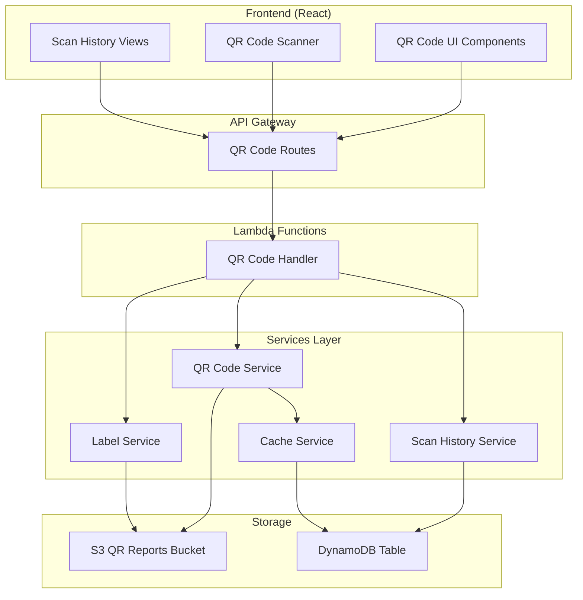

# QR Code System Enhancement - Design Document

## Overview

This design document outlines the architecture and implementation approach for completing and enhancing the QR Code system in the Home Inventory Management application. The system enables users to generate, scan, and manage QR codes for containers, providing quick access to container information and contents.

## Architecture

### High-Level Architecture



### Service Architecture

The QR code system follows a layered architecture with clear separation of concerns:

1. **Handler Layer**: Routes API requests and handles authentication
2. **Service Layer**: Business logic for QR code operations
3. **Storage Layer**: Persistent storage for images and metadata
4. **Cache Layer**: Performance optimization for frequently accessed data

## Components and Interfaces

### QR Code Handler (`backend/handlers/qrCode.js`)

**Purpose**: Main entry point for all QR code API requests

**Key Functions**:
- `generateQRCode(event)` - Generate individual QR codes
- `generateBatchQRCodes(event)` - Generate multiple QR codes
- `scanQRCode(event)` - Scan and validate QR codes
- `lookupContainer(event)` - Manual container lookup
- `getScanHistory(event)` - Retrieve scan history
- `getRecentScans(event)` - Get recent successful scans
- `generateLabel(event)` - Generate printable labels
- `generateBatchLabels(event)` - Generate multiple labels

**Authentication**: All endpoints require valid JWT tokens via Cognito authorizer

### QR Code Service (`backend/services/qrCodeService.js`)

**Purpose**: Core QR code generation and validation logic

**Key Features**:
- Pure JavaScript implementation using `qrcode` library
- No native dependencies (Lambda-compatible)
- Supports multiple sizes (small, medium, large)
- QR code validation and expiration checking
- Batch processing with concurrency limits
- S3 integration for image storage

**QR Code Format**:
```
CONT_{containerId}_{timestamp}_{uniqueId}
```

**API Methods**:
```javascript
// Generate QR code for container
generateContainerQRCode(containerId, size) -> Promise<QRCodeData>

// Validate QR code format and expiration
validateQRCode(qrCodeId) -> boolean

// Decode QR code to extract container info
decodeQRCodeId(qrCodeId) -> ContainerInfo

// Scan QR code and return validation result
scanQRCode(qrCodeData) -> ScanResult

// Generate multiple QR codes
generateBatchQRCodes(containerIds, size) -> Promise<BatchResult>
```

### Label Service (`backend/services/labelService.js`)

**Purpose**: Generate printable labels with QR codes and container information

**Key Features**:
- SVG-based label generation (no canvas dependency)
- Multiple label sizes with proper scaling
- Embedded QR codes with container metadata
- Batch label generation
- Label sheet creation for printing multiple labels

**Label Dimensions**:
```javascript
{
  small: { width: 288, height: 288, qrSize: 120, fontSize: 12 },
  medium: { width: 432, height: 432, qrSize: 180, fontSize: 16 },
  large: { width: 576, height: 576, qrSize: 240, fontSize: 20 }
}
```

**API Methods**:
```javascript
// Generate individual label
generateLabel(containerData, size) -> Promise<Buffer>

// Generate multiple labels
generateBatchLabels(containersData, size) -> Promise<BatchResult>

// Generate label sheet for printing
generateLabelSheet(containersData, size, options) -> Promise<Buffer>
```

### Scan History Service (`backend/services/scanHistoryService.js`)

**Purpose**: Track and manage QR code scan history for audit and user convenience

**Key Features**:
- Records all scan attempts (successful and failed)
- Supports multiple scan types (QR scan, manual lookup, search)
- Automatic cleanup with TTL (90 days)
- Pagination for large history sets
- Recent scans with deduplication

**Scan Record Structure**:
```javascript
{
  pk: "USER#{userId}#SCAN_HISTORY",
  sk: "{timestamp}#{scanId}",
  userId: string,
  inventoryId: string,
  type: "qr_scan" | "manual_lookup" | "container_search",
  success: boolean,
  containerId: string,
  containerName: string,
  method: "camera" | "manual_entry" | "name_search" | "id_lookup",
  error: string,
  itemCount: number,
  ttl: number
}
```

### Cache Service (`backend/services/cacheService.js`)

**Purpose**: Performance optimization through intelligent caching

**Key Features**:
- Multi-tier caching (memory + DynamoDB)
- Configurable TTL per data type
- Cache invalidation patterns
- QR code image URL caching
- Container data caching

## Data Models

### QR Code Metadata

**Storage**: DynamoDB with TTL
**Structure**:
```javascript
{
  pk: "QR#{qrCodeId}",
  sk: "METADATA",
  containerId: string,
  inventoryId: string,
  createdAt: string,
  expiresAt: number, // TTL
  size: string,
  s3Key: string,
  generatedBy: string
}
```

### S3 Storage Structure

**Bucket**: `home-inv-qr-reports-982081071280-dev`

**QR Codes**:
```
qr-codes/
  ├── {containerId}/
  │   ├── small_{timestamp}.png
  │   ├── medium_{timestamp}.png
  │   └── large_{timestamp}.png
```

**Labels**:
```
labels/
  ├── {containerId}/
  │   ├── small_label_{timestamp}.svg
  │   ├── medium_label_{timestamp}.svg
  │   └── large_label_{timestamp}.svg
  └── sheets/
      └── batch_{timestamp}_{size}.svg
```

## Correctness Properties

*A property is a characteristic or behavior that should hold true across all valid executions of a system-essentially, a formal statement about what the system should do. Properties serve as the bridge between human-readable specifications and machine-verifiable correctness guarantees.*

### Property 1: QR Code Generation Consistency
*For any* container ID and size combination, generating a QR code should always produce a valid QR code that can be decoded back to the original container ID.
**Validates: Requirements 1.1**

### Property 2: QR Code Uniqueness
*For any* container, each QR code generation should produce a unique QR code ID that includes timestamp and unique identifier components.
**Validates: Requirements 1.1**

### Property 3: Batch Generation Completeness
*For any* valid list of container IDs (≤50), batch QR code generation should process all containers and return results indicating success or failure for each.
**Validates: Requirements 1.2**

### Property 4: QR Code Validation Accuracy
*For any* QR code ID, validation should correctly identify valid format and non-expired codes while rejecting invalid or expired ones.
**Validates: Requirements 2.1**

### Property 5: Container Lookup Consistency
*For any* valid container ID and inventory ID combination, manual container lookup should return the same container data as QR code scanning.
**Validates: Requirements 2.2**

### Property 6: Scan History Recording
*For any* scan operation (successful or failed), the system should record the scan event with accurate timestamp, user, and result information.
**Validates: Requirements 4.1**

### Property 7: Recent Scans Deduplication
*For any* user's scan history, recent scans should return unique containers (no duplicates) ordered by most recent access.
**Validates: Requirements 4.2**

### Property 8: Label Generation Completeness
*For any* valid container data, label generation should produce a complete label containing QR code, container name, type, creation date, and container ID.
**Validates: Requirements 3.1**

### Property 9: S3 Storage Consistency
*For any* generated QR code or label, the system should store the file in S3 and return a valid S3 key that can be used to retrieve the file.
**Validates: Requirements 1.1, 3.1**

### Property 10: Cache Invalidation
*For any* container update operation, related QR code and container cache entries should be invalidated to ensure data consistency.
**Validates: System consistency requirements**

## Error Handling

### QR Code Generation Errors

**Invalid Container ID**:
- Status: 400 Bad Request
- Response: "Container ID is required"
- Logging: Security event logged

**Invalid Size Parameter**:
- Status: 400 Bad Request
- Response: "Invalid size. Must be small, medium, or large"
- Logging: Request validation error

**S3 Storage Failure**:
- Status: 500 Internal Server Error
- Response: "Failed to store QR code image"
- Logging: S3 error with details
- Retry: Automatic retry with exponential backoff

**Batch Size Exceeded**:
- Status: 400 Bad Request
- Response: "Cannot process more than 50 containers at once"
- Logging: Request validation error

### QR Code Scanning Errors

**Invalid QR Code Format**:
- Status: 400 Bad Request
- Response: "Invalid or expired QR code"
- Logging: Security event for invalid scan attempt
- History: Failed scan recorded

**Expired QR Code**:
- Status: 400 Bad Request
- Response: "QR code has expired"
- Logging: Security event
- History: Failed scan recorded

**Container Access Denied**:
- Status: 403 Forbidden
- Response: "Access denied to container inventory"
- Logging: Security event for unauthorized access
- History: Failed scan recorded

**Container Not Found**:
- Status: 404 Not Found
- Response: "Container not found or has been deleted"
- Logging: Container lookup failure
- History: Failed scan recorded

### Service Dependency Errors

**DynamoDB Unavailable**:
- Fallback: Continue operation without caching
- Logging: Service degradation warning
- Monitoring: CloudWatch alarm triggered

**S3 Unavailable**:
- Status: 503 Service Unavailable
- Response: "Storage service temporarily unavailable"
- Retry: Client should retry after delay

## Testing Strategy

### Unit Testing

**QR Code Service Tests**:
```javascript
describe('QRCodeService', () => {
  test('generates valid QR code for container', async () => {
    const result = await qrCodeService.generateContainerQRCode('test-id', 'medium');
    expect(result.qrCodeId).toMatch(/^CONT_test-id_\d+_[a-f0-9]{8}$/);
    expect(result.s3Key).toBeDefined();
  });

  test('validates QR code format correctly', () => {
    const validId = 'CONT_test-id_1640995200000_abc12345';
    const invalidId = 'INVALID_FORMAT';
    expect(qrCodeService.validateQRCodeFormat(validId)).toBe(true);
    expect(qrCodeService.validateQRCodeFormat(invalidId)).toBe(false);
  });

  test('decodes QR code to extract container info', () => {
    const qrCodeId = 'CONT_test-id_1640995200000_abc12345';
    const decoded = qrCodeService.decodeQRCodeId(qrCodeId);
    expect(decoded.containerId).toBe('test-id');
    expect(decoded.timestamp).toBe(1640995200000);
  });
});
```

**Label Service Tests**:
```javascript
describe('LabelService', () => {
  test('generates SVG label with all required elements', async () => {
    const containerData = {
      id: 'test-id',
      name: 'Test Container',
      type: 'Box',
      createdAt: '2023-01-01T00:00:00Z'
    };
    
    const labelBuffer = await labelService.generateLabel(containerData, 'medium');
    const labelSvg = labelBuffer.toString('utf8');
    
    expect(labelSvg).toContain('Test Container');
    expect(labelSvg).toContain('Type: Box');
    expect(labelSvg).toContain('ID: test-id');
    expect(labelSvg).toContain('<svg');
  });
});
```

### Property-Based Testing

**Property Tests Configuration**:
- Minimum 100 iterations per test
- Use `fast-check` library for property generation
- Tag format: `Feature: qr-code-system-enhancement, Property {number}: {description}`

**Example Property Test**:
```javascript
describe('QR Code Properties', () => {
  test('QR code generation round-trip property', async () => {
    await fc.assert(fc.asyncProperty(
      fc.string({ minLength: 1, maxLength: 50 }), // containerId
      fc.constantFrom('small', 'medium', 'large'), // size
      async (containerId, size) => {
        // Generate QR code
        const qrData = await qrCodeService.generateContainerQRCode(containerId, size);
        
        // Decode QR code
        const decoded = qrCodeService.decodeQRCodeId(qrData.qrCodeId);
        
        // Property: decoded container ID should match original
        expect(decoded.containerId).toBe(containerId);
      }
    ), { numRuns: 100 });
  }, 30000);
});
```

### Integration Testing

**End-to-End QR Code Workflow**:
```javascript
describe('QR Code Integration', () => {
  test('complete QR code workflow', async () => {
    // 1. Generate QR code
    const generateResponse = await request(app)
      .post(`/containers/${testContainerId}/qr-code?size=medium`)
      .set('Authorization', `Bearer ${validToken}`)
      .expect(200);

    // 2. Verify S3 storage
    const s3Object = await s3Client.getObject({
      Bucket: process.env.QR_REPORT_BUCKET_NAME,
      Key: generateResponse.body.s3Key
    });
    expect(s3Object.Body).toBeDefined();

    // 3. Scan QR code
    const scanResponse = await request(app)
      .post('/qr-codes/scan')
      .set('Authorization', `Bearer ${validToken}`)
      .send({
        qrCodeData: generateResponse.body.qrCodeId,
        inventoryId: testInventoryId
      })
      .expect(200);

    expect(scanResponse.body.container.id).toBe(testContainerId);

    // 4. Verify scan history
    const historyResponse = await request(app)
      .get(`/qr-codes/history?inventoryId=${testInventoryId}`)
      .set('Authorization', `Bearer ${validToken}`)
      .expect(200);

    expect(historyResponse.body.scans).toHaveLength(1);
    expect(historyResponse.body.scans[0].success).toBe(true);
  });
});
```

### Performance Testing

**Load Testing Scenarios**:
1. **Individual QR Generation**: 100 concurrent requests
2. **Batch QR Generation**: 10 concurrent batches of 50 containers
3. **QR Code Scanning**: 200 concurrent scan requests
4. **Scan History Retrieval**: 50 concurrent history requests

**Performance Targets**:
- Individual QR generation: < 5 seconds (95th percentile)
- Batch QR generation: < 30 seconds for 50 containers
- QR code scanning: < 2 seconds (95th percentile)
- Scan history: < 1 second (95th percentile)

## Security Considerations

### Authentication and Authorization

**JWT Validation**:
- All endpoints require valid Cognito JWT tokens
- Token validation includes signature verification and expiration checking
- User identity extracted from token for audit logging

**Inventory Access Control**:
- QR code operations validate user access to specified inventory
- Container lookup enforces inventory membership
- Scan history is user-scoped and inventory-filtered

### Data Protection

**QR Code Security**:
- QR codes include timestamp for expiration validation
- QR code IDs are not sequential or predictable
- Invalid scan attempts are logged for security monitoring

**Audit Logging**:
- All QR code operations logged with user context
- Failed operations logged with error details
- Security events sent to CloudWatch for monitoring

### Input Validation

**Parameter Validation**:
- Container IDs validated for format and existence
- Size parameters restricted to allowed values
- Batch sizes limited to prevent resource exhaustion

**QR Code Validation**:
- QR code format validation before processing
- Expiration checking for time-based security
- Malformed QR code rejection with logging

## Deployment and Operations

### Infrastructure Requirements

**Lambda Configuration**:
- Runtime: Node.js 20.x
- Memory: 512 MB (sufficient for QR generation)
- Timeout: 30 seconds (adequate for batch operations)
- Environment Variables: All required variables configured

**S3 Configuration**:
- Bucket: `home-inv-qr-reports-982081071280-dev`
- CORS: Configured for CloudFront domain
- Lifecycle: 365-day retention for QR codes, 90-day for reports

**DynamoDB Configuration**:
- Table: `home-inv-dev`
- TTL: Enabled for automatic cleanup
- Indexes: QRCodeIndex for efficient QR code lookups

### Monitoring and Alerting

**CloudWatch Metrics**:
- Lambda function duration and errors
- S3 request metrics and errors
- DynamoDB read/write capacity and throttling

**Custom Metrics**:
- QR code generation success rate
- Scan success rate
- Cache hit ratio
- Batch operation performance

**Alerts**:
- High error rate (>5% in 5 minutes)
- High duration (>25 seconds average)
- S3 or DynamoDB throttling
- Failed QR code generations

### Maintenance Procedures

**Cache Management**:
- Automatic memory cache cleanup every 2 minutes
- DynamoDB cache TTL handles long-term cleanup
- Manual cache invalidation for container updates

**Storage Cleanup**:
- S3 lifecycle policies for automatic cleanup
- DynamoDB TTL for scan history cleanup
- Monitoring for storage usage trends

This design provides a robust, scalable, and maintainable QR code system that addresses all requirements while ensuring proper error handling, security, and performance.