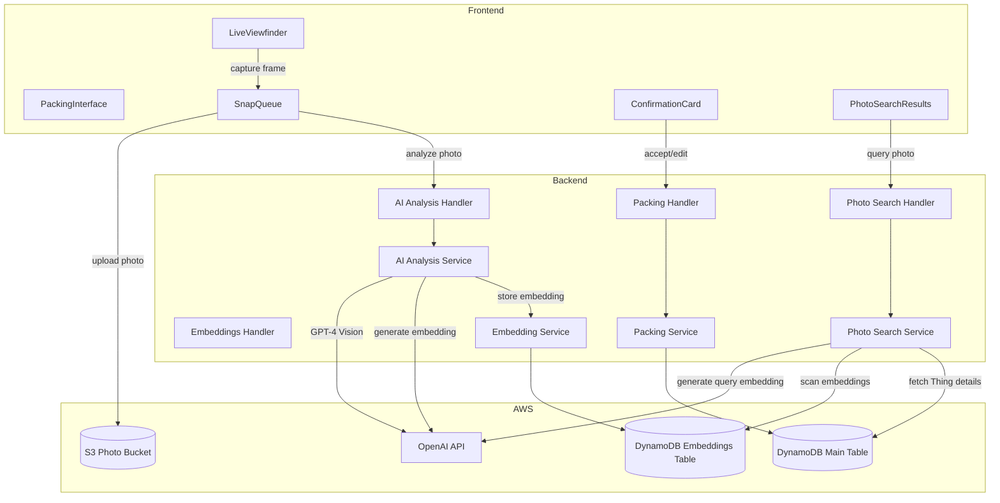
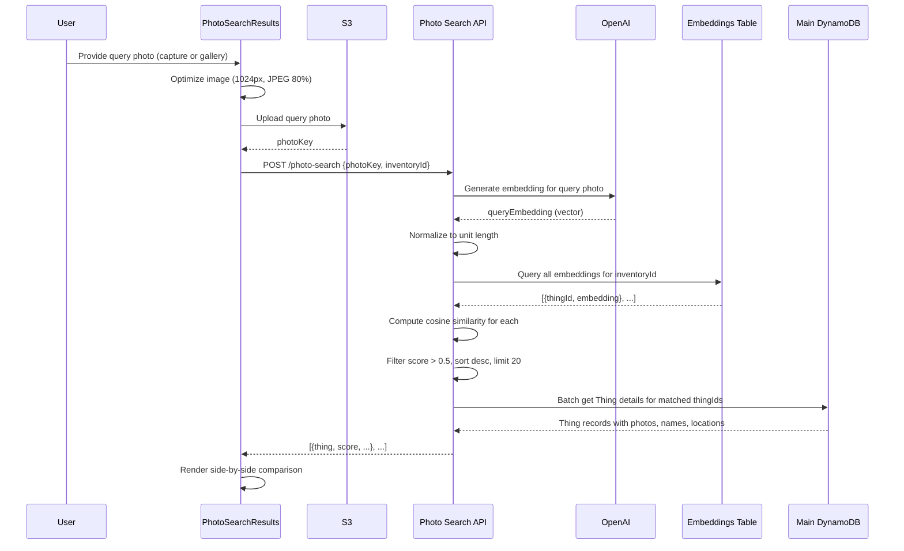

# Design Document: Quick Pack & Photo Search

## Overview

This design adds two complementary features to the home inventory system:

1. **Quick Pack Mode** — A continuous photo-capture workflow within the Packing Interface where users photograph items through a persistent live viewfinder, confirm AI-suggested details via compact confirmation cards, and pack items into the active container in rapid succession.

2. **Photo Search** — A visual similarity search that accepts a query photo and finds matching Things in the user's inventory using image embeddings stored in a dedicated DynamoDB table, accessible from both the Things view and the packing interface.

Both features extend the existing AI analysis service (OpenAI GPT-4 Vision), packing infrastructure (`create-and-pack` endpoint), and frontend components (`PackingInterface`, `AIPhotoUpload`, `iosCamera.ts`, `photoQueue.ts`).

### Key Design Decisions

| Decision | Choice | Rationale |
|----------|--------|-----------|
| Camera approach | Persistent `getUserMedia` stream via `<video>` element | Avoids iOS file-input capture flow that closes between shots; reuses `iosCamera.ts` utilities |
| Confirmation UX | Compact slide-up card with Accept/Edit | Keeps viewfinder partially visible; faster than full dialog |
| Embedding storage | Separate DynamoDB table (`EmbeddingsTable`) | Avoids bloating the main single-table with large vector data; enables independent capacity tuning |
| Embedding key design | `inventoryId` (PK) + `thingId` (SK) | Efficient per-inventory scans for search; matches existing access patterns |
| Similarity computation | Server-side cosine similarity in Lambda | Keeps embedding vectors off the client; consistent scoring |
| Search access | Global — both Things view and packing interface | Users need to find items regardless of current context |
| Rate limiting | 50 AI calls/hour per user, 1 photo/3s processing rate | Balances usability with cost control |
| Backfill strategy | Manual trigger from Settings | Avoids surprise costs; user controls when to generate embeddings for existing items |

## Architecture

### System Context



### Data Flow: Quick Pack Capture → Confirm → Create

```mermaid
sequenceDiagram
    participant U as User
    participant LV as LiveViewfinder
    participant SQ as SnapQueue
    participant S3 as S3
    participant AI as AI Analysis API
    participant CC as ConfirmationCard
    participant Pack as Packing API
    participant DDB as DynamoDB
    participant EDDB as Embeddings Table

    U->>LV: Tap capture button
    LV->>LV: Capture frame from video stream
    LV->>SQ: Add photo blob to queue
    SQ->>SQ: Optimize image (1024px, JPEG 80%)
    SQ->>S3: Upload via presigned URL
    S3-->>SQ: Upload complete (photoKey)
    SQ->>AI: POST /ai/analyze-photo {photoKey, inventoryId}
    AI-->>SQ: {name, category, confidence, ...}
    SQ->>CC: Display ConfirmationCard
    
    alt User taps Accept
        U->>CC: Accept
        CC->>Pack: POST /packing/create-and-pack {thingData, containerId}
        Pack->>DDB: Create Thing + assign to Container (transaction)
        Pack-->>CC: {thing, container}
        Pack->>AI: POST /ai/generate-embedding {photoKey}
        AI->>EDDB: Store embedding vector
        CC->>SQ: Update status → complete
    else User taps Edit
        U->>CC: Edit
        CC->>CC: Expand inline editing fields
        U->>CC: Modify fields + Confirm
        CC->>Pack: POST /packing/create-and-pack {editedThingData, containerId}
        Pack->>DDB: Create Thing + assign to Container
        Pack-->>CC: {thing, container}
    end
    
    Note over LV: Camera stays open throughout
    U->>LV: Tap capture again (next item)
```



### Data Flow: Photo Search



## Components and Interfaces

### Backend Components

#### 1. Embedding Service (`backend/services/embeddingService.js`)

New service responsible for embedding vector lifecycle management.

```javascript
// backend/services/embeddingService.js (CommonJS)

/**
 * Store an embedding vector for a Thing's photo
 * @param {string} inventoryId - Inventory UUID
 * @param {string} thingId - Thing UUID
 * @param {number[]} embedding - Normalized embedding vector
 * @param {string} photoKey - S3 key of the source photo
 * @param {string} modelVersion - Embedding model version identifier
 * @returns {Promise<void>}
 */
async function storeEmbedding(inventoryId, thingId, embedding, photoKey, modelVersion) { }

/**
 * Get an embedding for a specific Thing
 * @param {string} inventoryId - Inventory UUID
 * @param {string} thingId - Thing UUID
 * @returns {Promise<{embedding: number[], photoKey: string, modelVersion: string} | null>}
 */
async function getEmbedding(inventoryId, thingId) { }

/**
 * Get all embeddings for an inventory (for search)
 * @param {string} inventoryId - Inventory UUID
 * @returns {Promise<Array<{thingId: string, embedding: number[], photoKey: string}>>}
 */
async function getInventoryEmbeddings(inventoryId) { }

/**
 * Delete an embedding when a Thing is deleted
 * @param {string} inventoryId - Inventory UUID
 * @param {string} thingId - Thing UUID
 * @returns {Promise<void>}
 */
async function deleteEmbedding(inventoryId, thingId) { }

/**
 * Get Things that have photos but no embeddings (for backfill)
 * @param {string} inventoryId - Inventory UUID
 * @returns {Promise<Array<{thingId: string, photoKey: string}>>}
 */
async function getThingsWithoutEmbeddings(inventoryId) { }

/**
 * Normalize a vector to unit length
 * @param {number[]} vector - Input vector
 * @returns {number[]} Unit vector
 */
function normalizeVector(vector) { }

/**
 * Compute cosine similarity between two unit vectors
 * @param {number[]} a - First unit vector
 * @param {number[]} b - Second unit vector
 * @returns {number} Similarity score between -1 and 1
 */
function cosineSimilarity(a, b) { }

```

#### 2. Photo Search Service (`backend/services/photoSearchService.js`)

New service that orchestrates the photo search workflow.

```javascript
// backend/services/photoSearchService.js (CommonJS)

/**
 * Search for visually similar Things by photo
 * @param {string} photoKey - S3 key of the query photo
 * @param {string} inventoryId - Inventory UUID
 * @param {string} userId - Requesting user's UUID
 * @returns {Promise<{results: Array<{thing: object, score: number, photoKey: string}>, queryPhotoKey: string}>}
 */
async function searchByPhoto(photoKey, inventoryId, userId) { }

/**
 * Trigger embedding backfill for an inventory
 * @param {string} inventoryId - Inventory UUID
 * @param {string} userId - Requesting user's UUID
 * @returns {Promise<{queued: number, skipped: number, errors: number}>}
 */
async function triggerBackfill(inventoryId, userId) { }
```

#### 3. AI Analysis Service Extensions (`backend/services/aiAnalysisService.js`)

Extend the existing `AIAnalysisService` class with embedding methods.

```javascript
// New methods added to existing AIAnalysisService class

/**
 * Generate an image embedding vector using OpenAI embeddings API
 * @param {string} photoKey - S3 key of the photo
 * @returns {Promise<{embedding: number[], model: string}>}
 */
async generateEmbedding(photoKey) { }

/**
 * Generate a mock embedding for development/testing
 * @param {string} photoKey - S3 key of the photo
 * @returns {Promise<{embedding: number[], model: string}>}
 */
async mockGenerateEmbedding(photoKey) { }
```

The `generateEmbedding` method will:
1. Generate a presigned download URL for the photo
2. Call the OpenAI API to get a CLIP-based image embedding (using `text-embedding-3-small` with image input, or a vision model to extract features)
3. Return the raw embedding vector and model version

Mock mode (`AI_MOCK_MODE=true`) returns a deterministic pseudo-random vector based on the photoKey hash, enabling development without API costs.

#### 4. Photo Search Handler (`backend/handlers/photoSearch.js`)

New Lambda handler for photo search and embedding management endpoints.

```javascript
// backend/handlers/photoSearch.js (CommonJS)
// Follows existing handler pattern: authenticate → route → delegate → respond

// Routes:
// POST /photo-search              → searchByPhoto
// POST /photo-search/backfill     → triggerBackfill
// GET  /photo-search/status       → getBackfillStatus
```

Handler pattern matches existing conventions:
- Wrapped with `withCorsValidation(withRateLimit(handler))`
- Uses `authenticate(event)` and `authorizeInventoryAccess(event, inventoryId)`
- Returns responses via `success()` / `error()` / `secureError()`
- Validates UUIDs with `validateUUID()`
- Sanitizes inputs with `sanitizeInput()`

#### 5. Modifications to Existing Handlers

**`backend/handlers/things.js`** — `handleDelete`:
- After deleting a Thing, call `embeddingService.deleteEmbedding(inventoryId, thingId)` to clean up the embedding.
- Failure to delete the embedding should be logged but not block the Thing deletion.

**`backend/handlers/packing.js`** — `handleCreateAndPack`:
- After successful Thing creation and packing, trigger async embedding generation.
- Call `aiAnalysisService.generateEmbedding(photoKey)` then `embeddingService.storeEmbedding(...)`.
- Embedding generation failure should be logged but not fail the create-and-pack response (fire-and-forget pattern).

**`backend/handlers/aiAnalysis.js`** — `handleAnalyzePhoto`:
- No changes needed. Embedding generation is triggered separately after Thing creation, not during analysis.

### Frontend Components

#### 1. LiveViewfinder (`frontend/src/components/packing/LiveViewfinder.tsx`)

Persistent camera component that stays open throughout a Quick Pack session.

```typescript
interface LiveViewfinderProps {
  onCapture: (imageBlob: Blob) => void;
  onClose: () => void;
  disabled?: boolean;
}
```

Implementation details:
- Uses `requestIOSCameraPermission()` from `iosCamera.ts` to get a `MediaStream`
- Renders a `<video>` element with `autoPlay`, `playsInline`, `muted` attributes
- Capture button positioned at bottom-center for one-handed thumb access
- On capture: draws current video frame to an offscreen `<canvas>`, exports as JPEG blob at 80% quality, resizes to max 1024px dimension
- Plays haptic feedback via `navigator.vibrate(50)` where supported
- Shows brief white flash overlay on capture
- Fallback: file input with `accept="image/*"` when camera is unavailable
- Calls `stopIOSCameraStream()` on unmount

#### 2. SnapQueue State Management (`frontend/src/hooks/useSnapQueue.ts`)

Custom hook managing the capture → upload → analyze → confirm → create pipeline.

```typescript
interface SnapQueueItem {
  id: string;                    // UUID
  imageBlob: Blob;               // Captured image data
  photoKey?: string;             // S3 key after upload
  status: 'queued' | 'uploading' | 'analyzing' | 'confirming' | 'creating' | 'complete' | 'failed';
  analysisResult?: AIAnalysisResult;
  thingData?: Partial<Thing>;    // Final data after user confirmation
  thingId?: string;              // Created Thing ID
  error?: string;
  retryCount: number;
  createdAt: number;             // Timestamp
}

interface UseSnapQueueReturn {
  items: SnapQueueItem[];
  addPhoto: (blob: Blob) => string;           // Returns item ID
  confirmItem: (id: string) => void;          // Accept AI suggestion
  editItem: (id: string, data: Partial<Thing>) => void;  // Edit and confirm
  retryItem: (id: string) => void;
  discardItem: (id: string) => void;
  deleteCompletedItem: (id: string) => Promise<void>;
  activeItemId: string | null;                // Currently confirming item
  sessionStats: { captured: number; completed: number; failed: number };
  isProcessing: boolean;
  isPaused: boolean;
}
```

Processing rules:
- Sequential processing: only one item in `uploading` or `analyzing` state at a time
- Rate limiting: minimum 3-second interval between starting processing of consecutive items
- On 503 from AI service: exponential backoff (1s, 2s, 4s) with max 3 retries
- On network loss: pause processing, retain all items, resume on reconnect
- Items move through states: `queued` → `uploading` → `analyzing` → `confirming` → `creating` → `complete`
- Failed items retain their `imageBlob`, `photoKey`, and `analysisResult` for retry

#### 3. ConfirmationCard (`frontend/src/components/packing/ConfirmationCard.tsx`)

Compact overlay card for confirming AI-suggested item details.

```typescript
interface ConfirmationCardProps {
  item: SnapQueueItem;
  categories: Category[];
  onAccept: () => void;
  onEdit: (editedData: Partial<Thing>) => void;
  onDiscard: () => void;
  lowConfidenceThreshold?: number;  // Default: 0.6
}
```

Behavior:
- Displays AI-suggested name and category with Accept and Edit buttons
- When confidence score ≤ 0.6, highlights the low-confidence fields with a warning chip (amber background, warning icon)
- Edit mode: expands to show inline `TextField` for name, description, and a `Select` for category
- Renders as a slide-up `Paper` component positioned at the bottom of the viewfinder area with `position: absolute`
- Uses MUI `Slide` transition for smooth appearance

#### 4. QuickPackMode (`frontend/src/components/packing/QuickPackMode.tsx`)

Container component that orchestrates the Quick Pack experience.

```typescript
interface QuickPackModeProps {
  container: Container;
  inventoryId: string;
  categories: Category[];
  onExit: (stats: { captured: number; completed: number; failed: number }) => void;
  onContainerUpdated?: (container: Container) => void;
}
```

Composes: `LiveViewfinder` + `useSnapQueue` + `ConfirmationCard` + thumbnail strip.

Layout:
- Full-height flex container
- Top: header bar with container name, session counter, exit button
- Center: `LiveViewfinder` component with `ConfirmationCard` overlay
- Bottom: horizontal scrollable thumbnail strip showing queue items with status indicators

#### 5. PhotoSearchResults (`frontend/src/components/PhotoSearchResults.tsx`)

Search results component with side-by-side comparison view.

```typescript
interface PhotoSearchResultsProps {
  queryPhotoKey: string;
  results: Array<{
    thing: Thing;
    score: number;
    photoKey: string;
  }>;
  onSelectResult: (thingId: string) => void;
  onNavigateToContainer: (containerId: string) => void;
  onClose: () => void;
  isLoading?: boolean;
  error?: string | null;
}
```

Layout:
- Query photo displayed at the top as a reference
- Each result card shows: query photo (small) | matched Thing photo (small) side-by-side
- Below photos: similarity percentage badge, Thing name, location, container assignment
- Tap a result → action sheet with "View Thing" and "View Container" options
- Empty state: "No matching items found. Try text-based search instead."

#### 6. PhotoSearchButton (`frontend/src/components/PhotoSearchButton.tsx`)

Reusable button/trigger for initiating photo search from multiple locations.

```typescript
interface PhotoSearchButtonProps {
  inventoryId: string;
  variant?: 'icon' | 'button';
  onResultSelect?: (thingId: string) => void;
}
```

Used in:
- Things list view (search area)
- PackingInterface (toolbar)

Opens a dialog with camera capture / gallery picker, then displays `PhotoSearchResults`.

### API Endpoints

| Method | Path | Handler | Description |
|--------|------|---------|-------------|
| POST | `/photo-search` | `photoSearch.js` | Search by photo — accepts `{photoKey, inventoryId}`, returns ranked results |
| POST | `/photo-search/backfill` | `photoSearch.js` | Trigger embedding backfill for an inventory |
| GET | `/photo-search/status` | `photoSearch.js` | Get backfill status for an inventory |

Existing endpoints used without modification:
- `POST /ai/analyze-photo` — AI analysis (already exists)
- `POST /packing/create-and-pack` — Create Thing and pack into container (already exists)
- `POST /upload` — Generate presigned upload URL (already exists)
- `GET /photo` — Generate presigned download URL (already exists)

## Data Models

### Embeddings Table Schema

```yaml
TableName: home-inv-embeddings-{Environment}
BillingMode: PAY_PER_REQUEST

KeySchema:
  - AttributeName: inventoryId    # Partition Key (String)
  - AttributeName: thingId        # Sort Key (String)

Attributes:
  inventoryId: String             # UUID — same as main table
  thingId: String                 # UUID — references Thing in main table
  embedding: String               # JSON-serialized array of floats (e.g., "[0.123, -0.456, ...]")
  photoKey: String                # S3 key of the source photo
  modelVersion: String            # Embedding model identifier (e.g., "text-embedding-3-small-v1")
  dimensions: Number              # Vector dimensionality (e.g., 1536)
  createdAt: String               # ISO 8601 timestamp
  updatedAt: String               # ISO 8601 timestamp
```

No GSIs needed — the primary access pattern is:
1. **Search**: Query all embeddings for a given `inventoryId` (partition key scan)
2. **CRUD**: Get/Put/Delete by `inventoryId` + `thingId` (exact key lookup)

The embedding vector is stored as a JSON-serialized string of a float array. This is deserialized server-side for cosine similarity computation. Vectors are normalized to unit length before storage to ensure consistent similarity scores.

### SnapQueueItem (Frontend State)

```typescript
interface SnapQueueItem {
  id: string;                                    // Client-generated UUID
  imageBlob: Blob;                               // Raw captured image
  optimizedBlob?: Blob;                          // Resized/compressed image
  photoKey?: string;                             // S3 key after upload
  status: SnapQueueItemStatus;
  analysisResult?: {
    itemName: string;
    description: string;
    suggestedCategory: string;
    extractedText: { brandNames: string[]; modelNumbers: string[]; serialNumbers: string[]; otherText: string[] };
    estimatedValue?: number;
    confidence: { overall: number; itemName: number; description: number; category: number };
  };
  editedData?: Partial<Thing>;                   // User edits before confirmation
  thingId?: string;                              // Created Thing ID
  error?: string;
  retryCount: number;
  createdAt: number;
  completedAt?: number;
}

type SnapQueueItemStatus = 'queued' | 'uploading' | 'analyzing' | 'confirming' | 'creating' | 'complete' | 'failed';
```

### SAM Template Changes

New resources to add to `template.yaml`:

```yaml
# DynamoDB Embeddings Table
EmbeddingsTable:
  Type: AWS::DynamoDB::Table
  DeletionPolicy: !If [IsProduction, Retain, Delete]
  UpdateReplacePolicy: !If [IsProduction, Retain, Delete]
  Properties:
    TableName: !Sub home-inv-embeddings-${Environment}
    BillingMode: PAY_PER_REQUEST
    AttributeDefinitions:
      - AttributeName: inventoryId
        AttributeType: S
      - AttributeName: thingId
        AttributeType: S
    KeySchema:
      - AttributeName: inventoryId
        KeyType: HASH
      - AttributeName: thingId
        KeyType: RANGE
    PointInTimeRecoverySpecification:
      PointInTimeRecoveryEnabled: !If [IsProduction, true, false]
    SSESpecification:
      SSEEnabled: true
    Tags:
      - Key: Environment
        Value: !Ref Environment
      - Key: Purpose
        Value: ImageEmbeddings

# Photo Search Lambda Function
PhotoSearchFunction:
  Type: AWS::Serverless::Function
  Properties:
    CodeUri: backend/
    Handler: handlers/photoSearch.handler
    Timeout: 30
    MemorySize: 512  # Higher memory for vector computation
    Environment:
      Variables:
        EMBEDDINGS_TABLE_NAME: !Ref EmbeddingsTable
        OPENAI_API_KEY: !Ref OpenAIAPIKey
        AI_MOCK_MODE: !If [IsProduction, 'false', 'true']
    Policies:
      - DynamoDBCrudPolicy:
          TableName: !Ref EmbeddingsTable
      - DynamoDBCrudPolicy:
          TableName: !Ref InventoryTable
      - S3CrudPolicy:
          BucketName: !Sub home-inv-photos-${AWS::AccountId}-${Environment}
      - Version: '2012-10-17'
        Statement:
          - Effect: Allow
            Action:
              - secretsmanager:GetSecretValue
            Resource: !Ref AuditLogHMACSecret
    Events:
      SearchByPhoto:
        Type: HttpApi
        Properties:
          ApiId: !Ref HttpApi
          Path: /photo-search
          Method: POST
          Auth:
            Authorizer: CognitoAuthorizer
      TriggerBackfill:
        Type: HttpApi
        Properties:
          ApiId: !Ref HttpApi
          Path: /photo-search/backfill
          Method: POST
          Auth:
            Authorizer: CognitoAuthorizer
      GetBackfillStatus:
        Type: HttpApi
        Properties:
          ApiId: !Ref HttpApi
          Path: /photo-search/status
          Method: GET
          Auth:
            Authorizer: CognitoAuthorizer
```

Additionally, the existing `ThingsFunction` and `PackingFunction` need the `EMBEDDINGS_TABLE_NAME` environment variable and `DynamoDBCrudPolicy` for the `EmbeddingsTable` added to their configurations, so they can manage embeddings during Thing creation, update, and deletion.

## Correctness Properties

*A property is a characteristic or behavior that should hold true across all valid executions of a system — essentially, a formal statement about what the system should do. Properties serve as the bridge between human-readable specifications and machine-verifiable correctness guarantees.*

### Property 1: Capture grows the queue

*For any* Quick Pack session with an active viewfinder, each capture action should add exactly one item to the SnapQueue and the queue length should increase by one.

**Validates: Requirements 2.2**

### Property 2: Thumbnail status reflects queue item state

*For any* SnapQueueItem with a given status value, the rendered thumbnail component should display the corresponding status indicator (uploading spinner, analyzing animation, confirming highlight, complete checkmark, or failed error icon).

**Validates: Requirements 2.4**

### Property 3: Sequential FIFO processing

*For any* sequence of photos added to the SnapQueue, the queue should process items in insertion order with at most one item in an active processing state (`uploading` or `analyzing`) at any time.

**Validates: Requirements 2.5**

### Property 4: ConfirmationCard displays analysis fields

*For any* valid AI analysis result containing a name, category, and confidence scores, the rendered ConfirmationCard should display the suggested name, the suggested category, an Accept button, and an Edit button.

**Validates: Requirements 3.2**

### Property 5: Low-confidence field highlighting

*For any* AI analysis result, the ConfirmationCard should highlight fields with a warning indicator if and only if the overall confidence score is at or below 0.6.

**Validates: Requirements 3.3**

### Property 6: Session summary accuracy

*For any* SnapQueue state containing items in various statuses, the computed session summary should report `captured` equal to the total number of items, `completed` equal to the count of items with status `complete`, and `failed` equal to the count of items with status `failed`.

**Validates: Requirements 4.4**

### Property 7: Queue resilience on failure

*For any* SnapQueue containing a failed item, the queue should continue processing subsequent queued items without blocking, and the failed item should retain its `imageBlob`, `photoKey`, and `analysisResult` (if available) for retry.

**Validates: Requirements 5.1, 5.2**

### Property 8: Exponential backoff on 503

*For any* SnapQueueItem that receives HTTP 503 responses from the AI service, the retry delays should follow exponential backoff (base × 2^attempt) and processing should stop after a maximum of 3 retry attempts, marking the item as failed.

**Validates: Requirements 5.5**

### Property 9: Search results sorted by descending score

*For any* array of photo search results with similarity scores, the results should be ordered by score in strictly non-increasing order.

**Validates: Requirements 7.4**

### Property 10: Search result displays required fields

*For any* photo search result item, the rendered result component should contain the similarity score as a percentage, the Thing name, the location name, and the container assignment.

**Validates: Requirements 8.2**

### Property 11: Search result filtering and limiting

*For any* set of stored embeddings and a query embedding, the Photo Search Service should return at most 20 results, and every returned result should have a similarity score strictly greater than 0.5.

**Validates: Requirements 8.4**

### Property 12: Processing rate limit

*For any* sequence of photos submitted to the SnapQueue during a Quick Pack session, the time interval between the start of processing consecutive items should be at least 3 seconds.

**Validates: Requirements 10.1**

### Property 13: Image optimization constraints

*For any* captured image of arbitrary dimensions, the optimized output should have its largest dimension at most 1024 pixels and be in JPEG format.

**Validates: Requirements 11.2**

### Property 14: Embedding serialization round-trip

*For any* valid embedding vector (array of finite floating-point numbers), serializing to JSON and then deserializing should produce a numerically equivalent vector where each element differs by less than 1e-10 from the original.

**Validates: Requirements 12.1, 12.2**

### Property 15: Cosine similarity mathematical properties

*For any* two unit vectors of equal dimension, cosine similarity should return a value between -1 and 1 (inclusive). *For any* unit vector compared with itself, cosine similarity should return approximately 1.0 (within floating-point tolerance of 1e-10).

**Validates: Requirements 12.3**

### Property 16: Vector normalization to unit length

*For any* non-zero vector, after normalization the Euclidean magnitude should be approximately 1.0 (within floating-point tolerance of 1e-10).

**Validates: Requirements 12.4**

## Error Handling

### Backend Error Handling

| Scenario | Handler | Response | Side Effect |
|----------|---------|----------|-------------|
| Invalid photoKey format | `photoSearch.js` | `error('Invalid photo key format', 400)` | None |
| Inventory access denied | `photoSearch.js` | `error('Access denied', 403)` | None |
| OpenAI API failure during embedding generation | `embeddingService.js` | Log error, return null | Thing creation proceeds without embedding |
| OpenAI API failure during search | `photoSearch.js` | `error('Photo search service temporarily unavailable', 503)` | Log error |
| Corrupted embedding in DynamoDB | `photoSearchService.js` | Skip item, log error | Exclude Thing from results |
| Rate limit exceeded (50/hour) | `aiAnalysis.js` | `error('AI analysis rate limit exceeded. Please try again later.', 429)` | Log rate limit event |
| Embedding table write failure | `embeddingService.js` | Log error, return null | Thing exists without embedding |
| Backfill already in progress | `photoSearch.js` | `error('Backfill already in progress', 409)` | None |

Error handling follows existing conventions:
- Known validation errors use `error(message, statusCode, origin)` with safe, user-written messages
- Unexpected errors in catch blocks use `secureError(err, context, origin)` to avoid leaking internals
- Embedding failures are non-blocking — Thing creation always succeeds even if embedding fails

### Frontend Error Handling

| Scenario | Component | Behavior |
|----------|-----------|----------|
| Camera permission denied | `LiveViewfinder` | Show error message with platform-specific instructions (reuses `getIOSCameraErrorMessage`), offer gallery fallback |
| Camera in use by another app | `LiveViewfinder` | Show "Camera busy" message, offer gallery fallback |
| Photo upload failure | `useSnapQueue` | Mark item as `failed`, retain blob for retry |
| AI analysis timeout (>10s) | `useSnapQueue` | Mark item as `failed`, show timeout message |
| AI analysis 503 | `useSnapQueue` | Exponential backoff (1s, 2s, 4s), max 3 retries, then mark as `failed` |
| Create-and-pack failure | `useSnapQueue` | Mark item as `failed`, retain analysis data for retry or manual entry |
| Network loss | `useSnapQueue` | Pause processing, show offline banner (reuses `OfflineBanner`), resume on reconnect |
| Low device storage | `QuickPackMode` | Show warning via `showError()`, limit queue to 5 unprocessed items |
| Photo search API failure | `PhotoSearchResults` | Show error alert with retry button |
| No search results | `PhotoSearchResults` | Show "No matching items" message with suggestion to use text search |

## Testing Strategy

### Property-Based Tests

Property-based tests use `fast-check` (backend) and `@fast-check/vitest` (frontend) with a minimum of 100 iterations per property. Each test references its design document property.

**Backend (Jest + fast-check):**
- `tests/embeddingService.test.js`:
  - Property 14: Embedding serialization round-trip
  - Property 15: Cosine similarity mathematical properties
  - Property 16: Vector normalization to unit length
  - Property 11: Search result filtering and limiting (with mock embeddings)
  - Property 9: Search results sorted by descending score

**Frontend (Vitest + @fast-check/vitest):**
- `src/components/packing/__tests__/useSnapQueue.test.ts`:
  - Property 1: Capture grows the queue
  - Property 3: Sequential FIFO processing
  - Property 6: Session summary accuracy
  - Property 7: Queue resilience on failure
  - Property 8: Exponential backoff on 503
  - Property 12: Processing rate limit
- `src/components/packing/__tests__/ConfirmationCard.test.tsx`:
  - Property 4: ConfirmationCard displays analysis fields
  - Property 5: Low-confidence field highlighting
- `src/components/__tests__/PhotoSearchResults.test.tsx`:
  - Property 10: Search result displays required fields
- `src/components/packing/__tests__/LiveViewfinder.test.tsx`:
  - Property 13: Image optimization constraints
- `src/components/packing/__tests__/SnapQueueThumbnail.test.tsx`:
  - Property 2: Thumbnail status reflects queue item state

**Tag format:** `Feature: quick-pack-photo-search, Property {number}: {property_text}`

### Unit Tests (Example-Based)

- **Backend:**
  - `tests/photoSearch.test.js` — Handler routing, input validation, auth checks
  - `tests/embeddingService.test.js` — Store/get/delete operations with mocked DynamoDB
  - `tests/aiAnalysisService.test.js` — Mock embedding generation, error handling

- **Frontend:**
  - `LiveViewfinder` — Camera initialization, capture flow, cleanup on unmount
  - `QuickPackMode` — Mode activation, exit with summary, container preservation
  - `ConfirmationCard` — Accept flow, edit flow, discard flow
  - `PhotoSearchButton` — Renders in both Things view and packing interface
  - `PhotoSearchResults` — Empty state, error state, navigation actions
  - `CreationMethodSelector` — Quick Pack button presence alongside existing methods

### Integration Tests

- Create-and-pack with embedding generation (mock OpenAI)
- Thing deletion cascades to embedding deletion
- Photo search end-to-end with mock embeddings
- Backfill trigger processes Things without embeddings
- Rate limiting: 51st request returns 429
