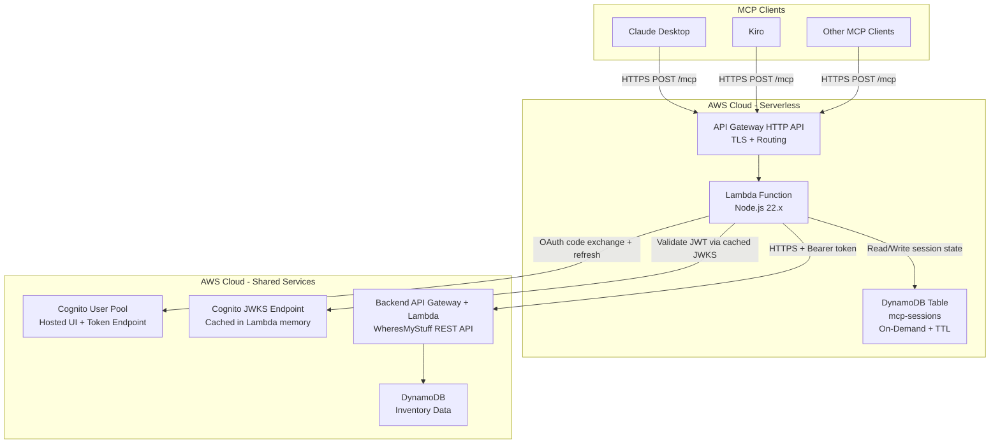
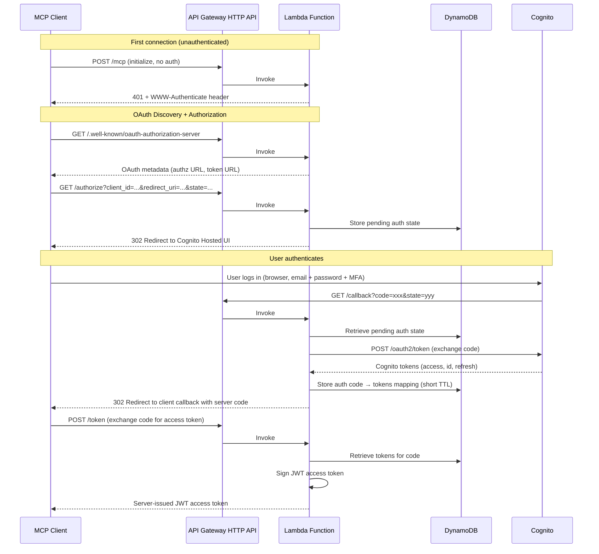
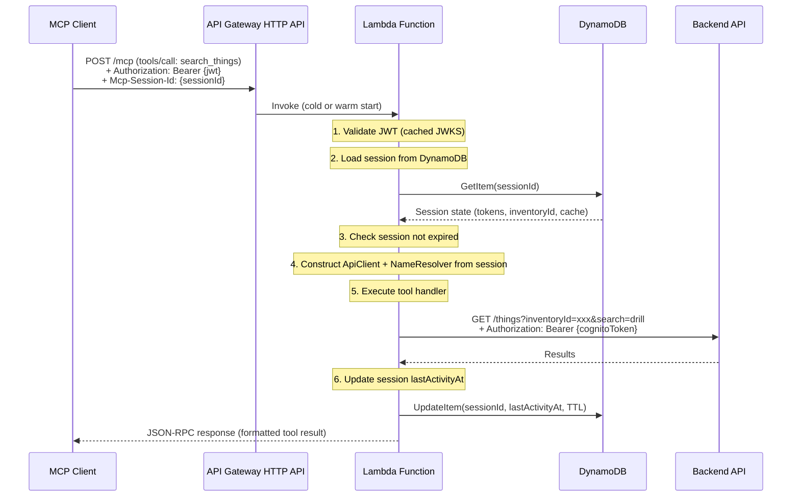
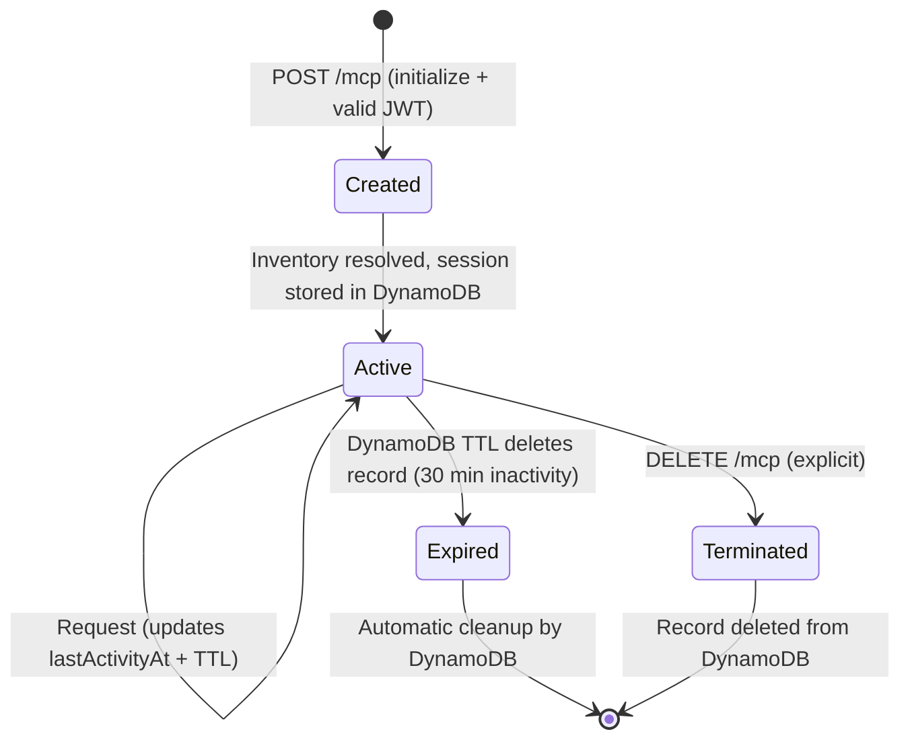

# Design Document: Remote MCP Server

## Overview

The Remote MCP Server converts the existing local stdio-based WheresMyStuff MCP server into a serverless hosted service using AWS Lambda, API Gateway HTTP API, and DynamoDB. Multiple users connect from Claude Desktop or other MCP clients by configuring a URL endpoint. The server handles per-user OAuth authentication delegated to Cognito, supports multi-tenancy through per-session state stored in DynamoDB, and reuses the existing 13 tool handlers unchanged.

### Key Design Decisions

1. **Lambda + API Gateway HTTP API (not REST API)** — Pay-per-invocation pricing with near-zero cost at low traffic. HTTP API is ~70% cheaper per request than REST API and sufficient for our needs (no API keys, usage plans, or request validation features needed at the gateway level). Each HTTP POST to `/mcp` triggers a separate Lambda invocation.

2. **DynamoDB on-demand for session state** — Sessions are stored in DynamoDB with on-demand capacity mode (pay-per-request). This eliminates the need for always-on containers with in-memory state. DynamoDB TTL handles automatic session cleanup without a garbage-collection process.

3. **No ALB, no NAT Gateway, no always-on containers** — All fixed-cost infrastructure is eliminated. Lambda runs in the default VPC-less configuration (public internet access for Cognito and Backend API calls). TLS termination happens at API Gateway.

4. **Stateless Lambda with DynamoDB session hydration** — Each Lambda invocation loads session state from DynamoDB at request start and writes back any changes (token refresh, cache updates) at request end. This is the key adaptation for MCP's Streamable HTTP transport working with Lambda's request/response model.

5. **JWKS caching in Lambda execution environment** — Cognito JWKS keys are cached in module-level variables, surviving across warm Lambda invocations. This eliminates a network call on most requests.

6. **Name resolution cache in DynamoDB session record** — The entity name cache (locations, rooms, categories) is serialized into the session's DynamoDB record, persisting across Lambda invocations for the same session.

7. **Reuse tool handlers via adapted `createServer()` pattern** — The existing 13 tool handlers are reused unchanged. A per-request `ApiClient` and `NameResolver` are constructed from session state loaded from DynamoDB.

8. **MCP OAuth flow delegating to Cognito Hosted UI** — Same proxy OAuth pattern as before: the server implements MCP OAuth endpoints, redirecting to Cognito for actual authentication, then issuing its own signed JWTs.

## Architecture




### Request Flow: OAuth Authentication




### Request Flow: Tool Invocation



### Session Lifecycle




## Components and Interfaces

### File Structure

```
mcp-server/
├── package.json
├── tsconfig.json
├── template.yaml                   # SAM template
├── samconfig.toml                  # SAM deployment config
├── src/
│   ├── index.ts                    # Local stdio entry point (unchanged)
│   ├── server.ts                   # MCP server setup, tool registration (unchanged)
│   ├── config.ts                   # Local config (unchanged)
│   ├── auth-manager.ts             # Local OAuth (unchanged, macOS Keychain)
│   ├── api-client.ts               # HTTP client (unchanged)
│   ├── name-resolver.ts            # Entity cache + fuzzy matching (unchanged)
│   ├── formatters.ts               # Response formatting (unchanged)
│   ├── remote/
│   │   ├── lambda-handler.ts       # Lambda entry point, API Gateway event routing
│   │   ├── session-store.ts        # DynamoDB session CRUD operations
│   │   ├── oauth-proxy.ts          # MCP OAuth flow delegating to Cognito
│   │   ├── jwt-validator.ts        # Server-issued JWT signing + validation
│   │   ├── jwks-cache.ts           # Cognito JWKS fetch + in-memory cache
│   │   ├── mcp-handler.ts          # MCP protocol handler (init, tools/call, etc.)
│   │   ├── security-middleware.ts  # Origin validation, rate limiting, payload size
│   │   ├── request-logger.ts       # Structured JSON logging
│   │   └── remote-config.ts        # Lambda environment variable loading
│   └── tools/                      # Existing 13 tool handlers (unchanged)
│       ├── search-things.ts
│       ├── get-things-in-location.ts
│       ├── create-thing.ts
│       ├── update-thing.ts
│       ├── move-thing.ts
│       ├── delete-thing.ts
│       ├── list-locations.ts
│       ├── list-rooms.ts
│       ├── list-categories.ts
│       ├── get-things-by-category.ts
│       ├── list-containers.ts
│       ├── get-container-contents.ts
│       └── find-thing-container.ts
└── tests/
    ├── remote/
    │   ├── session-store.test.ts
    │   ├── oauth-proxy.test.ts
    │   ├── jwt-validator.test.ts
    │   ├── mcp-handler.test.ts
    │   ├── security-middleware.test.ts
    │   └── lambda-handler.test.ts
    └── ... (existing tests unchanged)
```


### Component: Remote Config (`src/remote/remote-config.ts`)

Loads and validates Lambda environment variables at cold start.

```typescript
interface RemoteServerConfig {
  apiUrl: string;                  // WHERESMYSTUFF_API_URL
  userPoolId: string;              // WHERESMYSTUFF_USER_POOL_ID
  clientId: string;                // WHERESMYSTUFF_CLIENT_ID
  region: string;                  // WHERESMYSTUFF_REGION
  allowedOrigins: string[];        // ALLOWED_ORIGINS (comma-separated, optional)
  sessionTimeoutMs: number;        // SESSION_TIMEOUT_MS (default: 1800000 = 30 min)
  maxSessions: number;             // MAX_SESSIONS (default: 1000)
  rateLimitPerMinute: number;      // RATE_LIMIT_PER_MINUTE (default: 100)
  maxPayloadBytes: number;         // MAX_PAYLOAD_BYTES (default: 1048576 = 1MB)
  cognitoDomain: string;           // WHERESMYSTUFF_COGNITO_DOMAIN
  serverBaseUrl: string;           // SERVER_BASE_URL (API Gateway URL for OAuth callbacks)
  tokenSigningSecret: string;      // TOKEN_SIGNING_SECRET (from Secrets Manager or env)
  sessionsTableName: string;       // SESSIONS_TABLE_NAME (DynamoDB table)
}

function loadRemoteConfig(): RemoteServerConfig;
// Throws descriptive error if any required variable is missing
```

### Component: Lambda Handler (`src/remote/lambda-handler.ts`)

The Lambda function entry point. Routes API Gateway HTTP API events to the appropriate handler based on path and method.

```typescript
import { APIGatewayProxyEventV2, APIGatewayProxyResultV2 } from 'aws-lambda';

// Module-level singletons (persist across warm invocations)
let config: RemoteServerConfig | null = null;
let jwksCache: JwksCache | null = null;

export async function handler(
  event: APIGatewayProxyEventV2
): Promise<APIGatewayProxyResultV2> {
  // Initialize config + JWKS cache on cold start
  if (!config) config = loadRemoteConfig();
  if (!jwksCache) jwksCache = new JwksCache(config.userPoolId, config.region);

  const { method, path } = parseRoute(event);
  const startTime = Date.now();

  try {
    // Apply security checks (origin, payload size)
    const securityResult = validateSecurity(event, config);
    if (securityResult) return securityResult; // 403 or 413

    // Route to handler
    let response: APIGatewayProxyResultV2;
    switch (true) {
      case path === '/health' && method === 'GET':
        response = handleHealth();
        break;
      case path === '/.well-known/oauth-authorization-server' && method === 'GET':
        response = handleOAuthMetadata(config);
        break;
      case path === '/authorize' && method === 'GET':
        response = await handleAuthorize(event, config);
        break;
      case path === '/callback' && method === 'GET':
        response = await handleCallback(event, config);
        break;
      case path === '/token' && method === 'POST':
        response = await handleTokenExchange(event, config);
        break;
      case path === '/mcp' && method === 'POST':
        response = await handleMcpPost(event, config, jwksCache);
        break;
      case path === '/mcp' && method === 'DELETE':
        response = await handleMcpDelete(event, config, jwksCache);
        break;
      default:
        response = { statusCode: 404, body: 'Not found' };
    }

    // Add security headers to all responses
    response.headers = {
      ...response.headers,
      'X-Content-Type-Options': 'nosniff',
      'X-Frame-Options': 'DENY',
      'Cache-Control': 'no-store',
    };

    logRequest(event, response.statusCode ?? 200, Date.now() - startTime);
    return response;
  } catch (error) {
    logError(error, event);
    return {
      statusCode: 500,
      headers: { 'Content-Type': 'application/json' },
      body: JSON.stringify({ error: 'Internal server error' }),
    };
  }
}
```


### Component: Session Store (`src/remote/session-store.ts`)

DynamoDB-backed session CRUD. All session state is persisted per-request.

```typescript
import { DynamoDBClient } from '@aws-sdk/client-dynamodb';
import { DynamoDBDocumentClient, GetCommand, PutCommand, UpdateCommand, DeleteCommand } from '@aws-sdk/lib-dynamodb';

interface SessionRecord {
  sessionId: string;                 // Partition key
  userId: string;                    // Cognito 'sub' claim
  email: string;
  inventoryId: string;
  cognitoAccessToken: string;        // Encrypted at rest by DynamoDB
  cognitoRefreshToken: string;
  cognitoTokenExpiresAt: number;     // Unix ms
  nameCache?: SerializedNameCache;   // Locations, rooms, categories
  createdAt: number;                 // Unix ms
  lastActivityAt: number;            // Unix ms
  ttl: number;                       // Unix SECONDS for DynamoDB TTL
  requestTimestamps?: number[];      // Rate limiting window (last 60s)
}

interface SerializedNameCache {
  locations?: Array<{ id: string; name: string }>;
  rooms?: Array<{ id: string; name: string; parentName?: string }>;
  categories?: Array<{ id: string; name: string }>;
  populatedAt?: number;              // Unix ms, for cache staleness check
}

class SessionStore {
  private readonly client: DynamoDBDocumentClient;
  private readonly tableName: string;

  constructor(tableName: string, region: string);

  // Retrieve a session by ID, returns null if not found or expired
  async getSession(sessionId: string): Promise<SessionRecord | null>;

  // Create a new session record
  async createSession(session: SessionRecord): Promise<void>;

  // Update lastActivityAt and TTL (called on every request)
  async touchSession(sessionId: string, timeoutMs: number): Promise<void>;

  // Update session with refreshed tokens
  async updateTokens(
    sessionId: string,
    accessToken: string,
    expiresAt: number
  ): Promise<void>;

  // Update the name resolution cache in the session
  async updateNameCache(
    sessionId: string,
    cache: SerializedNameCache
  ): Promise<void>;

  // Update rate limiting timestamps
  async updateRateLimit(
    sessionId: string,
    timestamps: number[]
  ): Promise<void>;

  // Delete a session explicitly
  async deleteSession(sessionId: string): Promise<void>;

  // Count active sessions (for max sessions check)
  // Uses a Scan with a count — acceptable at low scale
  async countActiveSessions(): Promise<number>;
}
```

### Component: JWKS Cache (`src/remote/jwks-cache.ts`)

Caches Cognito JWKS keys in Lambda execution environment memory (module-level). On cold start, fetches JWKS once. On warm starts, reuses the cached keys.

```typescript
import { createRemoteJWKSet, jwtVerify, JWTPayload } from 'jose';

class JwksCache {
  private jwks: ReturnType<typeof createRemoteJWKSet> | null = null;
  private readonly jwksUrl: string;
  private readonly expectedAudience: string;
  private readonly expectedIssuer: string;

  constructor(userPoolId: string, region: string);

  // Validate a Cognito JWT (access or ID token)
  async validateCognitoToken(token: string): Promise<JWTPayload>;

  // Get or create the JWKS verifier (cached across warm invocations)
  private getJwks(): ReturnType<typeof createRemoteJWKSet>;
}
```


### Component: MCP Handler (`src/remote/mcp-handler.ts`)

Handles MCP protocol messages (initialize, tools/list, tools/call) within a Lambda invocation. Hydrates session state from DynamoDB, constructs per-request tool infrastructure, executes the tool, and persists any state changes.

```typescript
interface McpRequest {
  jsonrpc: '2.0';
  id: string | number;
  method: string;
  params?: Record<string, unknown>;
}

interface McpResponse {
  jsonrpc: '2.0';
  id: string | number;
  result?: unknown;
  error?: { code: number; message: string; data?: unknown };
}

async function handleMcpPost(
  event: APIGatewayProxyEventV2,
  config: RemoteServerConfig,
  jwksCache: JwksCache
): Promise<APIGatewayProxyResultV2> {
  // 1. Extract and validate Bearer token
  const token = extractBearerToken(event);
  if (!token) return unauthorized(config.serverBaseUrl);

  const jwtValidator = new JwtValidator(config.tokenSigningSecret);
  const payload = await jwtValidator.validateToken(token);
  if (!payload) return unauthorized(config.serverBaseUrl);

  // 2. Parse JSON-RPC request
  const body = parseJsonRpcBody(event.body);
  if (!body) return jsonRpcError(null, -32700, 'Parse error');
  if (!isValidJsonRpc(body)) return jsonRpcError(body.id, -32600, 'Invalid Request');

  // 3. Handle 'initialize' — create new session
  if (body.method === 'initialize') {
    return await handleInitialize(body, payload, config);
  }

  // 4. For all other methods, require Mcp-Session-Id
  const sessionId = event.headers?.['mcp-session-id'];
  if (!sessionId) return { statusCode: 400, body: 'Missing Mcp-Session-Id' };

  // 5. Load session from DynamoDB
  const store = new SessionStore(config.sessionsTableName, config.region);
  const session = await store.getSession(sessionId);
  if (!session) return { statusCode: 404, body: 'Session not found' };

  // 6. Check rate limit
  if (!checkRateLimit(session, config.rateLimitPerMinute)) {
    return { statusCode: 429, body: 'Rate limit exceeded' };
  }

  // 7. Handle tools/list
  if (body.method === 'tools/list') {
    await store.touchSession(sessionId, config.sessionTimeoutMs);
    return jsonRpcSuccess(body.id, { tools: getToolDefinitions() });
  }

  // 8. Handle tools/call
  if (body.method === 'tools/call') {
    const result = await executeToolCall(body.params, session, config, store);
    await store.touchSession(sessionId, config.sessionTimeoutMs);
    return jsonRpcSuccess(body.id, result);
  }

  return jsonRpcError(body.id, -32601, 'Method not found');
}

async function handleInitialize(
  request: McpRequest,
  userPayload: JwtPayload,
  config: RemoteServerConfig
): Promise<APIGatewayProxyResultV2> {
  // Check max sessions
  const store = new SessionStore(config.sessionsTableName, config.region);
  const count = await store.countActiveSessions();
  if (count >= config.maxSessions) {
    return { statusCode: 503, body: 'Service at capacity' };
  }

  // Generate session ID
  const sessionId = crypto.randomBytes(32).toString('hex');

  // Resolve user's inventory ID from Backend API
  const inventoryId = await resolveInventoryId(userPayload, config);

  // Store session in DynamoDB
  const now = Date.now();
  await store.createSession({
    sessionId,
    userId: userPayload.sub,
    email: userPayload.email,
    inventoryId,
    cognitoAccessToken: userPayload.cognitoAccessToken,
    cognitoRefreshToken: userPayload.cognitoRefreshToken,
    cognitoTokenExpiresAt: userPayload.cognitoTokenExpiresAt,
    createdAt: now,
    lastActivityAt: now,
    ttl: Math.floor((now + config.sessionTimeoutMs) / 1000),
  });

  // Return MCP initialize response with session ID header
  return {
    statusCode: 200,
    headers: {
      'Content-Type': 'application/json',
      'Mcp-Session-Id': sessionId,
    },
    body: JSON.stringify({
      jsonrpc: '2.0',
      id: request.id,
      result: {
        protocolVersion: '2025-03-26',
        capabilities: { tools: {} },
        serverInfo: { name: 'wheresmystuff', version: '1.0.0' },
      },
    }),
  };
}
```


### Component: OAuth Proxy (`src/remote/oauth-proxy.ts`)

Implements the MCP OAuth flow endpoints as Lambda route handlers. Uses DynamoDB for pending auth state and issued codes (with short TTLs).

```typescript
interface OAuthState {
  state: string;                    // Server-generated state parameter
  clientRedirectUri: string;        // Where to redirect after auth
  clientState?: string;             // Client's original state
  createdAt: number;
  ttl: number;                      // 10-minute TTL
}

interface IssuedCode {
  code: string;                     // Server-issued authorization code
  cognitoAccessToken: string;
  cognitoRefreshToken: string;
  cognitoIdToken: string;
  cognitoTokenExpiresAt: number;
  clientRedirectUri: string;
  ttl: number;                      // 5-minute TTL
}

// GET /.well-known/oauth-authorization-server
function handleOAuthMetadata(config: RemoteServerConfig): APIGatewayProxyResultV2;

// GET /authorize — stores pending state in DDB, redirects to Cognito
async function handleAuthorize(
  event: APIGatewayProxyEventV2,
  config: RemoteServerConfig
): Promise<APIGatewayProxyResultV2>;

// GET /callback — Cognito redirects here after login
async function handleCallback(
  event: APIGatewayProxyEventV2,
  config: RemoteServerConfig
): Promise<APIGatewayProxyResultV2>;

// POST /token — client exchanges server-issued code for JWT
async function handleTokenExchange(
  event: APIGatewayProxyEventV2,
  config: RemoteServerConfig
): Promise<APIGatewayProxyResultV2>;
```

**OAuth metadata response:**
```json
{
  "issuer": "https://{api-gateway-url}",
  "authorization_endpoint": "https://{api-gateway-url}/authorize",
  "token_endpoint": "https://{api-gateway-url}/token",
  "response_types_supported": ["code"],
  "grant_types_supported": ["authorization_code", "refresh_token"],
  "code_challenge_methods_supported": ["S256"],
  "token_endpoint_auth_methods_supported": ["none"]
}
```

### Component: JWT Validator (`src/remote/jwt-validator.ts`)

Signs and validates the server-issued JWT access tokens. Uses HS256 with a secret stored in environment variables (sourced from Secrets Manager at deploy time).

```typescript
import { SignJWT, jwtVerify } from 'jose';

interface JwtPayload {
  sub: string;                      // Cognito user ID
  email: string;
  cognitoAccessToken: string;       // Embedded for session creation
  cognitoRefreshToken: string;
  cognitoTokenExpiresAt: number;
  iat: number;
  exp: number;
}

class JwtValidator {
  private readonly secret: Uint8Array;

  constructor(signingSecret: string);

  // Sign a new access token (issued during POST /token)
  async signToken(payload: Omit<JwtPayload, 'iat' | 'exp'>): Promise<string>;

  // Validate and decode a server-issued JWT
  async validateToken(token: string): Promise<JwtPayload | null>;
}
```

### Component: Security Middleware (`src/remote/security-middleware.ts`)

Validates origin headers and payload size before routing.

```typescript
function validateSecurity(
  event: APIGatewayProxyEventV2,
  config: RemoteServerConfig
): APIGatewayProxyResultV2 | null;
// Returns null if all checks pass, or an error response (403/413)

// Origin validation: if ALLOWED_ORIGINS is non-empty, check Origin header
// Payload size: if body length > MAX_PAYLOAD_BYTES, return 413

function checkRateLimit(
  session: SessionRecord,
  maxPerMinute: number
): boolean;
// Checks session.requestTimestamps against sliding window
// Returns true if allowed, false if rate limited
```


### Component: Request Logger (`src/remote/request-logger.ts`)

Structured JSON logging to stdout (CloudWatch Logs picks up automatically).

```typescript
interface RequestLogEntry {
  timestamp: string;           // ISO 8601
  method: string;              // HTTP method
  path: string;                // Request path
  sessionId?: string;          // Mcp-Session-Id if present
  statusCode: number;
  durationMs: number;
  requestId?: string;          // Lambda request ID
}

function logRequest(
  event: APIGatewayProxyEventV2,
  statusCode: number,
  durationMs: number
): void;

function logSessionEvent(
  eventType: 'created' | 'expired' | 'terminated',
  sessionId: string,
  userId: string
): void;

function logError(error: unknown, event?: APIGatewayProxyEventV2): void;
// Logs error with stack trace, NEVER logs tokens or request bodies
```

## Data Models

### DynamoDB Table: `mcp-sessions`

**Table Design:**

| Attribute | Type | Key | Description |
|-----------|------|-----|-------------|
| `pk` | String | Partition Key | Session ID (64 hex chars) or `OAUTH#{state}` or `CODE#{code}` |
| `sk` | String | Sort Key | Record type: `SESSION`, `OAUTH_STATE`, `AUTH_CODE` |
| `userId` | String | — | Cognito `sub` claim |
| `email` | String | — | User email |
| `inventoryId` | String | — | User's inventory ID |
| `cognitoAccessToken` | String | — | Encrypted at rest by DynamoDB |
| `cognitoRefreshToken` | String | — | Encrypted at rest by DynamoDB |
| `cognitoTokenExpiresAt` | Number | — | Unix ms |
| `nameCache` | Map | — | Serialized name resolution cache |
| `createdAt` | Number | — | Unix ms |
| `lastActivityAt` | Number | — | Unix ms |
| `requestTimestamps` | List | — | Recent request timestamps for rate limiting |
| `ttl` | Number | TTL attribute | Unix seconds for DynamoDB auto-deletion |

**Record Types:**

1. **Session records** (`pk=sessionId, sk=SESSION`): Full session state including tokens, inventory ID, and name cache.
2. **OAuth state records** (`pk=OAUTH#{state}, sk=OAUTH_STATE`): Pending authorization requests, TTL of 10 minutes.
3. **Auth code records** (`pk=CODE#{code}, sk=AUTH_CODE`): Issued authorization codes mapped to Cognito tokens, TTL of 5 minutes.

**Access Patterns:**

| Operation | Key Condition | Frequency |
|-----------|--------------|-----------|
| Get session | `pk = sessionId, sk = SESSION` | Every MCP request |
| Create session | PutItem | On initialize |
| Update activity | UpdateItem (lastActivityAt, ttl) | Every MCP request |
| Update tokens | UpdateItem (cognitoAccessToken, expiresAt) | On token refresh |
| Update name cache | UpdateItem (nameCache) | On first tool call per session |
| Delete session | DeleteItem | On explicit termination |
| Store OAuth state | PutItem (`pk=OAUTH#{state}`) | On /authorize |
| Get OAuth state | GetItem (`pk=OAUTH#{state}`) | On /callback |
| Store auth code | PutItem (`pk=CODE#{code}`) | On /callback |
| Get auth code | GetItem (`pk=CODE#{code}`) | On POST /token |
| Count sessions | Scan with filter `sk=SESSION` | On initialize (rate check) |


### SAM Template Structure (`template.yaml`)

```yaml
AWSTemplateFormatVersion: '2010-09-09'
Transform: AWS::Serverless-2016-10-31
Description: WheresMyStuff Remote MCP Server - Serverless

Globals:
  Function:
    Timeout: 30
    Runtime: nodejs22.x
    MemorySize: 256
    Environment:
      Variables:
        SESSIONS_TABLE_NAME: !Ref SessionsTable
        WHERESMYSTUFF_API_URL: !Ref ApiUrl
        WHERESMYSTUFF_USER_POOL_ID: !Ref UserPoolId
        WHERESMYSTUFF_CLIENT_ID: !Ref ClientId
        WHERESMYSTUFF_REGION: !Ref AWS::Region
        WHERESMYSTUFF_COGNITO_DOMAIN: !Ref CognitoDomain
        SERVER_BASE_URL: !Sub 'https://${HttpApi}.execute-api.${AWS::Region}.amazonaws.com'
        TOKEN_SIGNING_SECRET: !Ref TokenSigningSecret

Parameters:
  ApiUrl:
    Type: String
    Description: Backend API URL
  UserPoolId:
    Type: String
    Description: Cognito User Pool ID
  ClientId:
    Type: String
    Description: Cognito App Client ID
  CognitoDomain:
    Type: String
    Description: Cognito domain for Hosted UI
  TokenSigningSecret:
    Type: String
    NoEcho: true
    Description: Secret for signing JWT access tokens

Resources:
  HttpApi:
    Type: AWS::Serverless::HttpApi
    Properties:
      StageName: '$default'
      CorsConfiguration:
        AllowOrigins:
          - '*'
        AllowMethods:
          - GET
          - POST
          - DELETE
        AllowHeaders:
          - Authorization
          - Content-Type
          - Mcp-Session-Id
          - Accept

  McpFunction:
    Type: AWS::Serverless::Function
    Properties:
      Handler: dist/remote/lambda-handler.handler
      CodeUri: .
      Events:
        McpPost:
          Type: HttpApi
          Properties:
            ApiId: !Ref HttpApi
            Path: /mcp
            Method: POST
        McpDelete:
          Type: HttpApi
          Properties:
            ApiId: !Ref HttpApi
            Path: /mcp
            Method: DELETE
        Health:
          Type: HttpApi
          Properties:
            ApiId: !Ref HttpApi
            Path: /health
            Method: GET
        OAuthMetadata:
          Type: HttpApi
          Properties:
            ApiId: !Ref HttpApi
            Path: /.well-known/oauth-authorization-server
            Method: GET
        Authorize:
          Type: HttpApi
          Properties:
            ApiId: !Ref HttpApi
            Path: /authorize
            Method: GET
        Callback:
          Type: HttpApi
          Properties:
            ApiId: !Ref HttpApi
            Path: /callback
            Method: GET
        Token:
          Type: HttpApi
          Properties:
            ApiId: !Ref HttpApi
            Path: /token
            Method: POST
      Policies:
        - DynamoDBCrudPolicy:
            TableName: !Ref SessionsTable

  SessionsTable:
    Type: AWS::DynamoDB::Table
    Properties:
      TableName: !Sub 'mcp-sessions-${AWS::StackName}'
      BillingMode: PAY_PER_REQUEST
      AttributeDefinitions:
        - AttributeName: pk
          AttributeType: S
        - AttributeName: sk
          AttributeType: S
      KeySchema:
        - AttributeName: pk
          KeyType: HASH
        - AttributeName: sk
          KeyType: RANGE
      TimeToLiveSpecification:
        AttributeName: ttl
        Enabled: true
      SSESpecification:
        SSEEnabled: true

Outputs:
  McpEndpoint:
    Description: MCP Server URL for client configuration
    Value: !Sub 'https://${HttpApi}.execute-api.${AWS::Region}.amazonaws.com/mcp'
```

### Environment Variables

| Variable | Required | Default | Description |
|----------|----------|---------|-------------|
| `SESSIONS_TABLE_NAME` | Yes | — | DynamoDB table name (from SAM) |
| `WHERESMYSTUFF_API_URL` | Yes | — | Backend API base URL |
| `WHERESMYSTUFF_USER_POOL_ID` | Yes | — | Cognito User Pool ID |
| `WHERESMYSTUFF_CLIENT_ID` | Yes | — | Cognito app client ID |
| `WHERESMYSTUFF_REGION` | Yes | — | AWS region (auto-set by SAM) |
| `WHERESMYSTUFF_COGNITO_DOMAIN` | Yes | — | Cognito domain for Hosted UI |
| `SERVER_BASE_URL` | Yes | — | Public API Gateway URL |
| `TOKEN_SIGNING_SECRET` | Yes | — | JWT signing secret (min 32 chars) |
| `ALLOWED_ORIGINS` | No | "" | Comma-separated allowed origins |
| `SESSION_TIMEOUT_MS` | No | 1800000 | Session inactivity timeout (30 min) |
| `MAX_SESSIONS` | No | 1000 | Maximum concurrent sessions |
| `RATE_LIMIT_PER_MINUTE` | No | 100 | Per-session request rate limit |
| `MAX_PAYLOAD_BYTES` | No | 1048576 | Maximum request body size (1 MB) |


### Client Configuration (Claude Desktop)

```json
{
  "mcpServers": {
    "wheresmystuff": {
      "url": "https://{api-id}.execute-api.{region}.amazonaws.com/mcp"
    }
  }
}
```

### Cost Analysis

For typical personal usage (~100 requests/day, ~3000/month):

| Service | Free Tier | Monthly Usage | Estimated Cost |
|---------|-----------|---------------|----------------|
| Lambda | 1M requests, 400K GB-s | ~3000 invocations, ~750 GB-s | $0.00 |
| API Gateway HTTP API | 1M calls (first 12 mo) | ~3000 calls | $0.00 |
| DynamoDB on-demand | 25 GB, 25 WRU/25 RRU | ~6000 RRU, ~3000 WRU | $0.00 |
| CloudWatch Logs | 5 GB ingest | ~10 MB | $0.00 |
| **Total** | | | **$0.00** (within Free Tier) |

Even beyond free tier: ~$0.01/month for Lambda, ~$0.01 for API Gateway, ~$0.01 for DynamoDB = negligible.


## Correctness Properties

*A property is a characteristic or behavior that should hold true across all valid executions of a system — essentially, a formal statement about what the system should do. Properties serve as the bridge between human-readable specifications and machine-verifiable correctness guarantees.*

### Property 1: Session isolation

*For any* set of N concurrent sessions with different authenticated users, and *for any* tool invocation on session S, the `ApiClient` used SHALL send the Cognito access token belonging to session S's user, the `NameResolver` SHALL resolve names against session S's inventory data only, and the inventory ID used SHALL be session S's resolved inventory ID. No session SHALL ever access another session's tokens, inventory ID, or cached entities.

**Validates: Requirements 1.5, 2.3, 4.3, 4.4**

### Property 2: Session ID format and uniqueness

*For any* number of sessions created (up to the configured maximum), every session ID SHALL be exactly 64 hexadecimal characters (32 bytes from `crypto.randomBytes`), and no two session IDs SHALL be equal.

**Validates: Requirements 1.4, 5.1, 8.5**

### Property 3: Invalid session ID rejection

*For any* string that is not a currently-active session ID in DynamoDB, a request to `/mcp` with that string as the `Mcp-Session-Id` header SHALL return HTTP 404.

**Validates: Requirements 1.6**

### Property 4: Authentication enforcement

*For any* HTTP request to the `/mcp` endpoint that does not include a valid Bearer token (missing, expired, malformed, wrong signature, or wrong audience), the server SHALL return HTTP 401. *For any* request with a valid server-issued JWT (correct signature, non-expired, correct audience), the server SHALL proceed to process the request. No tool execution or session creation SHALL occur for invalid tokens.

**Validates: Requirements 3.2, 3.7, 3.8, 3.10**

### Property 5: JSON-RPC response validity

*For any* valid JSON-RPC 2.0 request sent to an authenticated session, the response body SHALL be a valid JSON-RPC 2.0 response object with the same `id` as the request. The response SHALL have either a `result` field or an `error` field, never both.

**Validates: Requirements 1.2**

### Property 6: Malformed request error codes

*For any* request body that is not valid JSON, the server SHALL return a JSON-RPC error with code -32700 (Parse error). *For any* request body that is valid JSON but not a valid JSON-RPC 2.0 request object (missing `jsonrpc`, `method`, or `id` fields), the server SHALL return error code -32600 (Invalid Request).

**Validates: Requirements 7.6**

### Property 7: Origin validation

*For any* configured non-empty origin allowlist and *for any* request with an `Origin` header, the request SHALL be accepted if and only if the Origin value is in the allowlist. Requests with disallowed origins SHALL receive HTTP 403. If the allowlist is empty (not configured), all origins SHALL be accepted.

**Validates: Requirements 8.2, 8.7**

### Property 8: Per-session rate limiting

*For any* session, after exactly `rateLimitPerMinute` requests within a 60-second sliding window, subsequent requests within that window SHALL receive HTTP 429. Requests from other sessions SHALL not be affected by one session's rate limit state.

**Validates: Requirements 8.3**

### Property 9: Payload size enforcement

*For any* request body larger than `maxPayloadBytes`, the server SHALL return HTTP 413 without processing the JSON-RPC content. *For any* request body at or below the configured limit, the server SHALL proceed to process the request normally.

**Validates: Requirements 8.6**

### Property 10: Security headers presence

*For any* HTTP response from any endpoint on the server, the response headers SHALL include `X-Content-Type-Options: nosniff` and `X-Frame-Options: DENY`. For authenticated endpoints, `Cache-Control: no-store` SHALL also be present.

**Validates: Requirements 8.8**

### Property 11: No sensitive data leakage

*For any* error response returned to an MCP client and *for any* log entry written by the server, the content SHALL NOT contain access tokens, refresh tokens, internal stack traces, or response bodies from the Backend API. Only structured metadata (status codes, timing, session IDs) SHALL appear in logs.

**Validates: Requirements 7.7, 8.4**

### Property 12: Backend 5xx retry behavior

*For any* Backend API request that receives a 5xx response or network error, the system SHALL make up to 2 additional retry attempts (3 total) with at least a 2-second delay between attempts before returning an error to the client.

**Validates: Requirements 7.5**

### Property 13: Session TTL management

*For any* session creation or request that updates a session, the DynamoDB `ttl` attribute SHALL be set to `Math.floor((lastActivityAt + sessionTimeoutMs) / 1000)` (Unix seconds). *For any* request to an active session, `lastActivityAt` SHALL be updated to the current timestamp.

**Validates: Requirements 5.2, 5.5, 10.4**

### Property 14: Maximum sessions enforcement

*For any* number of active sessions equal to the configured maximum (`maxSessions`), a request to create a new session SHALL return HTTP 503. Existing sessions SHALL continue to function normally.

**Validates: Requirements 5.4**

### Property 15: Tool handler equivalence

*For any* tool invocation with arguments A, given the same mocked Backend API responses, the remote server SHALL produce an identical MCP tool result (same content text, same `isError` flag) as the local stdio server would produce with the same inputs. The name resolution logic SHALL be case-insensitive exact match followed by substring match, capped at 10 candidates.

**Validates: Requirements 6.1, 6.2, 6.3, 6.4**

### Property 16: Missing environment variable detection

*For any* non-empty subset of required environment variables (`WHERESMYSTUFF_API_URL`, `WHERESMYSTUFF_USER_POOL_ID`, `WHERESMYSTUFF_CLIENT_ID`, `WHERESMYSTUFF_REGION`, `WHERESMYSTUFF_COGNITO_DOMAIN`, `SERVER_BASE_URL`, `TOKEN_SIGNING_SECRET`, `SESSIONS_TABLE_NAME`) that is missing or empty, `loadRemoteConfig()` SHALL throw an error identifying at least one missing variable.

**Validates: Requirements 2.10**

### Property 17: Structured request logging

*For any* HTTP request processed by the Lambda handler, a structured JSON log entry SHALL be written to stdout containing: timestamp (ISO 8601), HTTP method, path, session ID (if present), response status code, and duration in milliseconds. The log entry SHALL NOT contain Bearer tokens or request/response bodies.

**Validates: Requirements 2.5, 9.1**

### Property 18: JWKS caching across warm invocations

*For any* sequence of N Lambda invocations within the same execution environment (warm starts), the Cognito JWKS endpoint SHALL be fetched at most once. Subsequent JWT validations SHALL use the cached key set.

**Validates: Requirements 10.6**

### Property 19: Name cache persistence in DynamoDB

*For any* session where the name resolution cache has not been populated, the first tool call that requires name resolution SHALL fetch entities from the Backend API, store them in the session's DynamoDB `nameCache` field, and use them for resolution. *For any* subsequent Lambda invocation for the same session, the `NameResolver` SHALL be hydrated from the DynamoDB `nameCache` without additional Backend API calls.

**Validates: Requirements 10.8**

### Property 20: Token refresh on Backend 401

*For any* Backend API request that receives HTTP 401, the system SHALL attempt to refresh the Cognito access token using the stored refresh token before retrying the request once with the new token. If refresh succeeds, the new token SHALL be persisted to the session's DynamoDB record.

**Validates: Requirements 4.5**


## Error Handling

### Error Categories and Responses

| Error Source | HTTP Status / MCP Error | User-Facing Message | Action |
|---|---|---|---|
| Missing env var | N/A (cold start) | Throw with var name in message | Lambda initialization fails |
| No Bearer token | 401 | `WWW-Authenticate` header with metadata URL | Block request |
| Invalid/expired JWT | 401 | "Authentication required" | Block request |
| Invalid session ID | 404 | "Session not found" | Block request |
| Disallowed Origin | 403 | "Forbidden" | Block request |
| Rate limited (per-session) | 429 | "Rate limit exceeded" | Block request |
| Payload too large | 413 | "Payload too large" | Block request |
| Max sessions reached | 503 | "Service at capacity, try again later" | Block new sessions |
| Malformed JSON | JSON-RPC -32700 | "Parse error" | Return error response |
| Invalid JSON-RPC | JSON-RPC -32600 | "Invalid Request" | Return error response |
| Unknown method | JSON-RPC -32601 | "Method not found" | Return error response |
| Backend API 401 + refresh fails | MCP error | "Session expired, please re-authenticate" | Return isError |
| Backend API 403 | MCP error | "Access denied to this resource" | Return isError |
| Backend API 404 | MCP error | "Resource not found" | Return isError |
| Backend API 429 | MCP error | "Rate limited by inventory service, retry after {N}s" | Return isError |
| Backend API 5xx (after retries) | MCP error | "Unable to reach the inventory service" | Return isError |
| DynamoDB error | 500 | "Internal server error" | Log + generic response |
| Unhandled exception | 500 | "Internal server error" | Log with stack trace |

### Error Response Formats

**HTTP-level errors** (before MCP protocol parsing):
```json
{
  "statusCode": 401,
  "headers": { "WWW-Authenticate": "Bearer resource=\"https://{url}/.well-known/oauth-authorization-server\"" },
  "body": ""
}
```

**JSON-RPC protocol errors:**
```json
{
  "jsonrpc": "2.0",
  "id": null,
  "error": { "code": -32700, "message": "Parse error" }
}
```

**MCP tool errors** (within a valid JSON-RPC response):
```json
{
  "jsonrpc": "2.0",
  "id": 1,
  "result": {
    "content": [{ "type": "text", "text": "Access denied to this resource" }],
    "isError": true
  }
}
```

### Security Considerations

- DynamoDB encryption at rest (SSE enabled) protects stored tokens
- Tokens are never logged — only session IDs and user IDs appear in logs
- JWT signing secret is passed via environment variable (sourced from Secrets Manager or SSM at deploy)
- OAuth state parameters use `crypto.randomBytes(32)` to prevent CSRF
- Authorization codes have 5-minute TTL to limit replay window
- Lambda runs without VPC (no NAT Gateway needed) — connects to DynamoDB, Cognito, and Backend API over public endpoints via AWS SDK
- API Gateway HTTP API enforces HTTPS — no plaintext HTTP possible
- DynamoDB TTL ensures abandoned sessions are automatically cleaned up
- Rate limit state is stored per-session in DynamoDB, surviving across Lambda invocations


## Testing Strategy

### Unit Tests (Vitest)

Unit tests cover specific examples, edge cases, and error conditions:

- **Config loading**: Missing env vars produce correct error messages
- **Error mapping**: Each HTTP status code from Backend API maps to the correct MCP error message
- **Session store CRUD**: DynamoDB operations (mocked) correctly serialize/deserialize session state
- **OAuth proxy**: Metadata endpoint returns correct structure, authorize generates valid redirect, callback exchanges code correctly
- **JWT validator**: Valid tokens decode correctly, expired tokens rejected, wrong signature rejected
- **Security middleware**: Origin validation, payload size checks
- **Rate limiter**: Sliding window logic at boundaries
- **Request logger**: Log entries contain required fields, no sensitive data
- **MCP handler**: Initialize creates session, tools/list returns definitions, tools/call routes correctly
- **Lambda handler**: Correct routing for all paths/methods, 404 for unknown routes

### Property-Based Tests (fast-check via Vitest)

Property-based tests verify universal properties across randomized inputs. Uses `fast-check` integrated with Vitest.

**Configuration:**
- Minimum 100 iterations per property test
- Each property test references its design document property number
- Tag format: `Feature: remote-mcp-server, Property {N}: {title}`

**Properties to implement:**

1. **Session isolation** — Generate multiple sessions with different user data, execute tool calls on each, verify no cross-contamination of tokens or inventory IDs
2. **Session ID format and uniqueness** — Generate many sessions, verify all IDs are 64 hex chars and unique
3. **Invalid session ID rejection** — Generate random strings (not active session IDs), verify all get 404
4. **Authentication enforcement** — Generate valid and invalid JWTs (expired, wrong secret, malformed, missing), verify correct accept/reject
5. **JSON-RPC response validity** — Generate random valid JSON-RPC requests with various tool names and params, verify response is always valid JSON-RPC 2.0 with matching id
6. **Malformed request error codes** — Generate random invalid JSON (for -32700) and valid JSON violating JSON-RPC schema (for -32600)
7. **Origin validation** — Generate random origin headers and allowlists, verify correct accept/reject behavior
8. **Per-session rate limiting** — Generate request sequences of varying lengths, verify rate limit boundary is enforced correctly
9. **Payload size enforcement** — Generate payloads of varying sizes around the boundary, verify correct accept/reject
10. **Security headers presence** — Generate requests to various endpoints, verify all responses have required headers
11. **No sensitive data leakage** — Generate error scenarios with tokens embedded in context, verify tokens never appear in output
12. **Backend 5xx retry behavior** — Generate failing backend responses, verify exactly 3 attempts with delays
13. **Session TTL management** — Generate session operations at various timestamps, verify TTL is correctly calculated
14. **Maximum sessions enforcement** — Generate session creation attempts at capacity, verify 503
15. **Tool handler equivalence** — Generate random tool calls with mocked API responses, verify output matches local server
16. **Missing env var detection** — Generate random subsets of missing required vars, verify all are identified
17. **Structured request logging** — Generate random requests, verify log entries have all required fields and no sensitive data
18. **JWKS caching** — Simulate multiple invocations, verify JWKS fetched only once
19. **Name cache persistence** — Generate sessions with/without cache, verify cache stored on first use and loaded on subsequent
20. **Token refresh on Backend 401** — Generate 401 scenarios, verify refresh + retry + DynamoDB update

### Integration Tests

Integration tests verify end-to-end behavior with actual Lambda invocations (or local SAM invoke):

- **Full OAuth flow**: Authorize → Callback → Token exchange → MCP initialize
- **Tool invocation lifecycle**: Create session → call tool → verify result → terminate session
- **DynamoDB integration**: Session persistence across simulated Lambda invocations
- **TTL behavior**: Session created with correct TTL, updated on activity
- **Cold start performance**: Verify JWKS fetch on cold start, cache on warm

### Test Dependencies

```json
{
  "devDependencies": {
    "vitest": "^3.0.0",
    "fast-check": "^4.0.0",
    "@fast-check/vitest": "^0.2.0",
    "@aws-sdk/client-dynamodb": "^3.700.0",
    "@aws-sdk/lib-dynamodb": "^3.700.0",
    "aws-sdk-client-mock": "^4.0.0",
    "jose": "^6.0.0",
    "nock": "^14.0.0"
  }
}
```

- `vitest` — Test runner
- `fast-check` / `@fast-check/vitest` — Property-based testing
- `aws-sdk-client-mock` — Mock DynamoDB client operations
- `jose` — JWT signing and verification
- `nock` — HTTP request mocking for Backend API and Cognito endpoints

### Runtime Dependencies (Lambda)

```json
{
  "dependencies": {
    "@aws-sdk/client-dynamodb": "^3.700.0",
    "@aws-sdk/lib-dynamodb": "^3.700.0",
    "jose": "^6.0.0"
  }
}
```

Minimal dependencies for Lambda to keep bundle size small and cold starts fast. No Express — the Lambda handler directly processes API Gateway v2 events.
