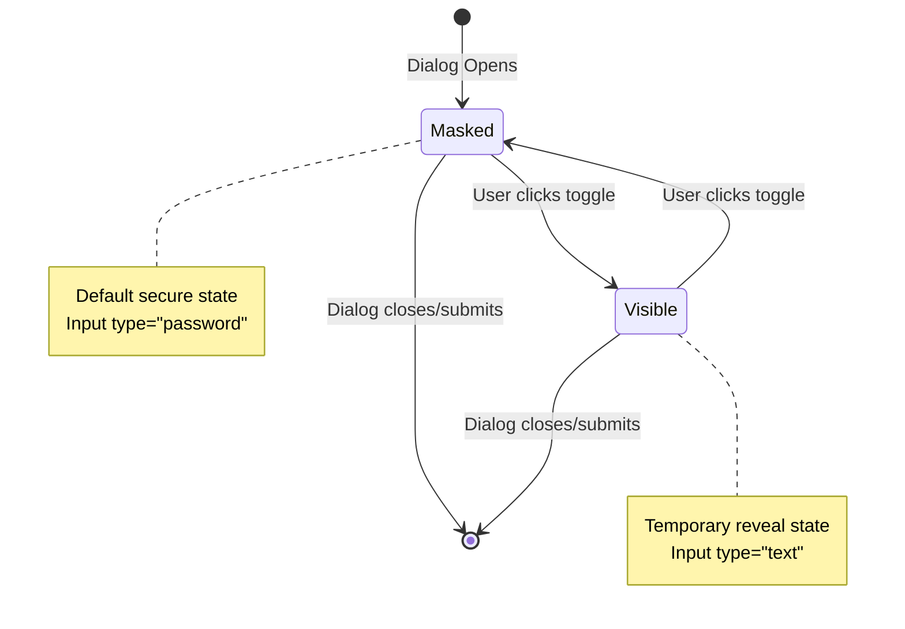

# Design Document: Show Password Toggle

## Overview

This feature adds password visibility toggle functionality to login dialogs, enabling users to temporarily reveal password characters for verification. The implementation focuses on accessibility, security, and consistent user experience across all authentication interfaces.

The design introduces a toggle button component that controls the input type of password fields, switching between masked (type="password") and visible (type="text") states. The solution integrates with existing dialog components and follows established design patterns for icon buttons and accessibility.

Key design goals:
- Minimal changes to existing dialog components
- Reusable toggle button component
- Full keyboard and screen reader support
- Secure defaults (always start masked, reset on dialog close)
- Consistent behavior across all authentication dialogs

## Architecture

The feature consists of three main layers:

1. **UI Component Layer**: PasswordToggleButton component that renders the toggle control
2. **State Management Layer**: Password field visibility state management within dialog components
3. **Integration Layer**: Hooks into existing login, registration, and password change dialogs

### Component Hierarchy

```
AuthenticationDialog (Login/Register/PasswordChange)
├── PasswordField
│   ├── Input (type controlled by visibility state)
│   └── PasswordToggleButton
│       ├── Icon (Eye/EyeOff)
│       └── Accessibility attributes
```

### State Flow



## Components and Interfaces

### PasswordToggleButton Component

A reusable button component that controls password field visibility.

**Props Interface:**
```typescript
interface PasswordToggleButtonProps {
  isVisible: boolean;
  onToggle: () => void;
  fieldId: string; // For aria-controls
  className?: string;
}
```

**Responsibilities:**
- Render appropriate icon based on visibility state
- Handle click and keyboard events (Space, Enter)
- Provide accessibility attributes (aria-label, aria-pressed, aria-controls)
- Announce state changes to screen readers

**Visual States:**
- Default (masked): Eye icon, aria-label="Show password"
- Active (visible): EyeOff icon, aria-label="Hide password"
- Focus: Visible focus ring following design system
- Hover: Subtle background color change

### PasswordField Component Enhancement

Existing password input fields will be enhanced to include the toggle button.

**Enhanced Interface:**
```typescript
interface PasswordFieldProps {
  id: string;
  value: string;
  onChange: (value: string) => void;
  label: string;
  showToggle?: boolean; // Default true
  // ... existing props
}
```

**Internal State:**
```typescript
const [isPasswordVisible, setIsPasswordVisible] = useState(false);
```

**Behavior:**
- Toggle button positioned at the right edge of the input field
- Input type switches between "password" and "text"
- State resets to false when component unmounts or parent dialog closes

### Dialog Integration

All authentication dialogs (Login, Register, PasswordChange) will integrate the enhanced PasswordField component.

**Integration Points:**
- LoginDialog: Single password field with toggle
- RegisterDialog: Password and confirm password fields, each with independent toggle
- PasswordChangeDialog: Current, new, and confirm password fields, each with independent toggle

**Reset Behavior:**
- On dialog close: Reset all password visibility states to masked
- On form submission: Reset all password visibility states to masked
- On navigation away: Reset handled by component unmount

## Data Models

### Component State Model

```typescript
// Per password field state
interface PasswordFieldState {
  value: string;
  isVisible: boolean;
  isFocused: boolean;
}

// Dialog-level state (example for RegisterDialog)
interface RegisterDialogState {
  email: string;
  password: PasswordFieldState;
  confirmPassword: PasswordFieldState;
  // ... other fields
}
```

### Accessibility Model

```typescript
interface AccessibilityAttributes {
  // For toggle button
  role: 'button';
  ariaLabel: string; // "Show password" | "Hide password"
  ariaPressed: boolean; // true when password is visible
  ariaControls: string; // ID of the password input
  tabIndex: 0;
  
  // For password input
  ariaDescribedBy?: string; // Optional hint text
}
```

### Icon State Mapping

```typescript
type VisibilityState = 'masked' | 'visible';

interface IconMapping {
  masked: {
    icon: 'Eye';
    ariaLabel: 'Show password';
    inputType: 'password';
  };
  visible: {
    icon: 'EyeOff';
    ariaLabel: 'Hide password';
    inputType: 'text';
  };
}
```


## Correctness Properties

*A property is a characteristic or behavior that should hold true across all valid executions of a system—essentially, a formal statement about what the system should do. Properties serve as the bridge between human-readable specifications and machine-verifiable correctness guarantees.*

### Property 1: Toggle Button Presence

*For any* password field component rendered in an authentication dialog, the component should include a toggle button element adjacent to the password input.

**Validates: Requirements 1.1, 5.1**

### Property 2: Bidirectional State Toggle

*For any* password field in any state (masked or visible), activating the toggle button should switch to the opposite state, and activating it again should return to the original state.

**Validates: Requirements 1.3, 1.4**

### Property 3: State Reflection in UI

*For any* password field, the toggle button's icon and aria-label should accurately reflect the current visibility state (Eye icon with "Show password" when masked, EyeOff icon with "Hide password" when visible).

**Validates: Requirements 1.5, 2.4**

### Property 4: Keyboard Activation

*For any* toggle button, pressing either the Space key or Enter key when the button has focus should trigger the toggle action identically to a mouse click.

**Validates: Requirements 2.3**

### Property 5: State Change Announcement

*For any* password visibility state change, the system should update ARIA attributes (aria-pressed, aria-label) to announce the change to assistive technologies.

**Validates: Requirements 2.5**

### Property 6: Dialog Lifecycle Reset

*For any* password field in any visibility state, when the containing dialog is closed, submitted, or unmounted, the password field should reset to masked state.

**Validates: Requirements 3.2, 3.3**

### Property 7: Consistent Positioning

*For any* authentication dialog type (login, registration, password change), the toggle button should be positioned in the same location relative to its password field (right edge, vertically centered).

**Validates: Requirements 4.3**

### Property 8: Cross-Dialog Consistency

*For any* two password fields in different dialog types, the toggle functionality should behave identically (same state transitions, same keyboard shortcuts, same accessibility attributes).

**Validates: Requirements 5.2**

### Property 9: Independent Field State

*For any* dialog containing multiple password fields, toggling the visibility of one field should not affect the visibility state of any other password field in the same dialog.

**Validates: Requirements 5.3**

## Error Handling

### User Input Errors

**Invalid Interactions:**
- Rapid clicking: Debounce not required; state toggles should handle rapid clicks gracefully through React's state batching
- Focus loss during toggle: State should persist; visibility state is independent of focus state

**Edge Cases:**
- Empty password field: Toggle should still function normally; visibility toggle is independent of field content
- Disabled password field: Toggle button should also be disabled and non-interactive

### Component Lifecycle Errors

**Unmounting During Toggle:**
- If component unmounts while toggle animation is in progress, cleanup should prevent state updates on unmounted components
- Use cleanup functions in useEffect hooks to cancel pending state updates

**Dialog State Conflicts:**
- If dialog closes while password is visible, ensure state resets before unmount to prevent memory leaks
- Reset visibility state in dialog's onClose handler before component unmounts

### Accessibility Errors

**Missing ARIA Attributes:**
- Fallback aria-label if state is undefined: Default to "Toggle password visibility"
- Missing icon: Render text label as fallback ("Show"/"Hide")

**Screen Reader Announcement Failures:**
- If ARIA live region is not supported, rely on aria-pressed and aria-label changes
- Ensure button role is explicit for maximum compatibility

### Browser Compatibility

**Input Type Switching:**
- Some older browsers may not support dynamic type switching on input elements
- Fallback: Replace input element entirely when toggling (less performant but compatible)
- Feature detection: Check if input.type = 'text' persists after setting

**Icon Rendering:**
- If icon library fails to load, render Unicode symbols as fallback (👁 / 👁‍🗨)
- Ensure aria-label is always present regardless of icon rendering

## Testing Strategy

### Dual Testing Approach

This feature requires both unit tests and property-based tests for comprehensive coverage:

- **Unit tests**: Verify specific examples, edge cases, and integration points
- **Property tests**: Verify universal properties across all inputs and states

Unit tests focus on concrete scenarios and component integration, while property tests ensure correctness across the full range of possible states and interactions. Together, they provide confidence that the feature works correctly in all situations.

### Property-Based Testing

**Framework**: Use `@fast-check/jest` for JavaScript/TypeScript property-based testing

**Configuration**:
- Minimum 100 iterations per property test
- Each test tagged with feature name and property reference
- Tag format: `Feature: show-password-toggle, Property {number}: {property_text}`

**Property Test Implementation**:

Each correctness property listed above should be implemented as a single property-based test:

1. **Property 1 (Toggle Button Presence)**: Generate random dialog configurations, verify toggle button exists in rendered output
2. **Property 2 (Bidirectional State Toggle)**: Generate random initial states, toggle twice, verify return to original state
3. **Property 3 (State Reflection)**: Generate random visibility states, verify icon and aria-label match expected values
4. **Property 4 (Keyboard Activation)**: Generate random key events (Space/Enter), verify toggle behavior matches click behavior
5. **Property 5 (State Change Announcement)**: Generate random state transitions, verify ARIA attributes update correctly
6. **Property 6 (Dialog Lifecycle Reset)**: Generate random visibility states, trigger lifecycle events, verify reset to masked
7. **Property 7 (Consistent Positioning)**: Generate different dialog types, verify toggle button positioning is consistent
8. **Property 8 (Cross-Dialog Consistency)**: Generate pairs of dialogs, verify toggle behavior is identical
9. **Property 9 (Independent Field State)**: Generate dialogs with multiple fields, toggle one, verify others unchanged

**Generators Needed**:
- `arbitraryVisibilityState()`: Generates 'masked' or 'visible' states
- `arbitraryDialogType()`: Generates 'login', 'register', or 'passwordChange'
- `arbitraryPasswordValue()`: Generates random password strings
- `arbitraryKeyboardEvent()`: Generates Space or Enter key events

### Unit Testing

**Component Tests**:

1. **PasswordToggleButton Component**:
   - Renders with correct default icon (Eye)
   - Renders with correct active icon (EyeOff)
   - Calls onToggle callback when clicked
   - Has correct aria-label in each state
   - Has correct aria-pressed value
   - Receives focus via Tab key
   - Shows focus indicator when focused
   - Minimum touch target size (44x44px)

2. **PasswordField Component**:
   - Renders with toggle button by default
   - Input type is "password" initially
   - Input type changes to "text" when toggled
   - Input type returns to "password" when toggled again
   - Toggle button can be disabled via prop
   - Value persists across visibility changes

3. **Dialog Integration Tests**:
   - LoginDialog includes toggle on password field
   - RegisterDialog includes independent toggles on password and confirm password
   - PasswordChangeDialog includes independent toggles on all three password fields
   - Closing dialog resets all password fields to masked
   - Submitting form resets all password fields to masked

**Accessibility Tests**:
- Toggle button has role="button"
- Toggle button has tabIndex={0}
- Toggle button has aria-controls pointing to password input ID
- Screen reader announces state changes (test with @testing-library/jest-dom)

**Edge Case Tests**:
- Empty password field with toggle
- Disabled password field with disabled toggle
- Rapid clicking doesn't cause state inconsistencies
- Component unmounts cleanly without warnings

**Integration Tests**:
- Toggle works with form validation
- Toggle works with password managers
- Toggle state doesn't interfere with form submission
- Multiple password fields maintain independent state

### Manual Testing Checklist

- [ ] Visual verification in all supported browsers
- [ ] Screen reader testing (NVDA, JAWS, VoiceOver)
- [ ] Keyboard-only navigation through entire flow
- [ ] Touch target size on mobile devices
- [ ] Color contrast meets WCAG AA standards
- [ ] Focus indicators visible in all themes
- [ ] Icon rendering in all supported icon sizes
- [ ] RTL (right-to-left) language support

