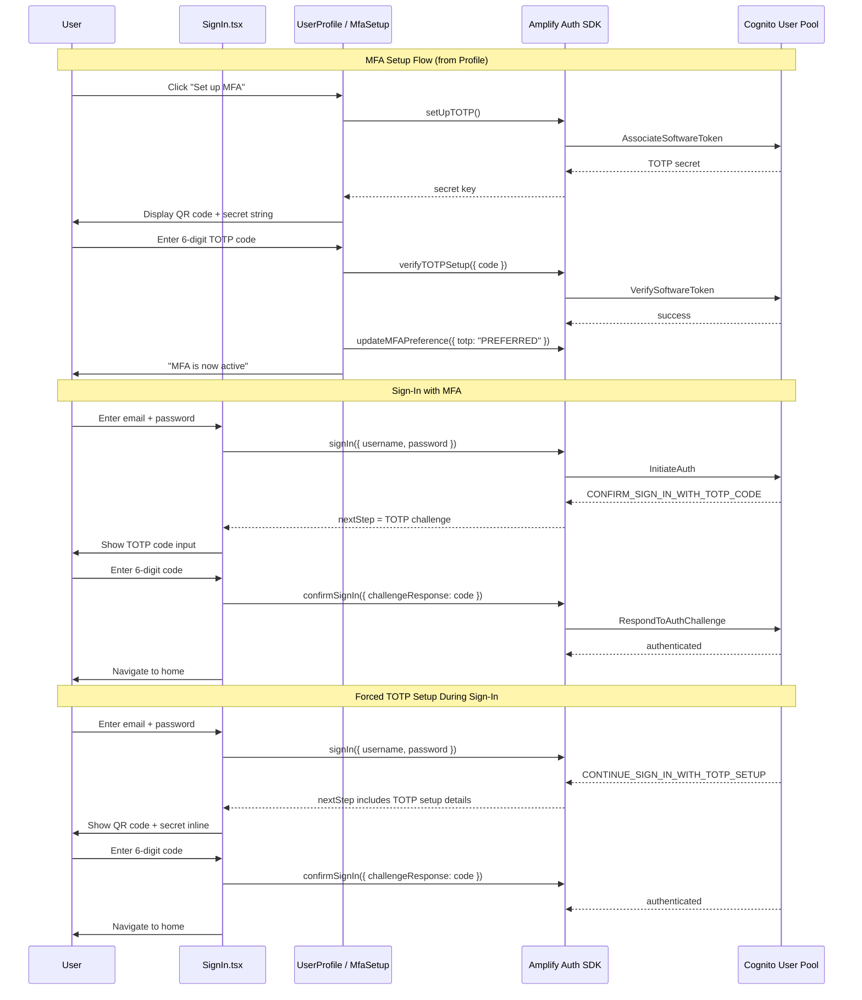
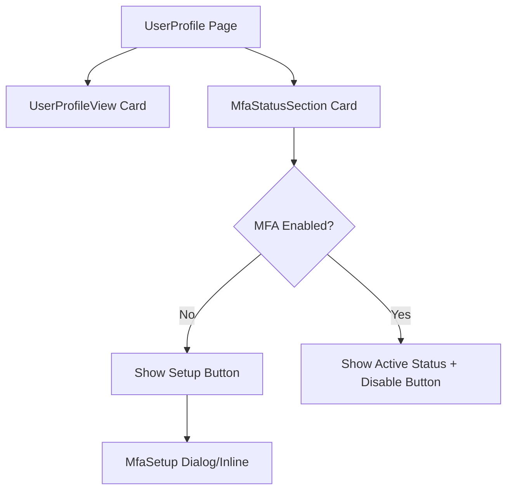

# Design Document: Two-Factor Authentication (TOTP)

## Overview

This design adds optional TOTP-based two-factor authentication to the existing Cognito + Amplify auth system. The feature touches three layers:

1. **Infrastructure** — SAM template changes to enable TOTP MFA on the Cognito User Pool (set `MfaConfiguration: OPTIONAL`, add `SOFTWARE_TOKEN_MFA` to `EnabledMfas`)
2. **Sign-in flow** — Extend the existing `SignIn.tsx` component to handle `CONFIRM_SIGN_IN_WITH_TOTP_CODE` and `CONTINUE_SIGN_IN_WITH_TOTP_SETUP` challenge steps from Cognito
3. **Profile MFA management** — Add an MFA settings section to the `UserProfile` page where users can set up TOTP (QR code + manual secret), verify a code, enable/disable MFA

The implementation relies entirely on Amplify v6 Auth APIs (`setUpTOTP`, `verifyTOTPSetup`, `updateMFAPreference`, `fetchMFAPreference`, `confirmSignIn`) and the `qrcode.react` library for QR code rendering. No backend Lambda changes are needed — Cognito handles TOTP verification natively.

## Architecture



### Key Design Decisions

- **OPTIONAL MFA** — `MfaConfiguration` is set to `OPTIONAL` (not `ON`) so users can choose to enable MFA. This avoids forcing all existing users through setup immediately.
- **No SMS MFA** — Only `SOFTWARE_TOKEN_MFA` is enabled. The existing SMS MFA condition and IAM role in the template are left intact but separate from this feature.
- **Environment parity** — TOTP MFA is available in both `dev` and `prod` environments. The current template gates MFA behind `IsProduction` + `EnableMFARequirement`; this design removes that gating for TOTP specifically.
- **QR code library** — Use `qrcode.react` (lightweight, React-native) to render the `otpauth://` URI as a scannable QR code. No server-side QR generation needed.
- **Inline forced setup** — When Cognito returns `CONTINUE_SIGN_IN_WITH_TOTP_SETUP`, the sign-in page handles it inline rather than redirecting to the profile page, since the user isn't authenticated yet.

## Components and Interfaces

### 1. SAM Template Changes (`template.yaml`)

Update the `UserPool` resource:

```yaml
UserPool:
  Type: AWS::Cognito::UserPool
  Properties:
    # ... existing properties ...
    MfaConfiguration: 'OPTIONAL'
    EnabledMfas:
      - SOFTWARE_TOKEN_MFA
    # Remove: MfaConfiguration: !If [EnableMFA, 'ON', 'OFF']
    # Remove: SmsConfiguration conditional block (for TOTP; SMS block can stay for future use)
```

The `UserPoolClient` keeps its existing `ExplicitAuthFlows` (`ALLOW_USER_SRP_AUTH`, `ALLOW_USER_PASSWORD_AUTH`, `ALLOW_REFRESH_TOKEN_AUTH`) unchanged.

### 2. MfaSetup Component (new: `frontend/src/components/MfaSetup.tsx`)

A reusable component for the TOTP setup wizard, used by both the Profile page and the forced-setup sign-in flow.

```typescript
interface MfaSetupProps {
  /** For forced setup during sign-in, pass the setup URI/secret from the sign-in response */
  totpSetupDetails?: { secretCode: string; username: string };
  /** Called when setup completes successfully */
  onSetupComplete: () => void;
  /** Called when user cancels setup */
  onCancel: () => void;
}
```

**Steps:**
1. Call `setUpTOTP()` (or use provided `totpSetupDetails`) to get the TOTP secret
2. Build the `otpauth://totp/{appName}:{username}?secret={secret}&issuer={appName}` URI
3. Render QR code via `qrcode.react` + display the raw secret as copyable text
4. Accept a 6-digit code input, call `verifyTOTPSetup({ code })`
5. On success, call `updateMFAPreference({ totp: 'PREFERRED' })` and invoke `onSetupComplete`

### 3. MfaStatusSection Component (new: `frontend/src/components/MfaStatusSection.tsx`)

Displayed on the Profile page below the existing profile card.

```typescript
interface MfaStatusSectionProps {
  /** no props needed — fetches MFA state internally */
}
```

**Behavior:**
- On mount, calls `fetchMFAPreference()` to determine current MFA status
- If MFA is not enabled: shows "Set up MFA" button → opens `MfaSetup`
- If MFA is enabled: shows "MFA Active" status chip + "Disable MFA" button
- Disable calls `updateMFAPreference({ totp: 'DISABLED' })` and refreshes status

### 4. SignIn.tsx Modifications

The existing `SignIn.tsx` already handles `CONFIRM_SIGN_IN_WITH_TOTP_CODE` (shows a TOTP code input) and `CONTINUE_SIGN_IN_WITH_TOTP_SETUP` (currently shows an error). Changes:

- **TOTP challenge** (`CONFIRM_SIGN_IN_WITH_TOTP_CODE`): Already handled — the existing MFA verification form works. No changes needed.
- **Forced TOTP setup** (`CONTINUE_SIGN_IN_WITH_TOTP_SETUP`): Replace the error message with an inline `MfaSetup` component. Extract the setup details from the sign-in response (`result.nextStep.totpSetupDetails`) and pass them to `MfaSetup`. On completion, call `confirmSignIn({ challengeResponse: code })` and navigate to home.
- **Session expiry**: The existing `NotAuthorizedException` handler already resets the form. Add handling for expired TOTP sessions to redirect back to credentials with a message.

### 5. UserProfile.tsx / UserProfileView.tsx Modifications

Add the `MfaStatusSection` component below the existing `UserProfileView` card on the profile page.



## Data Models

No new database tables or DynamoDB items are needed. All MFA state is managed by Cognito:

| Data | Storage | Access Method |
|------|---------|---------------|
| TOTP secret (per user) | Cognito User Pool | `setUpTOTP()` / `verifyTOTPSetup()` |
| MFA preference (per user) | Cognito User Pool attribute | `fetchMFAPreference()` / `updateMFAPreference()` |
| MFA challenge state | Cognito auth session | `signIn()` / `confirmSignIn()` response |

### Amplify Auth API Surface Used

| API | Purpose |
|-----|---------|
| `setUpTOTP()` | Generate TOTP secret for association |
| `verifyTOTPSetup({ code })` | Verify TOTP code and complete association |
| `updateMFAPreference({ totp: 'PREFERRED' \| 'DISABLED' })` | Enable/disable TOTP as preferred MFA |
| `fetchMFAPreference()` | Query current MFA status for display |
| `confirmSignIn({ challengeResponse })` | Submit TOTP code during sign-in challenge |
| `signIn({ username, password })` | Existing — returns challenge step if MFA enabled |


## Correctness Properties

*A property is a characteristic or behavior that should hold true across all valid executions of a system — essentially, a formal statement about what the system should do. Properties serve as the bridge between human-readable specifications and machine-verifiable correctness guarantees.*

Most acceptance criteria in this feature are example-based (specific UI interactions, API call sequences, conditional rendering) or smoke tests (IaC configuration checks). Two criteria have meaningful input variation suitable for property-based testing:

### Property 1: TOTP URI format correctness

*For any* TOTP secret string and any username string, the generated QR code URI SHALL be a valid `otpauth://totp/{issuer}:{username}?secret={secret}&issuer={issuer}` URI where the secret and username are correctly encoded in the output.

**Validates: Requirements 2.2**

### Property 2: TOTP input field accepts only 6-digit numeric codes

*For any* arbitrary string input, the TOTP code input field SHALL strip all non-numeric characters and truncate the result to at most 6 digits, such that the field value always matches the pattern `/^\d{0,6}$/`.

**Validates: Requirements 3.2**

## Error Handling

| Scenario | Error Source | Handling |
|----------|-------------|----------|
| Invalid TOTP code during setup | `verifyTOTPSetup` throws `EnableSoftwareTokenMFAException` | Display "Invalid code" error, keep form editable for retry |
| Invalid TOTP code during sign-in | `confirmSignIn` throws `CodeMismatchException` | Display "Invalid verification code" error, allow retry |
| TOTP session expired during sign-in | `confirmSignIn` throws `NotAuthorizedException` | Call `signOut({ global: true })`, reset to credentials form, show "Session expired" message |
| `setUpTOTP` fails | Network error or Cognito service error | Display generic error, offer retry button |
| `fetchMFAPreference` fails on profile load | Network error or auth token expired | Display error alert with retry button, don't block rest of profile |
| `updateMFAPreference` fails (enable/disable) | Network error or Cognito error | Display error, revert UI to previous state |
| Forced TOTP setup — invalid code | `confirmSignIn` throws `CodeMismatchException` | Display error, allow retry (don't reset the QR code / secret) |
| User cancels MFA setup mid-flow | User action | Reset setup state, return to previous view (profile or sign-in credentials) |

### Error UX Principles

- All errors display in an MUI `Alert` with `severity="error"` within the current form context
- No errors cause navigation away from the current step (except session expiry, which must restart sign-in)
- Retry is always available without re-entering previous steps (e.g., don't regenerate QR code on code verification failure)
- Loading states use `CircularProgress` consistent with existing components

## Testing Strategy

### Unit Tests (Example-Based)

Focus on specific interactions and conditional rendering:

- **MfaSetup component**: Setup flow calls `setUpTOTP`, displays QR code and secret, calls `verifyTOTPSetup` on submit, calls `updateMFAPreference` on success, shows error on invalid code, shows confirmation on completion
- **MfaStatusSection component**: Calls `fetchMFAPreference` on mount, shows setup button when MFA disabled, shows active status when MFA enabled, calls `updateMFAPreference` on disable
- **SignIn TOTP challenge**: Renders TOTP input on `CONFIRM_SIGN_IN_WITH_TOTP_CODE`, calls `confirmSignIn` on submit, navigates home on success, shows error on `CodeMismatchException`, resets on session expiry
- **SignIn forced setup**: Renders `MfaSetup` on `CONTINUE_SIGN_IN_WITH_TOTP_SETUP`, passes setup details, navigates home on completion
- **SAM template**: Smoke tests verifying `MfaConfiguration: OPTIONAL`, `EnabledMfas` includes `SOFTWARE_TOKEN_MFA`, `ExplicitAuthFlows` preserved

### Property-Based Tests

Using `fast-check` (already compatible with the project's Vitest setup):

- **Property 1** (TOTP URI format): Generate random secret strings and usernames via `fc.string()`, build the URI, assert it matches the `otpauth://totp/` scheme with correct query parameters. Minimum 100 iterations.
  - Tag: `Feature: two-factor-authentication, Property 1: TOTP URI format correctness`

- **Property 2** (TOTP input sanitization): Generate random strings via `fc.string()`, pass through the input sanitization function, assert the output matches `/^\d{0,6}$/`. Minimum 100 iterations.
  - Tag: `Feature: two-factor-authentication, Property 2: TOTP input field accepts only 6-digit numeric codes`

### Integration Tests

- End-to-end MFA setup flow with mocked Amplify APIs (setup → QR display → verify → enable)
- End-to-end sign-in with MFA challenge using mocked Amplify APIs
- Profile MFA toggle (enable → verify active → disable → verify inactive)
